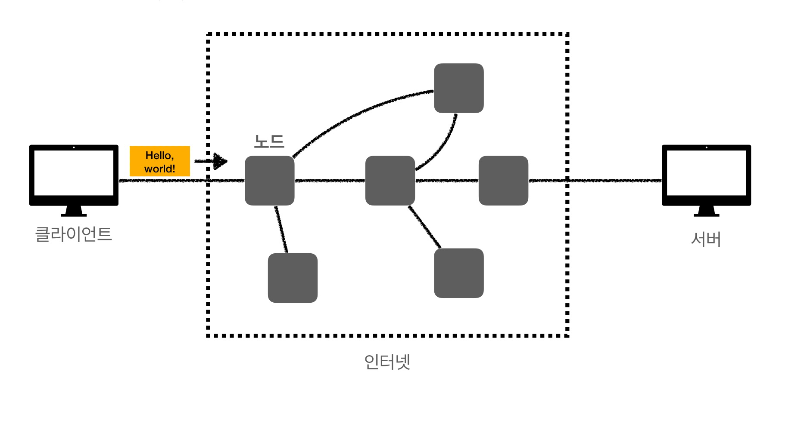

# HTTP 웹 기본 지식 - [1] 인터넷 네트워크

### 학습 목표
1. 인터넷 통신에 대해 안다.
2. IP, TCP, PORT, DNS가 무엇인지 안다.

# 1. 인터넷 통신
### [인터넷 네트워크]
- 인터넷 통신
- IP (Internet Protocol)

## 1. 인터넷에서 컴퓨터 둘은 어떻게 통신할까?
  

## 2.  IP (Internet Protocol)
- IP 주소를 통해 통신이 가능하다 
- 지정한 IP(IP Address)에 데이터 전달
- Packet 이라는 통신 단위로 데이터 전달

### IP 패킷 정보
- 출발지 IP
- 목적지 IP
- 기타
- 전송 데이터

### IP 프로토콜의 한계
#### 1. 비연결성
- 패킷을 받을 대상이 없거나 서비스 불능 상태여도 그냥 패킷이 전송된다

#### 2. 비신뢰성
- 중간에 패킷이 사라지면?
- 패킷이 순서대로 안오면?
- 에 대한 해결책이 없음

#### 3. 프로그램 구분
- 같은 IP를 사용하는 서버에서 통신하는 애플리케이션이 둘 이상이면?

### 1. 비연결성 - 대상이 서비스 불능, 패킷 전송
- 대상 서버가 패킷을 받을 수 있는 상태인지 몰라도 일단 그냥 보낸다

### 2. 비신뢰성 - 패킷 소실
- 중간 노드가 꺼져있어서 패킷이 소실되도 모른다

#### 패킷 전달 순서 문제 발생
- 패킷이 너무 큰 경우에 이를 끊어서 (나눠서)  보내는데, 무수히 많은 노드를 통해 전달되다 보면 순서가 바뀔 수 있다

#### 위의 문제를 해결해주는 것이 바로 ! TCP 와 UDP이다
## 3. TCP 와 UDP
### 인터넷 프로토콜 스택의 4계층
 #### Application Layer
- HTTP, FTP

#### Transport Layer
- TCP, UDP

#### Internet Layer
- IP

#### Network Interface Layer
- LAN 카드..

### TCP/IP 패킷 정보
#### IP 패킷

- 출발지 IP
- 목적지 IP

#### TCP segment

- 출발지 PORT
- 목적지 PORT
- 전송 제어
- 순서
- 검증 정보
- 전송 데이터

### TCP 특징 (Transmission Control Protocol)
- 연결 지향 - TCP 3 way handshake (가상 연결) : 연결을 먼저 하고 데이터를 보낸다
- 데이터 전달 보증
- 순서 보장
- 신뢰할 수 있는 프로토콜
- 현재는 대부분 TCP 사용

### TCP 3-way handshake
1. Syn
2. Syn + Ack
3. Ack
4. 데이터 전송

#### 데이터 전달 보증
1. 데이터 전송
2. 데이터 잘 받았다고 응답
=> 이 데이터가 잘 보내졌는지 아닌지 알 수 있다

#### 순서 보장
1. 패킷 1, 패킷 2, 패킷 3 순서로 전송
2. 패킷 1, 패킷 3, 패킷 2 순서로 도착하게 되면, 패킷 2부터 다시 보내달라고 응답

### UDP 특징 (User Datagram Protocol)
- 기능이 거의 없다
- 연결 지향 - TCP 3 way handshake 안함
- 데이터 전달 보증 안함
- 순서 보장 안함
- 데이터 전달 및 순서가 보장되지는 않지만, 단순하고 빠르다는 장점
- 정리
  - IP와 거의 같다. + PORT + checksum 이 있음
  - 애플리케이션에서 추가 작업이 필요

## 4. PORT
- 한 번에 둘 이상 연결해야 된다면 어떻게 해야 할까?
- 같은 IP 내에서 프로세스를 구분하는 역할
- 0 ~ 65535 할당 가능
- 0 ~ 1023 포트는 잘 알려진 포트로, 사용하지 않는 것이 좋다
  - FTP : 20, 21
  - TELNET : 23
  - HTTP : 80
  - HTTPS : 443

## 5. DNS (Domain Name System)
- IP 는 기억하기가 어렵고, 변경될 수 있다.
- DNS 서버에 도메인을 등록을 해두면, 도메인으로 접근 시 해당 IP로 접근 가능하도록 함

### 출처

[인프런-김영한님의 모든 개발자를 위한 HTTP 웹 기본 지식](https://www.inflearn.com/course/http-%EC%9B%B9-%EB%84%A4%ED%8A%B8%EC%9B%8C%ED%81%AC/dashboard)

