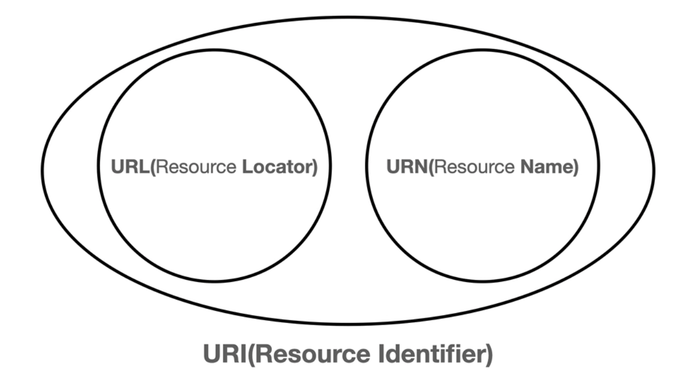

# HTTP 웹 기본 지식 - [2] URI와 웹 브라우저 요청 흐름

### 학습 목표
1. URI에 대해 안다.
2. 웹 브라우저에서 요청을 했을 때 흐름을 이해한다.

## 1. URI (Uniform Resource Identifier)

- URI (Uniform Resource Identifier)
  - Uniform : 리소스 식별하는 통일된 방식
  - Resource : 자원, URI로 식별할 수 있는 모든 것 (제한 없음)
  - Identifier : 다른 항목과 구분하는데 필요한 정보
- URL : Uniform Resource Locator
  - 리소스가 있는 위치를 지정
- URN : Uniform Resource Name
  - 리소스에 이름을 부여
- 위치는 변할 수 있지만, 이름은 변하지 않는다
- URN 이름만으로 실제 리소스를 찾을 수 있는 방법이 보편화 되지 않음

### URL 분석

#### https://www.google.com/search?q=hello&hl=ko

### URL 전체 문법
- `scheme://[userinfo@]host[:port][/[path]][?query][#fragment]`
- 프로토콜 : https
- 호스트명 : www.google.com
- 포트 번호 : 443
- path : /search
- 쿼리 파라미터 : q=hello&hl=ko

#### scheme
- 주로 프로토콜을 사용한다
- 프로토콜
  - 어떤 방식으로 자원에 접근할 것인가 하는 약속 규칙이다
    - ex) http, https, ftp
- http는 80포트, https는 443 포트를 주로 사용 & 포트는 생략 가능하다
- https는 http에 보안 추가 (HTTP Secure)

#### userinfo
- URL 에 사용자정보를 포함해서 인증
- 거의 사용하지 않는다

#### host
- 호스트명
- 도메인명이나 IP 주소를 직접 입력 가능하다

#### port
- 포트 (PORT)
- 접속 포트
- 일반적으로 생략, 생략 시 http는 80, https는 443

#### path
- 리소스 경로 (path) 이다
- 계층적 구조로 구성되어 있다

#### query
- key=value 형태
- `?` 로 시작, `&` 로 추가 가능
- query parameter, query string 등으로 불린다
- 웹 서버에 제공하는 파라미터로 문자 형태

#### fragment
- `https://docs.spring.io/spring-boot/docs/current/reference/html/getting-started.html#getting-started-introducing-spring-boot`
- html 내부 북마크 등에 사용
- **서버에 전송하는 정보는 아니다** 


## 2. 웹 브라우저 요청 흐름
`https://www.google.com/search?q=hello&hl=ko` 라는 URL에 접근한다고 하자.
1. 웹 브라우저는 DNS를 조회를 하여 IP를 찾고, scheme에 생략된 port 정보를 찾아내어 HTTP 요청 메시지를 생성한다
   - `https://www.google.com:443/search?q=hello&hl=ko`
   - HTTP Request Message
     - `GET /search?q=hello&hl=ko HTTP /1.1 HOST: www.google.com`

2. HTTP 메시지 전송한다
   1. 웹 브라우저가 HTTP 메시지 생성
   2. Socket 라이브러리를 통해 전달
      1. A : TCP/IP 연결 (IP, PORT)
      2. B : 데이터 전달 
   3. TCP/IP 패킷 생성, HTTP 메시지 포함

3. 요청 패킷 전달한다

4. 요청 패킷 도착 시, 서버가 TCP/IP 패킷을 분해해서 HTTP 메시지만을 해석한다

5. 서버에서 HTTP 응답 메시지를 생성한다

   - ```
     HTTP/1.1 200 OK
     Content-Type: text/html;charset=UTF-8
     Content-Length: 3423
     
     <html>
     	<body>...</body>
     </html>
     ```

6. 응답 패킷을 전달한다

7. 응답 패킷 도착 시, 웹 브라우저는 HTTP 메시지를 해석하여 HTML을 렌더링한다


### 출처

[인프런-김영한님의 모든 개발자를 위한 HTTP 웹 기본 지식](https://www.inflearn.com/course/http-%EC%9B%B9-%EB%84%A4%ED%8A%B8%EC%9B%8C%ED%81%AC/dashboard)