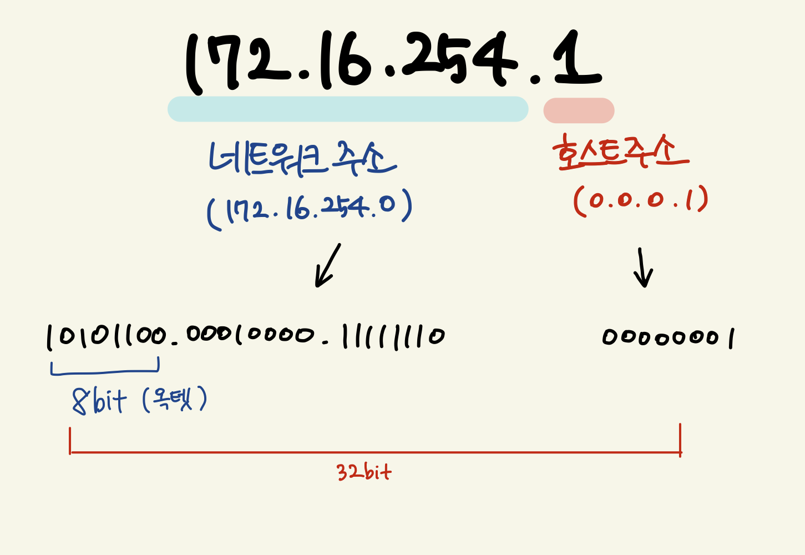
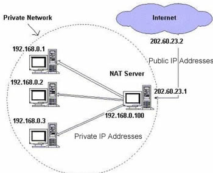

# IP

## IP (Internet Protocol)
- 인터넷에 연결되어 있는 장치들을 식별할 수 있도록 각 장비에 부여되는 고유 주소
- 네트워크에서 장치들이 서로 인식하고, 통신하기 위해 사용하는 특수 번호
- IP는 일반적으로 `172.16.254.1` 과 같이 마침표로 구분된 10진수 형식
  - 2진법으로 표현하면 `32 bit` 숫자

> ##### 참고
> - 전세계 IP주소는 미국의 InterNIC가 총괄해서 관리한다
> - 우리나라는 KRNIC가 InterNIC로부터 주소를 할당받아서 관리한다

### IP 종류
##### 1. IPv4 (32 bit)
##### 2. IPv6 (128 bit)

#### IPv4 (32 bit)

- 2^32 ➡️ 43억개
- IPv4는 0 ~ 2^32 까지의 주소 개수를 가질 수 있다
- 그런데, 사용자 수가 많아지니까 고갈될 위기에 처해있다
- ⭐️ 그래서 IPv6가 등장하게 되었다

#### IPv6 (128 bit)
- IPv4를 확장한 차세대 IP
- 16비트씩 8자리로 구성되며, 각 자리는 콜론 (`:`) 으로 구분한다

- 128 bit이므로, 2^128 ➡️ 거의 무한대로 쓸 수 있다
- 속도, 보안적인 부분 등 여러 면에서 뛰어나다
- 그러나, 기존 주소 체계를 변경하는 데 비용이 많이 들어서 아직 완전 상용화되지 않았다

#### 비교
비교  | IPv4  | IPv6  |  
--|---|---|--
주소 길이  | 32 bit   | 128 bit  |  
표시 방법  | 8 bit씩 4부분 ➡️ 10진수로 표시  | 16 bit씩 8부분 ➡️ 16진수로 표시   |  
주소 개수  | 약 43억개   | 43억 * 43억 * 43억 * 43억   |  
주소 할당  | A, B, C 등 클래스 단위 비순차적 할당  | Network 규모 및 단말기 수에 따른 순차적 할당   |  
품질 제어  | 지원 수단 없음  | 등급별, 서비스 별로 패킷 구분 가능   |  
보안 기능  | IPsec 별도 설치  | 확장 기능에서 기본 제공  |  
Plug & Play  | X  |  O  |  
모바일 IP  | 곤란  |  용이  |  
웹 캐스팅  | 곤란  | 용이  |  

#### 아직 IPv6가 상용화되지 않았다고 했는데, 그렇다면 어떻게 해야 고갈될 위치에 있는 IPv4를 계속 사용할 수 있을까??
- 공인 IP / 사설 IP 트릭을 사용한다

## IP 종류
- IP를 나누는 방식에 따라 고정 IP / 유동 IP / 공인 IP / 사설 IP로 나눈다

### 1. 고정 IP
- 컴퓨터에 고정적으로 부여된 IP
- 한 번 부여 시, 반납 전까지는 다른 장비에 부여할 수 없는 IP이다
- 보안성이 우수하여 보안 기관에서 많이 사용한다

### 2. 유동 IP
- 인터넷 사용자 모두에게 고정 IP를 부여해주기 힘들어서 일정 주기 또는 사용자들이 인터넷에 접속하는 순간마다 사용중이지 않은 IP를 임시로 발급하는 방법

### 3. 공인 IP
- ICANN 이라는 기관에서 국가별로 사용할 IP 대역을 관리하고, 우리나라는 KISA에서 관리한다
- ISP가 부여받고, 우리에게 발급해주는 IP이다
- 전 세계에서 유일하며, 외부 / 내부 관계없이 접속이 가능하다

### 4. 사설 IP
- 어떤 네트워크 안에서만 내부적으로 사용되는 고유한 IP이다
- 하나의 네트워크 안에서만 유일하여, 내부에서만 접속이 가능하다

 

## IP 접속 차이
### 1. Loopback (127.0.0.1)
- 호스트에 할당된 IP
- 내가 가진 노트북에서 서버를 띄우면, 그 노트북에서만 접속이 가능하다

### 2. 공인 IP
- 어디서나 접속이 가능하다

### 3. Private IP
- 같은 대역의 사설 IP를 할당 받은 모든 기기에서 접속이 가능하다
- 같은 대역의 사설 IP에 붙어있지 않으면 접속이 불가능하다

### 사설망 원리
- IP 주소의 절약과 관련되어 있다

- 공유기를 사용하여, 공유기 까지는 공인 IP를 할당하고
- 공유기에 연결된 각 네트워크 기기에는 사설 IP를 할당하여 그룹으로 묶는 방법이다
