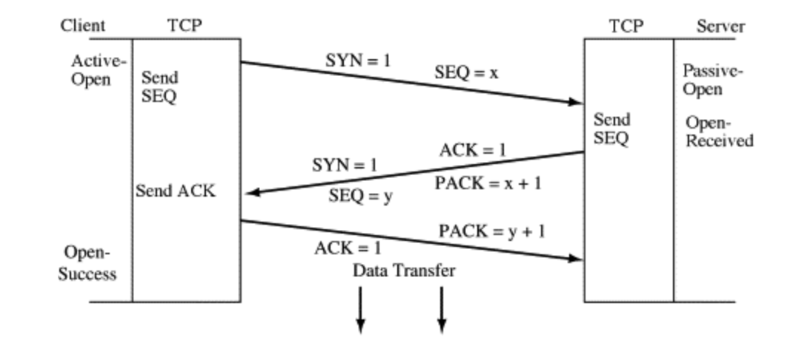

# TCP & UDP

### 학습 목표

### 1. TCP & UDP에 대해 알 수 있다.

  인터넷 프로토콜 기반 소켓의 경우, 데이터 전송 방법에 따라서 TCP 소켓과 UDP 소켓으로 나뉜다. TCP 소켓은 연결을 지향하기 때문에, **스트림 기반 소켓** 이라고도 이야기 한다. TCP는 Transmission Control Protocol의 약자로, 데이터 전송 과정의 컨트롤이라는 뜻을 담고 있다.

# 1. TCP

  신뢰성 있는 데이터의 전송을 담당하며, TCP가 데이터를 보낼 때 기반이 되는 프로토콜은 IP이다.

### IP와 TCP의 관계

- IP는 오로지 하나의 데이터 패킷이 전송되는 과정에만 중심을 두고 설계됨
- 따라서, 여러 개의 데이터 패킷을 전송한다고 하더라도, 각각의 패킷이 전송되는 과정은 IP에 의해 진행되므로, 전송의 순서나 전송 그 자체를 신뢰할 수 없음
- 데이터를 주고 받는 과정에서 서로 데이터를 잘 주고 받았다는 것을 확인하면, 데이터 전송을 신뢰할 수 있다는 생각에서 출발

> Packet (패킷)
>
> - 데이터 전송의 기본 단위

### TCP 3-way handshaking

  소켓은 full-duplex 방식으로 동작하므로, 양방향으로 데이터를 주고받을 수 있다. 데이터 송수신에 앞서 준비과정인 연결 요청이 필요한데, TCP는 상대 소켓과의 연결 설정 과정에서 세 번의 대화를 통해 연결을 한다. 이를 3-way handskaing이라고 하는데, 이 과정에 대해 알아보자. 간단히 정리하자면 아래와 같다.

1. [Shaking 1] 소켓 A : `안녕 소켓 B, 전달할 데이터가 있어!!!! 연결하자`
2. [Shaking 2] 소켓 B : `안녕, 소켓 A, 준비되었으니까 시작해`
3. [Shaking 3] 소켓 A : `OK!`

*[출처] : https://www.sciencedirect.com/topics/computer-science/three-way-handshake*

1. Client는 Server에게 `SYN` 을 보내어 연결을 요청한다
   - `[SYN] SEQ: 1000, ACK: -` : 지금 보내는 패킷의 번호는 1000번이고, 잘 받았다면 다음에는 1001번 패킷을 전달하라고 나한테 말해줘
   - **SYN** : Synchronization의 줄임말로, 데이터 송수신에 앞서 전송되는 **동기화 메시지**
2. Server는 Client에게  `SYN+ACK` 을 보내어 Client의 요청을 잘 받았다고 응답한다
   - `[SYN+ACK] SEQ: 2000, ACK: 1001 ` : 내가 지금 보내는 패킷은 2000번이고, 잘 받았으면 다음에는 2001번 패킷을 전달하라고 나한테 말해줘, 그리고 너가 보낸 SEQ 1000번 패킷 잘 받았고, 다음에는 1001번 패킷 보내줘
   - **SYN+ACK** : 클라이언트가 전송한 패킷에 대한 응답 메시지와 서버의 데이터 전송을 위한 동기화 메시지를 함께 묶은 형태
3. Client는 Server에게 `ACK` 을 보내어 Server의 응답을 잘 받았다고 응답한다
   - `[ACK] SEQ: 1001, ACK: 2001 ` : 내가 지금 보내는 패킷은 1001번이고, 조금 전에 너가 전송한 2000번 패킷은 잘 받았어, 다음에는 2001번을 보내줘

이렇게 3-way handshaking을 통해 상호간에 데이터 송수신을 위한 준비가 되었음을 서로 인식하게 된다.

#### 송수신에 사용되는 패킷에 번호를 부여하는 이유

- 번호를 부여해서 확인하는 절차를 거치기 때문에 손실된 데이터의 확인 및 재전송이 가능하다
- 그러므로, TCP는 손실 없는 데이터 전송을 보장할 수 있다

### TCP 4-way handshaking

  TCP 소켓은 연결 종료를 할 때 우아하게 연결 종료를 하는데, 그 이유는 그냥 연결을 끊어버리게 되면, 상대가 전송할 데이터가 남아있는 경우 문제가 생기기 때문이다. 그리하여 연결 종료 시, 연결 설정과 비슷하게 상호간에 합의 과정을 거친다.

*[출처] : https://www.geeksforgeeks.org/tcp-connection-termination/*

1. `FIN` 을 보내어 종료를 알리는 메시지를 보낸다
   - `[FIN] SEQ: 5000, ACK: -` : 나 연결 종료할래, 내가 보내는 패킷의 번호는 5000번이고, 잘 받았다면 다음에는 5001번 패킷을 전달하라고 나한테 말해줘
   - **FIN** : 종료를 알리는 메시지
2. `ACK` 을 보내어 패킷을 잘 받았다고 응답한다
   - `[ACK] SEQ: 7500, ACK: 5001` : 내가 지금 보내는 패킷은 7500번이고, 잘 받았으면 다음에는 7501번 패킷을 전달하라고 나한테 말해줘, 그리고 너가 보낸 SEQ 5000번 패킷 잘 받았어, 다음에는 5001번 패킷 보내줘
3. `FIN` 을 보내어 연결을 마치고자 한다
   -  `[FIN] SEQ: 7501, ACK: 5001` : 내가 지금 보내는 패킷은 7501번이고, 내가 앞에 보낸 `ACK` 메시지 이후에 데이터 수신이 없었으므로 재전송한다, 다음에는 7502번 패킷을 전달하라고 나한테 말해줘
4. `ACK` 을 보내어 연결을 마침
   - `[ACK] SEQ: 5001, ACK: 7502` : 내가 지금 보내는 패킷은 5001번이고, 너가 전송한 7501번 패킷 잘 받았어

이렇게, 4-way handshaking을 통해 상호간에 연결 종료 합의과정을 마친다.

## 2. UDP

  UDP는 TCP보다 훨씬 간결한 구조로 설계된 프로토콜로, ACK과 같은 응답 메시지를 보내지 않고, SEQ와 같이 패킷에 번호를 부여하지도 않는다. 그러므로, 상황에 따라 TCP보다 훨씬 좋은 성능을 발휘한다. 즉, **흐름제어가 없다**고 생각하면 된다.

  호스트를 떠난 UDP 패킷이 다른 호스트에 전달되도록 하는 것은 IP의 역할이지만, 이렇게 전달된 UDP 패킷을 호스트에 존재하는 UDP 소켓 중 하나에게 최종 전달하는 것은 IP의 역할이 아닌 UDP의 역할이다. UDP의 역할 중 가장 중요한 것은 호스트로 수신된 패킷을 PORT 정보를 참조하여 최종 목적지인 UDP 소켓에 전달하는 것이다.

- 인터넷을 기반으로 실시간 영상 및 음성을 전송하는 경우 UDP를 사용

## Reference

- https://www.sciencedirect.com/topics/computer-science/three-way-handshake
- https://www.geeksforgeeks.org/tcp-connection-termination/
- 윤성우, 『윤성우의 열혈 TCP/IP 소켓 프로그래밍』, 오렌지미디어(2011)

