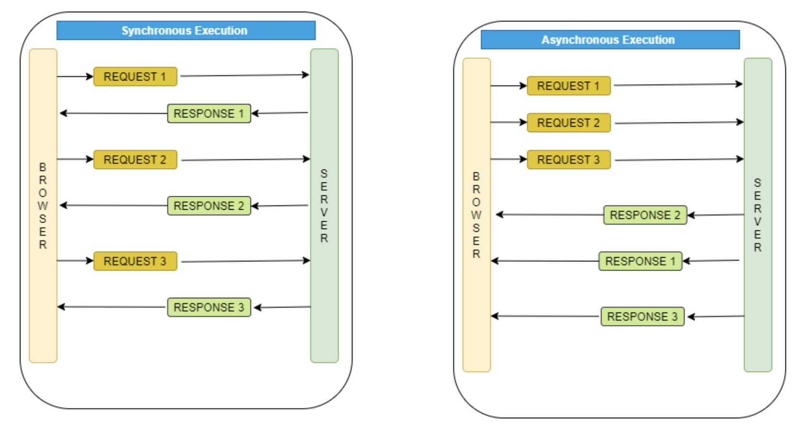

# Sync / Async (동기 / 비동기)

#### 결과물을 돌려받는 시점에 초점

## Synchronous (동기)
- Request를 보내면 얼마나 시간이 걸리든 간에 그 자리에서 Response를 받겠다
- **두 서버 사이의 Transaction을 맞추겠다**
- Request를 보낸 Thread는 Response가 도착하기 전까지는 아무것도 못하는 Block 상태가 된다
- 해당 Thread는 Request를 보내고 Reponse를 받게되어,
  - 요청값과 응답값의 순서를 보장하게 된다.
  - 보낸 Request에 대한 처리 결과 값을 보장받을 수 있다

### 장점
- 보낸 Request에 대한 처리 결과를 보장받을 수 있음

### 단점
- Request를 보내고 Response를 받을 때까지 Blocking이 되기 때문에 Response가 지연된다면 뒤에 들어오는 요청들은 Connection 가능한 Thread가 없어서 연결을 맺지 못한다.
- 결국 성능 저하가 발생할 수 있게 된다.

## Asynchronous (비동기)
- Request를 보내고 Response를 상관하지 않는 상태이다.
- Response를 기다리지 않으니까 Thread는 다른 일을 할 수 있다. (Non-Blocking)
- Thread가 Response를 받지 않았는데, 뒤에 보낸 요청이 먼저 처리가 되어서 뒤에 보낸 Request에 대한 Reponse가 먼저 올 수도 있다.
- 결국, 순서를 보장하지 않는 다는 점이 특징이다.

### 장점
- Sync에 비해 Non-Block 상태로 처리할 수 있기 때문에 성능적으로 좋을 수 밖에 없다.

### 단점
- 그러나, 순서를 보장하지 않기 때문에 Request에 대한 처리 결과를 보장받고 처리해야 하는 경우에는 Async는 적합하지 않다.
