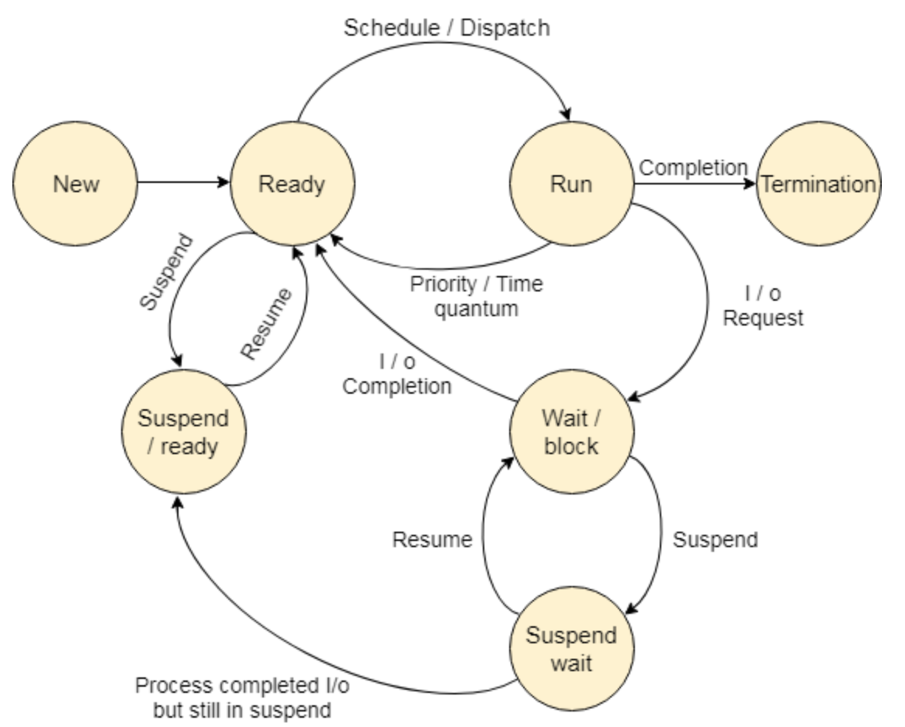

# [1] Process

### 학습목표

### 1. 프로세스가 무엇인지 알 수 있다.

### 2. 프로세스의 상태에 대해 알 수 있다.

## 1. Process

- Process is a **program in execution**
- 즉, **실행중인 프로그램** 이나 곧 실행이 가능한 PCB를 가진 프로그램
- 시스템의 작업 단위로 프로그램에 입출력 상태를 결합한 형태이며, CPU에 의해 수행되는 시스템 및 사용자 프로그램
- 운영체제로부터 시스템 자원을 할당받는 작업의 단위

### Process의 문맥 (context)

- CPU 수행 상태를 나타내는 하드웨어 문맥
  - Program Counter
  - 각종 register
- 프로세스의 주소 공간
  - code, data, stack
- 프로세스 관련 커널 자료 구조
  - PCB (Process Control Block)
  - Kernel Stack

## 2. Process State (프로세스의 상태)

- 프로세스는 상태가 변경되며 수행된다

#### 1. Running

- CPU를 잡고 instruction을 수행중인 상태

#### 2. Ready

- CPU를 기다리는 상태 (메모리 등 다른 조건을 모두 만족한 상태)

#### 3. Blocked (wait, sleep)

- CPU를 주어도 당장 instruction을 수행할 수 없는 상태
- Process 자신이 요청한 event (ex) I/O)가 즉시 만족되지 않아서 이를 기다리는 상태
- ex) 디스크에서 file을 읽어와야 하는 경우

#### 4. New

- 프로세스가 생성중인 상태 (막 생성이 된 상태)

#### 5. Terminated

- 프로세스의 수행 (execution)이 끝난 상태

*[출처] : https://www.javatpoint.com/os-process-states*

## 3. Process Control Block (PCB)

  PCB는 프로세스 제어 블록으로, 특정 프로세스에 대한 중요한 정보를 저장하고 있는 운영체제의 자료구조이다.

- 운영체제는 프로세스를 관리하기 위해 프로세스의 생성과 동시에 고유한 PCB를 생성함

### PCB에 저장되는 정보

- PID (Process ID) : 프로세스 식별자, 프로세스 식별번호
- 프로세스 상태
- 프로그램 카운터 : 프로세스가 다음에 실행할 명령어의 주소
- CPU Register
- CPU 스케줄링 정보 : 프로세스의 우선순위, 스케줄 큐에 대한 포인터
- 메모리 관리 정보 : 페이지 테이블 또는 세그먼트 테이블 등과 같은 정보를 포함
- 입출력 상태 정보 : 프로세스에 할당된 입출력 장치들과 열린 파일 목록
- 어카운팅 정보 : 사용된 CPU 시간, 시간 제한, 계정 번호 등

