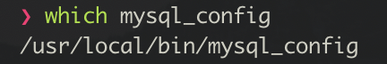

# 2018/11/21(수) - TIL

### 오늘 한 일

- Spring boot 보다는 Django를 이용하여 개발하는 것이 완성도가 더 높을 것이라 생각함

  - Django 안한지 너무 오래되어 다시 공부했다
  - 서버캠 플젝했을때는 1.10 버전을 사용했었는데, 어느새 2.1 버전이 나왔다

- mysql 

  - 괜히 strong password Encryption 쓰지 말고, 일단은 Legacy password를 쓰자

  - **pip3 install mysqlclient**

    ```shell
    Collecting mysqlclient
      Using cached mysqlclient-1.3.10.tar.gz
        Complete output from command python setup.py egg_info:
        Traceback (most recent call last):
    
        ----------------------------------------
    Command "python setup.py egg_info" failed with error code 1 ...(후략)...
    ```

    > 1월에 우분투에서 해결하느라 애먹었는데... 
    >
    > 이번엔 맥이...ㅠ___ㅠ

    ### 해결 방법 (OS X)

    1. mysql_config 파일 위치 찾기

    ```bash
    $ which mysql
    ```

    

    2. mysql_config 파일 해당 부분 변경

    ```shell
    $ vim /usr/local/bin/mysql_config
    ```

    - 기존 내용

    ```shell
    # on macOS, on or about line 112:
    # Create options
    libs="-L$pkglibdir"
    libs="$libs -l "
    ```

    - 하기와 같이 변경

    ```shell
    # Create options
    libs="-L$pkglibdir"
    libs="$libs -lmysqlclient -lssl -lcrypto"
    ```

    3. 하기 명령어 실행

    ```shell
    $ brew info openssl
    ```


### 	해결 방법 (Ubuntu)

​	