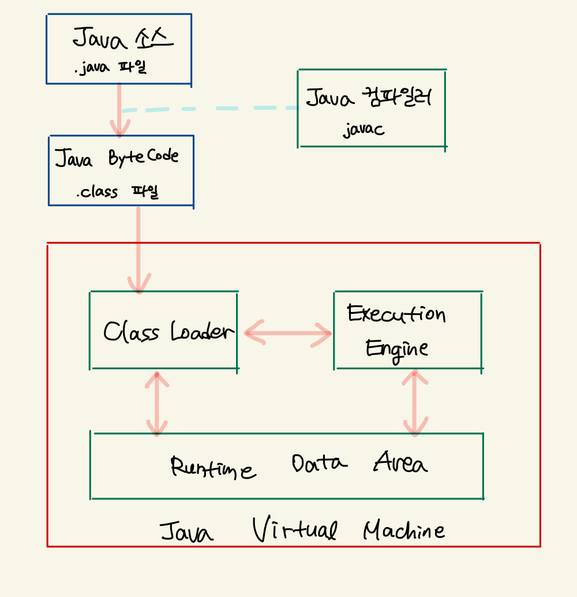

# 2023-05-27

### 키워드
- Java 프로그램 실행 과정
- Java Virtual Machine
- JVM / JDK / JRE
- JVM 구조
  - Class Loader

## Java 언어의 특징
1. 자바는 단순하고, 객체 지향이며, 친숙해야 한다
    - 자바에 대한 기본 컨셉을 배우는 것이 어렵지 않다
2. 자바는 견고하며, 보안상 안전하다 
3. 자바는 아키텍쳐에 중립적이어야 하며 포터블해야 한다
4. 자바는 높은 성능을 제공해야 한다
5. 자바는 인터프리트 언어이며, 쓰레드를 제공하고 동적인 언어이다

- 자바는 플랫폼에 구애를 받지 않고 개발이 가능하다
  - 구동되는 환경에 구애 받지 않고 실행될 수 있다
  - C 계열의 언어로 작성된 프로그램들은 Windows 환경에서 빌드되었다면 그 프로그램을 macOS나 linux로 가져가서 실행할 수 없다
  - 그러나, Java로 작성된 프로그램은 플랫폼에 맞는 JVM만 설치되어 있다면 문제없이 동작한다
- 자동으로 메모리를 관리해준다
  - Garbage Collection 이라는 개념을 통해 프로그램 메모리를 자동으로 관리해준다

## Java 프로그램 실행 과정

1. 자바 소스 코드를 작성한다 (`.java`)
2. 자바 소스 코드를 자바 컴파일러(`javac`) 를 통해 자바 바이트 코드 파일(`.class`) 로 컴파일한다 (JDK에서 이루어지는 일)
3. 컴파일 된 자바 바이트 코드 파일을 Runtime으로 가져가는 시점에 클래스 로더가 동작한다
4. 클래스 로더는 동적 로딩을 통해서 자바 바이트 코드를 런타임 데이터 영역에 로드한다 (JVM 메모리에 로드)
5. 실행 엔진은 JVM 메모리에 적재된 바이트 코드들을 명령어 단위로 읽어서 실행한다

## Java Virtual Machine
- 자바 가상 머신, 작성한 자바 프로그램이 수행되는 프로세스
- 자바 애플리케이션을 클래스 로더 (Class Loader) 를 통해 읽어 들여서 자바 API와 함께 실행한다
- 자바 바이트코드를 실행하고자 하는 모든 하드웨어에 JVM을 동작시킴으로써 자바 실행 코드를 변경하지 않고도 모든 종류의 하드웨어에서 동작되게 했다
- Oracle의 HotSpot JVM 외에도 IBM JVM 등 JVM 명세를 따른 다양한 밴더사의 JVM이 존재한다

> ### 가상 머신 (Virtual Machine)
> 프로그램을 실행하기 위해서 물리적 머신(컴퓨터) 와 유사한 머신을 소프트웨어로 구현한 것
> 자바는 원래 WORA를 구현하기 위해서 물리적인 머신과 별개의 가상 머신을 기반으로 동작하도록 설계되었다

## JVM 특징
1. 스택 기반의 가상 머신
   - JVM은 스택 기반으로 동작한다
2. 심볼릭 레퍼런스 (symbolic reference)
   - 기본 자료형을 제외한 모든 타입을 명시적인 메모리 주소 기반의 레퍼런스가 아닌 심볼릭 레퍼런스를 통해 참조한다
3. 가비지 컬렉션 (garbage collection)
   - 클래스 인스턴스는 사용자 코드에 의해 명시적으로 생성되고 가비지 컬렉션에 의해 자동으로 파괴된다
4. 기본 자료형을 명확하게 정의해서 플랫폼 독립성을 보장
   - C/C++은 플랫폼에 따라 int형의 크기가 변하지만, JVM은 기본 자료형을 명확하게 정의하여 호환성을 유지하고 플랫폼 독립성을 보장한다
5. 네트워크 바이트 오더 (network byte order)
   - 자바 클래스 파일은 빅 엔디안인 네트워크 바이트 오더를 사용해서 플랫폼 독립성을 유지한다 (고정된 바이트 오더를 유지해야 플랫폼 독립성을 유지할 수 있다)

## JVM  / JDK / JRE
### JVM
- Java Virtual Machine
- 자바 애플리케이션을 클래스 로더를 통해 읽어들여서 자바 API와 함께 실행한다

### JDK = JRE + 개발도구
- Java Development Kit
- 자바 개발에 사용되는 SDK
- JDK 내에는 자바 개발 시 필요한 라이브러리와 컴파일러, 디버거 등의 개발 도구들이 포함되어 있다
  
### JRE
- Java Runtime Environment
- 자바 실행만을 위한 환경의 집합으로, 얘만 설치하게되면 자바를 컴파일 하는 각종 프로그램이 제외된 상태로 설치된다
- 클래스 라이브러리, JVM 및 배포 도구가 포함되어 있다

## JVM 구조

- 클래스 로더 (Class Loader)가 컴파일된 자바 바이트코드를 런타임 데이터 영역(Runtime Data Area) 에 로드하고, 실행 엔진(Execution Engine)이 자바 바이트 코드를 실행한다

### 클래스 로더 (Class Loader)
- 자바는 동적 로드 특징을 가지고 있다
- 동적 로드를 담당하는 부분이 JVM 내 클래스 로더이다

> 동적 로드
> 컴파일 타임이 아닌 런타임에 클래스를 처음으로 참조할 때, 해당 클래스를 로드하고 링크하는 특징

### 클래스 로더의 특징
1. 계층 구조
2. 위임 모델
3. 가시성 (Visibility) 제한
4. 언로드 불가

#### 1. 계층 구조
- 클래스 로더끼리 부모-자식 관계를 이루어서 계층 구조로 생성된다
- 최상위 클래스 로더는 Bootstrap Class Loader 이다

> Bootstrap 클래스 로더
> JVM을 기동할 때 생성되며, Object 클래스들을 비롯하여 자바 API들을 로드한다
> HotSpot VM의 BOOTCLASSSPATH에서 클래스들을 로드한다

#### 2. 위임 모델
- 계층 구조를 바탕으로 클래스 로더끼리 로드를 위임하는 구조로 동작한다
- 클래스를 로드할 때 먼저 상위 클래스 로더를 확인해서 상위 클래스 로더에 있다면 해당 클래스를 사용하고, 없다면 로드를 요청받은 클래스 로더가 클래스를 로드한다

#### 3. 가시성 제한
- 하위 클래스 로더는 상위 클래스 로더의 클래스를 찾을 수 있지만, 상위 클래스 로더는 하위 클래스 로더의 클래스를 찾을 수 없다

#### 4. 언로드 불가
- 클래스 로더는 클래스를 로드할 수는 있지만 언로드 할 수는 없다
- 언로드 대신 , 현재 클래스 로더를 삭제하고 아예 새로운 클래스 로더를 생성하는 방법을 사용할 수 있다

### 클래스 로더 위임 모델
- 클래스 로더가 클래스 로드를 요청 받으면, 클래스 로더 캐시 -> 상위 클래스 로더 -> 자기 자신의 순서로 해당 클래스가 있는지 확인한다
- 이전에 로드된 클래스인지 클래스 로더 캐시를 확인하고, 없으면 상위 클래스 로더를 거슬러 올라가면서 확인한다
  - 부트스트랩 클래스 로더까지 확인해도 없다면 요청 받은 클래스 로더가 파일 시스템에서 해당 클래스를 찾는다

### 클래스 로드 단계
1. Loading : 클래스 파일을 메모리에 로드
2. Linking : 클래스 파일을 검증하고, static 필드를 생성 및 초기화 & 메서드 테이블을 할당한다
   1. Verifying
   2. Preparing
   3. Resolving
3. Initializing : static field 값들을 초기화한다

#### 1. Loading
- 주어진 클래스의 이름으로 클래스 패스에 있는 바이너리로 된 자바 클래스를 찾는다 
- 자바 클래스를 정의한다
- 해당 클래스를 나타내는 `java.lang` 패키지의 Class 클래스의 객체를 생성한다
- 클래스를 파일에서 가져와서 JVM의 메모리에 로드한다

#### 2-1. Linking - Verifying
- 읽어 들인 클래스가 자바 언어 명세 및 JVM 명세에 맞게 잘 구성되어 있는지 검사한다
- 이 부분이 가장 복잡하고 시간이 많이 걸린다

#### 2-2. Linking - Preparing
- 클래스가 필요로 하는 메모리를 할당하고, 클래스에서 정의된 필드, 메서드, 인터페이스들을 나타내는 데이터 구조를 준비한다

#### 2-3. Linking - Resolving
- 클래스의 상수 풀 내 모든 심볼릭 레퍼런스를 다이렉트 레퍼런스로 변경한다

#### 3. Initializing
- 클래스 변수들의 값을 코드에 명시된 값으로 초기화한다

## Reference
- https://d2.naver.com/helloworld/1230
