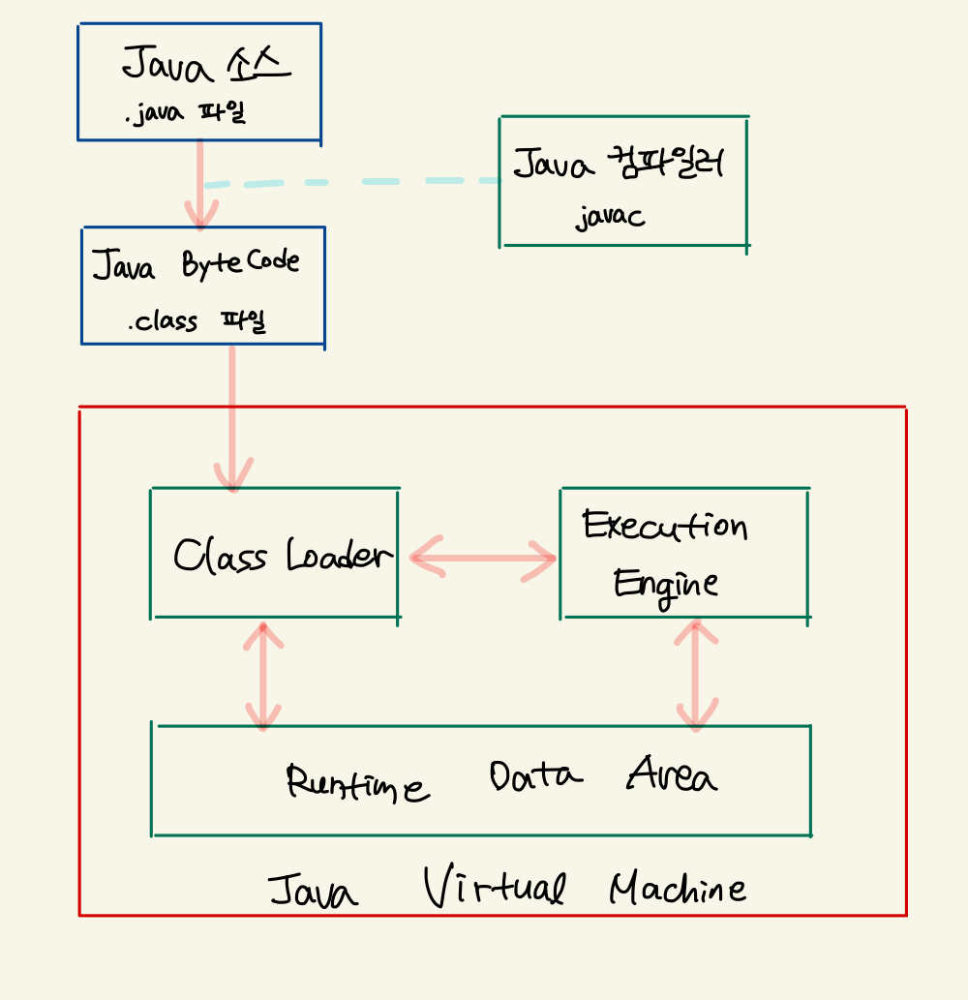

# 2023-05-28

## 키워드
- JVM의 런타임 데이터 영역
- 모든 스레드가 공유하는 영역
  - Method Area
  - Heap Area
  - Runtime Constant Pool
- 각 스레드마다 하나씩 생성되는 영역
  - PC 레지스터
  - JVM 스택
  - 네이티브 메서드 스택

## JVM 내 런타임 데이터 영역 (Runtime Data Area)
- JVM이 운영체제 위에서 실행되면서 할당받는 메모리 영역 

- 런타임 데이터 영역은 6개의 영역으로 나누어진다 
- 1 ~ 3은 모든 스레드가 공유하는 영역이다
- 4 ~ 6은 스레드마다 하나씩 생성되는 영역이다
    1. 힙 (Heap)
    2. 메소드 영역 (Method Area)
    3. 런타임 상수풀 (Runtime Constant Pool)
    4. PC 레지스터 (PC Register)
    5. JVM 스택 (JVM Stack)
    6. 네이티브 메서드 스택 (Native Method Stack)

## 메소드 영역 (Method Area)
- JVM이 시작할 때 생성되며 모든 스레드가 공유하는 영역이다
- 코드에서 사용되는 클래스 (`.class`) 를 클래스 로더로 읽어서 각 클래스와 인터페이스에 대한 아래 정보를 분류해서 저장한다
    - 런타임 상수 풀
    - field 데이터
    - 메소드 데이터
    - 메소드 코드
    - static 변수
    - 메서드의 byte code

- 메서드 영역은 JVM 벤더마다 다양한 형태로 구현할 수 있다
- 메서드 영역에 대한 가비지 컬렉션은 JVM 벤더의 선택 사항이다

## Heap Area
- 객체와 배열이 생성되는 영역이다 (인스턴스 또는 객체를 저장하는 공간)
- **가비지 컬렉션** 대상이다
  - 힙 영역에 생성된 객체와 배열은 JVM 스택 영역의 변수나 다른 객체의 필드에서 참조한다
  - 만약, 참조하는 변수나 필드가 없으면, 의미 없는 객체가 되어서 쓰레기로 취급한다
  - JVM은 **Garbage Collector**를 실행시켜서 쓰레기 객체를 힙 영역 내에서 자동으로 제거한다
  - GC 덕분에 개발자는 객체를 제거하기 위한 별도 코드를 작성할 필요가 없다
  - 자바에서는 코드로 객체를 직접 제거시키는 방법을 제공하지 않는다

## Runtime Constant Pool
- 클래스 파일 포맷에서 `constant_pool` 테이블에 해당하는 영역이다
- 메서드 영영에 포함되는 영역이지만, JVM 동작에서 핵심적인 역할을 수행하는 부분이다
- 각 클래스와 인터페이스의 상수뿐만 아니라, 메서드와 필드에 대한 모든 레퍼런스까지 담고있는 테이블이다
- 어떤 메서드나 필드를 참조할 때, JVM은 런타임 상수 풀을 통해 해당 메서드나 필드의 실제 메모리상 주소를 찾아서 참조한다

## PC Register
- PC(Program Counter) 레지스터는 각 스레드마다 하나씩 존재하며 스레드가 시작될 때 생성된다
- PC 레지스터는 현재 수행 중인 JVM 명령의 주소를 갖는다

## JVM Stack
- 각 스레드마다 하나씩 존재하며, 스레드가 시작될 때 생성된다
- Stack Frame이라는 구조체를 저장하는 스택이다
- 자바 프로그램 내에서 추가적으로 스레드 생성하지 않았으면
  - main 스레드만 존재 → JVM Stack도 한 개
- JVM 스택은 메소드 호출할 때 마다,
  - **프레임 (Frame)**을 추가 (push)한다
  - 메소드 종료 시, 해당 프레임 제거 (pop) 한다
- 예외 발생 시, printStackTrace() 메소드로 보여주는 Stack Trace의 각 라인 → 하나의 프레임을 표현한다
- 프레임 내부
  - 로컬 변수 스택
    - 기본 타입 변수나 참조 타입 변수가 추가 되거나 제거된다
    - 언제 추가 및 제거?
      - 변수 초기화 시에 추가 (최초로 변수에 값이 저장될 때) 된다
      - 선언된 블록을 벗어나면 스택에서 제거된다
     - 기본 타입 변수
       - 스택 영역에 직접 값을 가진다
     - 참조 타입 변수
       - 힙 영역이나 메소드 영역의 객체 주소를 가진다

## Native Method Stack
- 자바 외의 언어로 작성된 네이티브 코드를 위한 스택이다
- JNI (Java Native Interface) 를 통해 호출하는 C/C++ 코드를 수행하기 위한 스택이다

## Reference
- https://d2.naver.com/helloworld/1230
