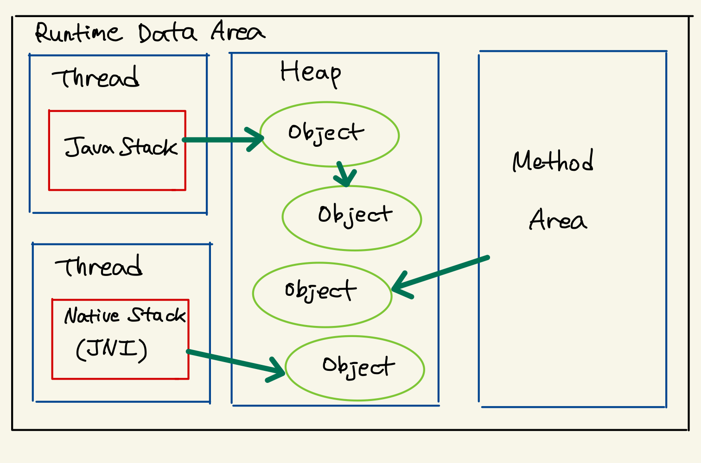
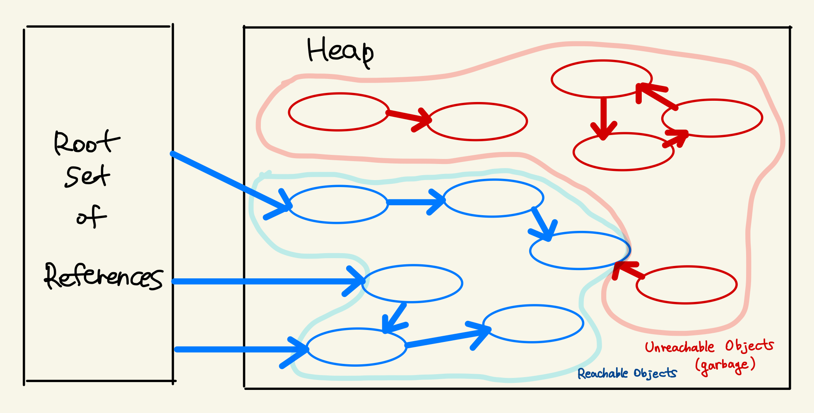
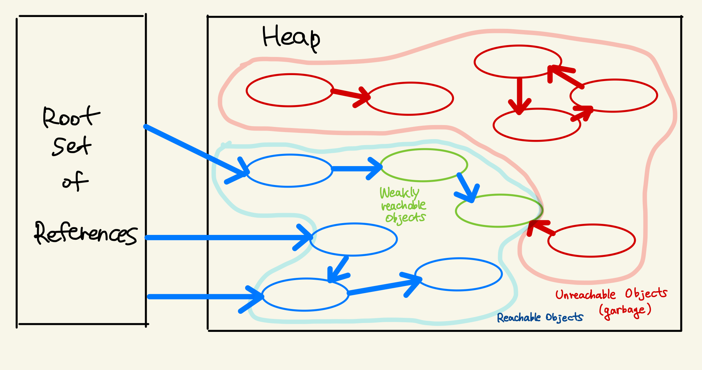

# 2023-05-31

### 📌 학습 계획
- Garbage Collector
  - GC Root
  - Mark & Sweep

### ✏️ TIL
- Garbage Collector
  - GC Root
  - GC Reachability
  - Mark & Sweep

## Garbage Collector
### GC의 전제조건
- `weak generational hypothesis`

- Garbage Collector가 공통적으로 수행하는 작업 2가지
1. Heap 내의 객체 중에서 가비지를 찾아낸다
2. 찾아낸 가비지를 처리해서 힙의 메모리를 회수한다

- 최초의 Java에서는 GC 작업에 애플리케이션의 사용자 코드가 관여하지 않도록 구현되어 있었다. 
- 그러나, 더 다양한 방법으로 객체를 처리하고자 하여 JDK 1.2부터는 `java.lang.ref` 패키지를 추가해서 제한적이나마 사용자 코드와 GC가 상호작용할 수 있게 하고 있다 

- `java.lang.ref` 패키지는 전형적인 객체 참조인 strong reference 이외에도
  - soft
  - weak
  - phantom
등 3가지의 새로운 참조 방식을 각각의 Reference 클래스로 제공한다

## GC와 Reachability
- Java GC는 객체가 가비지인지 아닌지 판별하기 위해서 `reachability` 라는 개념을 사용한다

### Reachability
- `Reachable` : 어떤 객체에 유효한 참조가 있다
- `Unreachable` : 유효한 참조가 없다

- `unreachable` 객체를 가비지로 간주해서 GC를 수행한다
- 한 객체는 여러 다른 객체를 참조하고, 참조된 다른 객체들도 마찬가지로 또 다른 객체들을 참조할 수 있으므로 객체들은 참조 사슬을 이룬다
- 이런 경우, 유효한 참조가 무엇인지 어떻게 파악해야 할까??
  - 항상 유효한 최초의 참조인 `root set` 을 보면 된다

## GC Root
- 가비지 컬렉터 프로세스의 시작점
- 일반적으로, GC 루트에서 직접 또는 간접적으로 참조되는 모든 개체는 가비지 컬렉션 대상이 아니다

### GC Root 유형
- 클래스 
- 로컬 스택
- 실행중인 자바 스레드
- JNI 참조


*출처 : https://d2.naver.com/helloworld/329631의 그림 1을 참고하여 그린 그림*

- 위의 그림에서, 힙에 있는 객체들에 대한 참조는 아래 4가지 종류 중 하나이다
1. 힙 내 다른 객체에 의한 참조
2. Java 스택, 즉 Java 메서드 실행 시에 사용하는 지역 변수와 파라미터들에 의한 참조
3. 네이티브 스택, 즉 JNI에 의해 생성된 객체에 의한 참조
4. 메서드 영역의 정적 변수에 의한 참조

- 이 중 첫번째 경우인 `힙 내 다른 객체에 의한 참조` 를 제외한 나머지 3개가 root set이다
- 결국 이게 `reachability` 를 판가름하는 기준이 된다

### Root set과 힙 내 개체를 중심으로 하는 Reachability

- root set으로부터 시작한 참조 사슬에 속한 객체들은 `reachable` 객체이다
- 이 참조 사슬과 무관한 객체들은 `unreachable` 객체로, GC 대상이다
- 만약, `reachable` 객체를 참조하더라도, 다른 `reachable` 객체가 해당 객체를 참조하지 않는다면 그 객체는 `unreachable` 객체이다

## Soft, Weak, Phantom Reference
```java
WeakReference<Sample> wr = new WeakReference<Sample>(new Sample());
Sample ex = wr.get();
...
ex = null;
```
- Sample 객체는 오직 WeakReference 내부에서만 참조된다 => `weakly reachable` 상태
- Reference Object에 의해 참조된 객체는 `referent`
  - `new WeakReference()` 생성자로 생성된 객체는 `reference object`이고
  - `new Sample()` 생성자로 생성된 객체는 `referent` 이다

## Reference와 Reachability

- 중간의 녹색 두 객체는 WeakReference로만 참조된 `weakly reachable` 객체이다
- 파란색 객체는 `strongly reachable` 객체이다
- GC가 동작할 때, `unreachable` 객체 뿐만아니라 `weakly reachable` 객체 또한 가비지 객체로 간주되어서 메모리에서 회수된다
- root set으로부터 시작된 참조 사슬에 포함되어 있음에도 불구하고 GC가 동작할 때 회수된다
- GC가 동작해서 어떤 객체를 `weakly reachable` 객체로 판명하면 -> GC는 WeakReference 객체에 있는 `weakly reference` 객체에 대한 참조를 **null**로 설정한다
- 그래서 이에 따라 `weakly reachable` 객체는 `unreachable` 객체와 마찬가지 상태가 되고, 가비지로 판명된 다른 객체들과 함께 메모리 회수 대상이 된다! 

## Mark & Sweep
1. Mark 단계 : 위에서 본 GC Root에서 시작해서 이 Root가 참조하는 모든 오브젝트, 또한 그 오브젝트들이 참조하는 다른 오브젝트들을 탐색해 내려가면서 *Mark* 한다
2. Sweep 단계 : Mark가 끝나면 가비지 컬렉터는 힙 내부 전체를 돌면서 Mark되지 않은 메모리들을 해제한다

## Reference
- https://www.baeldung.com/java-gc-roots
- https://d2.naver.com/helloworld/329631
- https://velog.io/@cham/JAVA-GCGarbage-Collector
