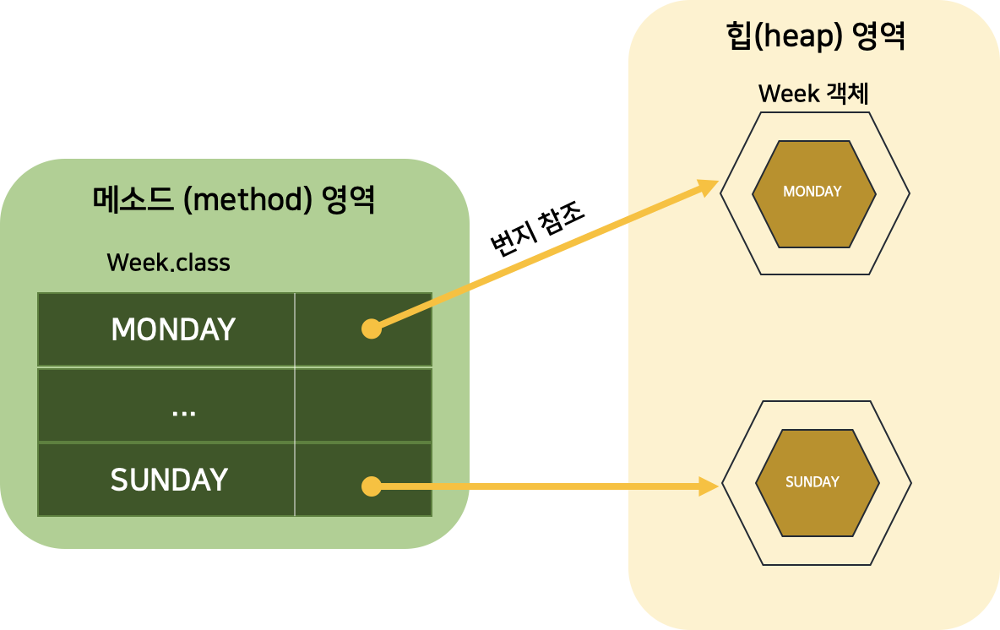
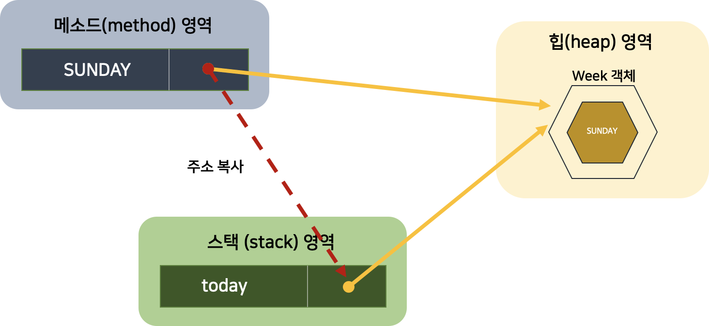
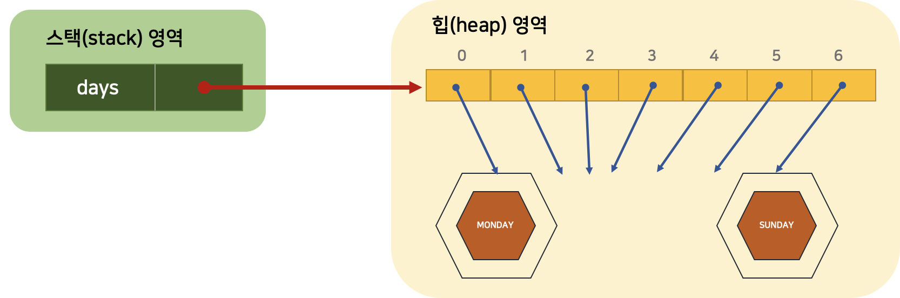

# EnumerationType (열거 타입)

## 학습 목표

#### 1. 열거 타입이 무엇인지 안다.

#### 2. 열거 타입의 선언과 열거 상수에 대해 안다.

#### 3. 열거 객체의 메소드 (java.lang.Enum 클래스에 선언된 메소드)를 이용할 수 있다.

[TOC]

## 열거 타입 (Enumeration Type)

- 한정된 값만을 갖는 데이터 타입
  - 요일에 대한 데이터 (월, 화, 수, 목, 금, 토, 일)
  - 계절에 대한 데이터 (봄, 여름, 가을, 겨울)
- 몇 개의 열거 상수 중 하나의 상수를 저장하는 데이터 타입


## 1. 열거 타입 선언

- 열거 타입 소스 파일은 첫 문자를 대문자로하고 나머지는 소문자로 구성

```java
public enum 열거타입이름 { ... }
```

- 열거 타입을 선언하기 위한 키워드
- 열거 상수 선언

```java
public enum Week  { MONDAY, TUESDAY, WEDNESDAY, THURSDAY, FRIDAY, ... }
```


## 2. 열거 타입 변수

```java
열거타입 변수;

Week today;
Week reservationDay;
```

- 열거 상수는 단독으로 사용 불가능
- 반드시 열거타입.열거상수 로 사용해야 함

```java
열거타입 변수 = 열거타입.열거상수;
Week today = Week.SUNDAY;
```

- 열거 타입도 참조 타입이기 때문에 `null` 저장 가능

  ```java
  Week birthday = null;
  ```

- 열거 상수 = 객체



```java
Week today = Week.SUNDAY;
```

- 열거 타입 변수 today는 스택 영역에 생성됨
- today에 저장되는 값 :  Week.SUNDAY 열거 상수가 참조하는 객체의 번지
- 열거 상수 Week.SUNDAY 와 today 변수는 서로 같은 Week 객체를 참조하게 됨



```java
Week week1 = Week.SATURDAY;
Week week2 = Week.SATURDAY;
System.out.println(week1 == week2); // true
```


## 3. 열거 객체의 메소드 - java.lang.Enum 클래스에 선언된 메소드

- 열거 객체 : 열거 상수의 문자열을 내부 데이터로 가짐
- 모든 열거 타입 - 컴파일 시 Enum 클래스를 상속하게 됨

| 리턴 타입 | 메소드(매개 변수)    | 설명                                  |
| --------- | -------------------- | ------------------------------------- |
| String    | name()               | 열거 객체의 문자열을 리턴             |
| int       | ordinal()            | 열거 객체의 순번 (0부터 시작)을 리턴  |
| int       | compareTo()          | 열거 객체를 비교해서 순번 차이를 리턴 |
| 열거 타입 | valueOf(String name) | 주어진 문자열의 열거 객체를 리턴      |
| 열거 배열 | values()             | 모든 열거 객체들을 배열로 리턴        |

### 1. name() 메소드

- 열거 객체가 가지고 있는 문자열을 리턴

  - 리턴되는 문자열 : 열거 타입을 정의할 때 사용한 상수 이름과 동일

  ```java
  Week today = Week.SUNDAY;
  String name = today.name(); // name은 SUNDAY
  ```

### 2. ordinal() 메소드

- 전체 열거 객체 중 몇 번째 열거 객체인지 알려줌

- 열거 타입을 정의 할 때 주어진 순번 리턴

  ```java
  Week today = Week.SUNDAY;
  int ordinal = today.ordinal(); // ordinal은 6
  ```

### 3. compareTo() 메소드

- 매개값으로 주어진 열거 객체를 비교해서 순번 차이를 리턴

- 열거 객체가 매개값의 열거 객체보다 순번이 빠르다 → 음수 리턴

- 열거 객체가 매개값의 열거 객체보다 순번이 늦다     → 양수 리턴

  ```java
  Week day1 = Week.MONDAY; // 0
  Week day2 = Week.WEDNESDAY; // 2
  int result1 = day1.compareTo(day2); // -2
  int result2 = day2.compareTo(day1); // 2
  ```

### 4. valueOf() 메소드

- 매개값으로 주어지는 문자열과 동일한 문자열을 가지는 열거 객체를 리턴

  ```java
  Week weekDay = Week.valueOf("SATURDAY"); // weekDay 변수는 Week.SATURDAY 열거 객체를 참조하게 됨
  ```

### 5. values() 메소드

- 열거 타입의 모든 열거 객체들을 배열로 만들어 리턴

  ```java
  Week[] days = Week.values();
  for (Week day : days) {
  		System.out.println(day);
  }
  ```

  

  - Week 배열은 다음과 같이 생성됨
    - 배열의 인덱스는 열거 객체의 순번과 같고,
    - 각 인덱스 값은 해당 순번의 열거 객체 번지임

```java
/* 열거 객체의 메소드 */
public class EnumMethodExample {
    public static void main(String[] args) {
        // name() 메소드
        Week today = Week.SUNDAY;
        String name = today.name();
        System.out.println(name);

        int ordinal = today.ordinal();
        System.out.println(ordinal);

        Week day1 = Week.MONDAY;
        Week day2 = Week.WEDNESDAY;
        int result1 = day1.compareTo(day2);
        int result2 = day2.compareTo(day1);
        System.out.println(result1);
        System.out.println(result2);

        if (args.length == 1) {
            String strDay = args[0];
            Week weekDay = Week.valueOf(strDay);
            if (weekDay == Week.SATURDAY || weekDay == Week.SUNDAY) {
                System.out.println("주말");
            } else {
                System.out.println("평일");
            }
        }

        Week[] days = Week.values();
        for (Week day : days) {
            System.out.println(day);
        }
    }
}
/*Result
    SUNDAY
    6
    -2
    2
    주말
    MONDAY
    TUESDAY
    WEDNESDAY
    THURSDAY
    FRIDAY
    SATURDAY
    SUNDAY
 */
```