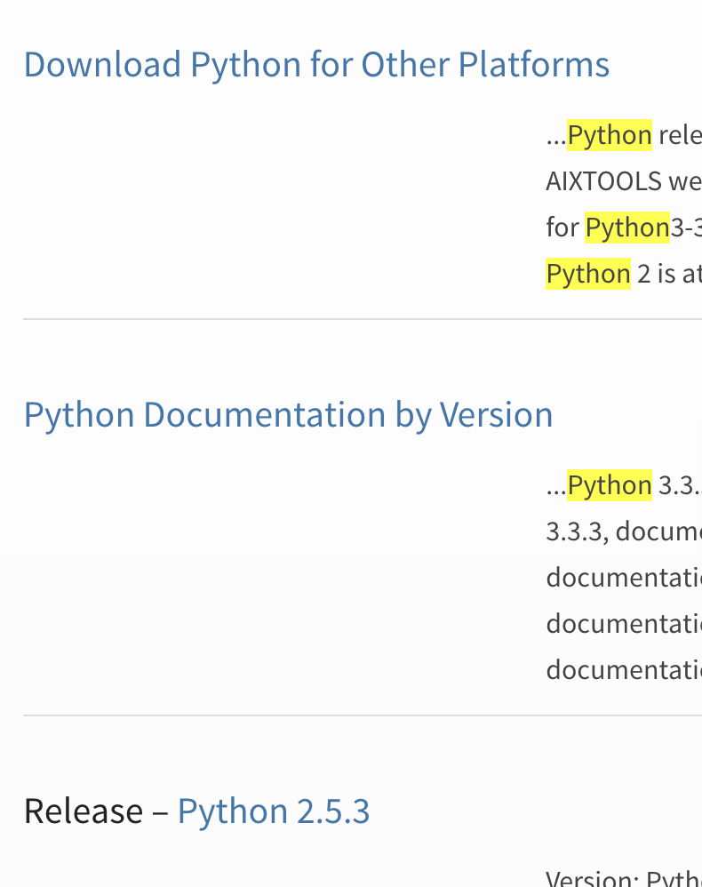
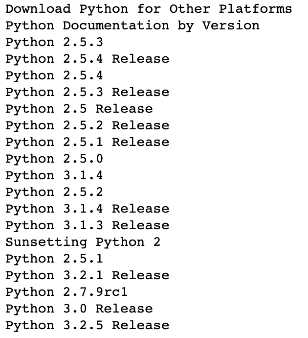

# 5. Selenium 기본 사용법 2

### 1. Selenium 로드

```python
from selenium import webdriver
from selenium.webdriver.common.keys import Keys
import time

chromedriver = '/usr/local/Cellar/chromedriver/chromedriver'
driver = webdriver.Chrome(chromedriver)
```


### 2. Crawling 사이트 호출 및 확인

```python
# 크롤링 할 사이트 호출
driver.get("http://www.python.org")

# Selenium은 웹 테스트를 위한 프레임워크로 다음과 같은 방식으로 웹 테스트를 자동으로 진행함 (참고)
assert "Python" in driver.title
```

- assert로 driver.page_source 에서 특정 키워드 확인하기
- time.sleep() 함수로 일정 시간 브라우저 내용 확인할 수 있도록 하기
- driver.quit() 함수로 브라우저 끝내기

```python
assert "No result found." not in driver.page_source

# 명시적으로 일정 시간을 기다릴 수 있음 (10초 기다림)
time.sleep(10)

# 크롬 브라우저 닫기 가능
driver.quit()
```

- 크롤링 사이트 정보 확인
  - 사이트 주소 : driver.current_url
  - 사이트 타이틀 : driver.title


- 데이터 가져오기 주요 함수

  - find_element_by_name() : 최초 발견한 name으로 가져오기

  - find_elements_by_name() : name이 동일한 모든 리스트를 가져오기

    ```python
    # <input id="id-search-field" name="q" 검색창 name으로 검색하기
    # 태그 name으로 특정한 태그를 찾을 수 있음
    elem = driver.find_element_by_name("q")
    ```

    > find_elements_ 와 같이 elements로 호출할 경우, 일치되는 모든 데이터 리스트를 가져옴
    >
    > - find_element_by_id
    > - find_element_by_name
    > - find_element_by_tag_name
    > - find_element_by_class_name
    > - find_element_by_css_selector
    > - find_element_by_xpath(XPATH 문법 이해 필요)


- 브라우저 컨트롤

  - clear() : input 텍스트 초기화 하기

  - send_keys(키워드) : 키보드 입력값 전달하기

    - Keys.RETURN - 엔터키
    - dir(Keys) 로 키에 대응되는 이름 찾기

    ```python
    # input 텍스트 초기화
    elem.clear()
    
    # 키 이벤트 전송
    elem.send_keys("python")
    
    # 엔터 입력
    elem.send_keys(Keys.RETURN)
    ```


- assert로 driver.page_source 에서 특정 키워드 확인하기

- time.sleep() 함수로 일정 시간 브라우저 내용 확인 할 수 있도록 하기

- driver.quit() 함수로 브라우저 끝내기

  ```python
  assert "No result found." not in driver.page_source
  
  time.sleep(10)
  driver.quit()
  ```


- find_element_by_css_selector

  ```python
  data = driver.find_elements_by_css_selector("#content > div > section > form > ul > li > h3 > a")
  for item in data:
      print(item.text)
  ```






