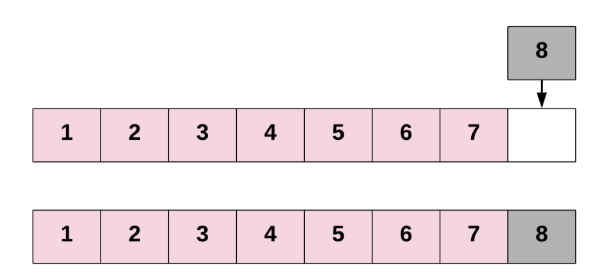
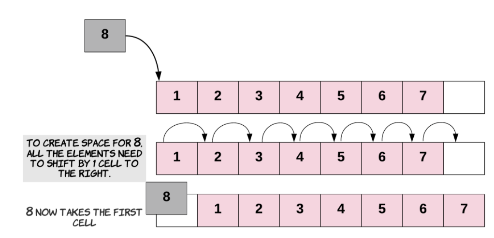
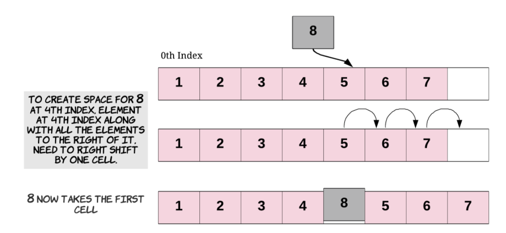

# Array

  배열은 다수의 비슷한 아이템을 저장하는데 적합한 간단한 자료구조이다. 모든 프로그래밍 언어에서 지원하는 데이터 타입이며, 거의 모든 자료구조들이 배열을 사용하여 구현된다.

## 학습 목표

1. 배열이란 무엇인지에 대해 안다
2. 배열의 기본 특성에 대해 안다
3. 기초 배열 연산을 구현한다
4. 배열을 이용한 간단한 프로그래밍 기술을 안다

## What is an Array?

  배열은 여러 개의 동일한 데이터 타입의 데이터를 한 번에 만들 때 사용된다. 배열은 연속된 공간을 할당받기 때문에 데이터 처리 속도가 빠르다는 장점을 가지고 있다.

### Creating an Array

  컴퓨터에서 배열은 `N` 개의 아이템을 저장할 수 있는데, 여기서의 `N` 은 프로그래머가 배열 생성 시점에 결정한다. 또한, 배열을 생성할 때는 배열에 담길 아이템의 타입을 지정해주어야 한다.

```
타입 배열의이름[N];
```

```java
int arr[6];
```


#### DVD 클래스와 15개의 DVD를 담을 수 있는 DVD 배열 생성 예제

```java
// DVD를 담을 배열 생성
DVD[] dvdCollection = new DVD[15];
```

#### DVD 클래스

```java
public class DVD {
    public String name;
    public int releaseYear;
    public String director;

    public DVD(String name, int releaseYear, String director) {
        this.name = name;
        this.releaseYear = releaseYear;
        this.director = director;
    }

    public String toString() {
        return (this.name + " , directed by " + this.director + " , released in " + this.releaseYear);
    }
}
```

- 배열의 크기가 15인 `dvdCollection` 배열을 선언 후 생성하였다
  - 각 공간에 하나씩의 DVD를 가지고 있을 수 있고, 배열이 생성된 직후에는 배열 안에 DVD가 당연히 없다
  - 개발자가 직접 배열에 DVD를 넣어주어야 한다
  - 크기가 15이기 때문에, 15개의 DVD까지만 저장할 수 있고, 만약 16번째 DVD를 저장하고자 한다면, 새로운 배열을 생성해야 한다
- 배열의 공간을 모두 사용한 경우에 어떻게 다뤄야 하는지는 이후에 살펴보자

> 처음 배열의 크기를 굉장히 크게 주면 어떨까?
>
> - 적은 수의 요소들을 저장하기 위해 배열의 크기를 처음부터 너무 크게 주는 것은 컴퓨터 메모리 사용에 있어서 굉장히 비효율적이다
> - 따라서, 터무니없이 배열의 크기를 크게 주지 않는다


## Accessing Elements in Arrays

  배열의 대표적인 두 가지 연산은 아래와 같다. 배열의 다른 연산들은 이 두 가지 기초적인 연산을 바탕으로 이루어진다.

1. 배열에 요소를 저장한다
2. 배열에 저장된 요소를 읽어온다


### 1. Writing Items into an Array

  배열 안에 요소를 저장하기 위해서는, 배열의 어디에 저장할지를 결정해야 한다. 배열의 각 공간은 `0` 부터 `N-1` 의 범위를 가지는 숫자를 이용하여 특정할 수 있다. 첫번째 공간은 `0`, 두번째 공간은 `1` ... 이렇게 나아가며, 마지막 15번째 공간은 `14` 라는 숫자를 이용하여 접근할 수 있다. 여기서 사용되는 배열의 공간을 특정하는 이 숫자를 우리는 `index` 라고 부른다.

**DVDCollection 배열의 8번째 공간에 아이템을 저장해보자**

```java
DVD avengersDVD = new DVD("The Avengers", 2012, "Joss Whedon"); // DVD 객체 생성

dvdCollection[7] = avengersDVD; // 8번째 공간에 avengers 저장
```

- index를 가지고 배열에 아이템을 저장할 수 있다
- 배열에 다른 DVD를 더 저장해보자

```java
DVD incrediblesDVD = new DVD("The Incredibles", 2004, "Brad Bird");
DVD findingDoryDVD = new DVD("Finding Dory", 2016, "Andrew Stanton");
DVD lionKingDVD = new DVD("The Lion King", 2019, "Jon Favreau");

dvdCollection[3] = incrediblesDVD;
dvdCollection[9] = findingDoryDVD;
dvdCollection[2] = lionKingDVD;
```


- 만약, 이미 `incrediblesDVD` 가 저장된 4번째 공간에 다른 DVD를 저장하면 어떻게 될까?

  ```java
  DVD starWarsDVD = new DVD("Star Wars", 1977, "George Lucas");
  dvdCollection[3] = starWarsDVD;
  ```

  - `dvdCollection` 배열의 4번째 공간에 `starWarsDVD` 를 저장하였기 때문에 이제 더 이상 `incrediblesDVD` 는 해당 배열에 저장되어있지 않게 된다 (덮어쓰여지게 됨)

### 2. Reading Items from an Array

  배열의 특정 인덱스에 어떤 아이템이 들어있을까?

```java
System.out.println(dvdCollections[7]);
System.out.println(dvdCollections[10]);
System.out.println(dvdCollections[3]);

/*
The Avengers, directed by Joss Whedon, released in 2012
null
Star Wars, directed by George Lucas, released in 1977
*/
```

- 특정 index 를 통해서 배열 내 아이템에 접근할 수 있다
- Java에서는 항상 배열을 선언 시, 아래와 같은 값으로 초기화한다
  - 객체 배열인 경우 : null로 초기화
  - primitive type : 해당 타입의 default 값으로 초기화


### 3. Writing Items into an Array with a Loop

  배열에 다수의 값을 저장할 때는 흔히 반복문을 이용한다. 아래 예제를 통해 반복문을 이용하여 배열에 값을 저장하는 방법을 살펴보자.

```java
int squareNumbers = new int[10];

for (int i=0; i<10; i++) {
		int square = (i + 1) * (i + 1);
		squareNumbers[i] = square;
}
```

- 반복문을 통해 i 번째 인덱스에 값을 저장하는 것을 확인할 수 있다


### 4. Reading Items from an Array with a Loop

  반복문을 이용하여 배열에 값을 저장했던 것처럼, 값을 읽어올 수도 있다.

```java
for (int i=0; i<10; i++) {
		System.out.print(squareNumbers[i] + " ");
}

/*
1 4 9 16 25 36 49 64 81 100
*/
```

```java
for (int square : squareNumbers) {
		System.out.print(square);
}
```


## Array Capacity VS Length

  만약 누군가가 DVD 배열의 길이가 얼마인지 묻는다면 어떻게 대답할 것인가?

1. 배열이 담을 수 있는 DVD의 최대 개수
2. 현재 배열에 담겨있는 DVD의 개수

  위의 두 답변 모두 맞지만, 의미가 조금 다르다. 첫번째는 배열의 용량 (capacity) 이라 칭하고, 두번째는 배열의 길이 (length)

라고 한다.


### 1. Array Capacity

```java
DVD[] array = new DVD[6]
```

   `array[6]` 나 `array[10]` 에 요소를 저장하고자 하는 것은 올바른 연산일까? 두 가지 모두 배열의 용량을 벗어난 연산이기에 올바르지 않다. 왜냐하면, `array` 배열은 6개의 요소만을 저장할 수 있도록 선언했기 때문이다. 여기서 주목해야 할 속성이 **capacity**이다. **Capacity**, 배열의 용량은 해당 배열이 생성될 때 결정되는 배열의 크기이다. 위의 array의 capacity는 6이라고 할 수 있다. 만약, `array[-3]` 과 같이 접근하고자 한다면, `ArrayIndexOutOfBoundsException` 을 마주할 수 밖에 없다.

#### capacity

- 배열의 capacity는 배열이 생성될 때 결정되는 특성이고, 이후에 변하지 않는다

- 만약, 배열의 capacity를 늘리고 싶다면, 배열 자체를 새로 생성해야 한다

- Java에서 배열의 용량은 `length` 속성을 이용하여 확인 할 수 있다

  ```java
  int capacity = array.length;
  System.out.println("The Array has a capacity of " + capacity);
  // The Array has a capacity of 6
  ```


### 2. Array Length

  배열의 길이는 현재 배열 안에 있는 요소의 개수라고 생각하면 된다. Length는 결국 개발자가 트래킹해야 하는 값이다.

다음은 배열의 length를 얻는 예제이다

```java
int[] array = new int[6];

int length = 0;

for (int i=0; i<3; i++) {
		array[i] = i * i;
		length++;
}

System.out.println("The Array has a capacity of " + array.length);
System.out.println("The Array has a length of " + length);
// The Array has a capacity of 6
// The Array has a length of 3
```


### 3.Handling Array Parameters

  배열의 인덱스는 항상 `0`부터 시작하기 때문에, 배열의 가장 최고의 인덱스는 `.length - 1` 이다. 그러므로, 배열을 순회하려면, 다음과 같이 반복을 하면 된다.

```java
class Solution {
		public int findMaxConsecutiveOnes(int[] nums) {
				for (int i=0; i<nums.length; i++) {
						// Do something
				}
		}
}
```


## Basic Array Operations

  배열은 위에서 배웠듯이 데이터를 특정한 형태로 저장하고, 데이터가 저장되는 데 있어 특정 연산을 지원하는 자료 구조이다. DVD 인벤토리 관리를 생각해보면서 배열을 이용하여 수행할 수 있는 연산을 알아보자.

1. Insert(삽입) : 특정 위치에 새로운 DVD를 넣는다.
2. Delete(삭제) : 이미 있는 DVD 묶음에서 특정 DVD를 제거한다.
3. Search(검색) : DVD 묶음에서 특정 DVD를 찾는다. 

위와 같은 3개의 연산을 배열의 기본 연산이라고 한다. 이 연산들은 거의 모든 자료구조에서 지원되는 연산이니 잘 기억해두자.


## Array Insertions (배열의 삽입 연산)

  이전 챕터에선, 배열에 요소를 어떻게 쓰는지 알아보았다.

배열에 새로운 요소를 삽인하는 것은 아래와 같이 여러가지 형태를 띈다.

1. 배열의 끝에 새로운 요소를 삽입한다.
2. 배열의 맨 처음에 새로운 요소를 삽입한다.
3. 배열의 특정 인덱스에 새로운 요소를 삽입한다.


### 1. Inserting at the End of an Array

  여기서 의미하는 배열의 끝에 새로운 요소를 넣는 연산은 할당된 배열의 맨 마지막 인덱스에 새로운 요소를 넣는 것이 아닌, 배열에 현재 저장되어 있는 요소들의 뒤에 새로운 요소를 삽입한다는 의미이다. 이전에 보았던 현재 배열 안에 있는 요소의 개수를 `length` 변수를 통해 계산하면 되므로, 계산 중이었던 `length` 의 위치에 새로운 요소를 저장하면 된다.



[출처] : https://leetcode.com/explore/learn/card/fun-with-arrays/525/inserting-items-into-an-array/3244/

아래 코드를 보자. 아래 코드는 6개의 아이템을 저장할 수 있는 새로운 배열을 만들고, 배열의 처음 3개 아이템에 값을 넣었다.

```java
int intArray = new int[6];
int length = 0;

for (int i=0; i<3; i++) {
		intArray[length] = i;
		length++;
}
```

배열을 출력해보면 그 결과를 알 수 있다.

```java
for (int i=0; i<intArray.length; i++) {
		System.out.println("Index " + i + "contains " + intArray[i]);
}
/**
Index 0 contains 0
Index 1 contains 1
Index 2 contains 2
Index 3 contains 0
Index 4 contains 0
Index 5 contains 0
*/

```

> 배열 인덱스 3 ~ 5에 해당하는 값들이 왜 다 `0` 인걸까? 지금 우리는 인덱스 3 ~ 5에 대해서는 아무것도 한 것이 없는 데 말이다.
>
> - 그 이유는 바로 `Java` 에서 `int` 배열을 생성하면 초기값을 `0` 으로 주기 때문이다. 자바에서는 모든 primitive 타입 배열을 생성할 시, 각 타입의 기본값으로 초기화한다.

이제 배열의 4번째 요소에 10을 넣어보자.

```java
intArray[length] = 10;
length++;
```

이렇게 해서 다시 배열을 출력해보면, 아래와 같은 결과가 나온다.

```java
for (int i=0; i<intArray.length; i++) {
		System.out.println("Index " + i + "contains " + intArray[i]);
}
/**
Index 0 contains 0
Index 1 contains 1
Index 2 contains 2
Index 3 contains 10
Index 4 contains 0
Index 5 contains 0
*/
```


### 2. Inserting at the Start of an Array

  배열의 맨 앞에 새로운 요소를 삽입하려면, 맨 앞에 요소를 추가할 공간을 마련하기 위해 배열의 다른 모든 요소들을 오른쪽으로 한 칸씩 옮겨야한다. 이렇게 다른 요소들을 한 칸씩 옮기는 작업 자체가 굉장히 비용이 많이 드는 연산인데, 배열에 존재하는 모든 요소들을 오른쪽으로 한 칸씩 밀어야 하기 때문이다. 모든 아이템들을 오른쪽으로 이동하는 연산 자체가 상수 시간 안에 끝나는 연산이 아니다. 배열의 맨 앞에 요소를 삽입하는 연산은 배열의 길이에 비례한다. 시간 복잡도로 말하자면, 선형 시간 복잡도 즉, `O(N)` 이다. 여기서 `N` 은 배열의 길이를 의미한다.



[출처] : https://leetcode.com/explore/learn/card/fun-with-arrays/525/inserting-items-into-an-array/3244/

아래의 코드를 보자. 아래 코드는 배열의 맨 앞에 20이라는 값을 삽입하기 위한 코드이다.

```java
for (int i = 3; i >= 0; i--) {
		intArray[i+1] = intArray[i];
}

intArray[0] = 20;
```

1. 먼저 배열에 존재하는 모든 요소들을 오른쪽으로 한 칸씩 이동한다
2. 이후 배열의 맨 앞에 20이라는 값을 넣는다.

배열을 출력해보면 아래와 같은 결과가 나온다.

```java
for (int i=0; i<intArray.length; i++) {
		System.out.println("Index " + i + "contains " + intArray[i]);
}
/**
Index 0 contains 20
Index 1 contains 0
Index 2 contains 1
Index 3 contains 2
Index 4 contains 10
Index 5 contains 0
*/
```


### 3. Inserting Anywhere in the Array

  배열의 맨 앞에 요소를 추가하는 것과 비슷하게, 배열의 특정 인덱스에 값을 삽입하는 연산도 먼저 해당 인덱스 이후의 요소들을 오른쪽으로 이동하여 새로운 값이 들어갈 공간을 만들어야한다. 새로운 요소를 넣기위한 공간이 만들어지면, 주어진 인덱스에 값을 넣으면 끝이다. 잘 생각해보면, 배열의 가장 맨 앞에 값을 삽입하는 것은 주어진 인덱스에 새로운 요소를 삽입하는 것의 경우 중 하나라고 볼 수 있다. 주어진 인덱스가 `0` 면 되니까 말이다.



이 연산 또한 우리가 삽입하고자 하는 인덱스 뒤의 모든 요소들을 오른쪽으로 이동해야 하기 때문에, 굉장히 비싼 연산이라고 할 수 있다. 

아래 코드는 주어진 인덱스가 2이고, 해당 위치에 새로운 값 30을 삽입하는 예제이다.

```java
for (int i=4; i >= 2; i--) {
		intArray[i+1] = intArray[i];
}

intArray[2] = 30;
```

1. 기존 배열에 인덱스 4까지 값이 존재했기에, 주어진 인덱스 2부터 4까지 한 칸 씩 오른쪽으로 이동한다.
2. 주어진 인덱스 2의 위치에 새로운 값 30을 삽입한다.

배열을 출력해보면 아래와 같은 결과가 나온다.

```java
for (int i=0; i<intArray.length; i++) {
		System.out.println("Index " + i + "contains " + intArray[i]);
}
/**
Index 0 contains 20
Index 1 contains 0
Index 2 contains 30
Index 3 contains 1
Index 4 contains 2
Index 5 contains 10
*/
```


  여기서 이해하고 넘어가야 할 것은 `array.length` 는 배열의 총 용량 (**capacity**) 를 제공해준다는 것이다. 만약, 가장 마지막으로 사용된 (저장된) 배열의 인덱스 값을 알고 싶다면, 개발자 스스로 `length` 변수를 관리하면서 배열의 삽입 / 삭제 연산이 일어날 때마다 `length` 변수를 트래킹해야 한다.


