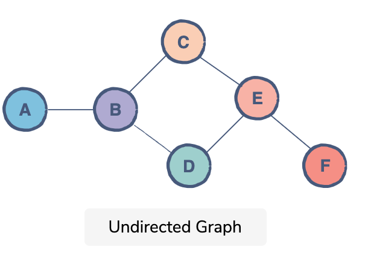
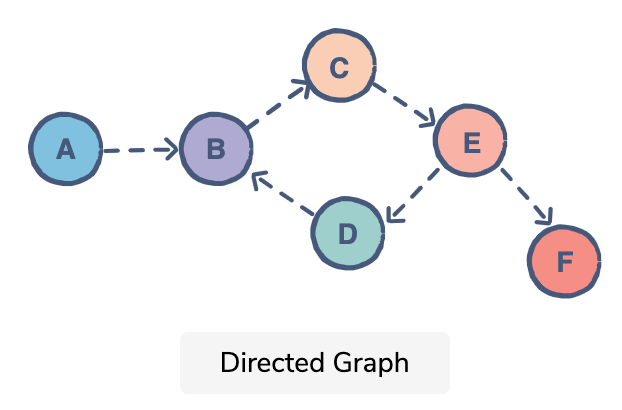
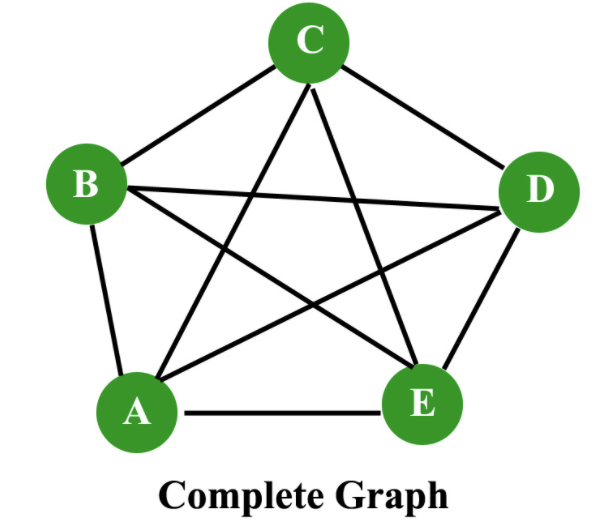
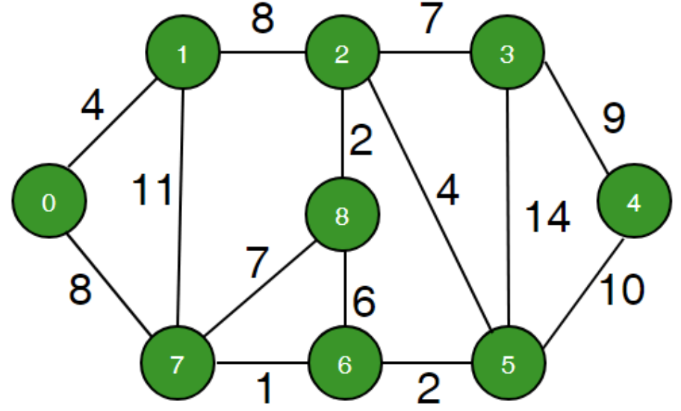

# Graph

  그래프란, 정점(노드)와 간선으로 이루어진 비선형 자료구조이다. 정점은 연결의 대사이 되는 개체 또는 위치이고, 간선은 정점 사이를 연결하는 선이라고 말할 수 있다. 그래프는 실생활에서 대표적으로 네트워크를 표현할 때 많이 사용된다. 또한, 페이스북과 같은 SNS에서 사용자들간의 연관관계를 나타낼 때도 이용된다. (각 정점이 사용자, 간선은 사용자 간의 친구 관계가 있을 때 존재한다고 대입하면 이해하기 쉽다)


## 학습 목표

### 1. 그래프의 개념에 대해 알 수 있다.

### 2. 그래프를 표현하는 방법에 대해 알 수 있다.


## 1. Graph 란

  그래프란 아래 두 요소로 구성된 비선형 자료구조이다.

1. Vertex, 노드라고 불리는 정점의 집합
   - 정점 : 연결의 대상이 되는 개체
2. Edge, 간선들의 집합
   - 간선 : 정점 사이의 연결
   - 간선 (u, v) 는 정점 u 에서 정점 v로 가는 연결선
   - 방향 그래프에서는 (u, v)와 (v, u) 는 서로 다른 간선으로 취급함
   - 간선은 가중치, 값, 비용을 가지고 있을 수 있다


*[출처] : http://www.btechsmartclass.com/data_structures/introduction-to-graphs.html*

위의 그래프에서, 정점의 집합은 `V = {A, B, C, D, E}` 이며, 간선의 집합은 `E = {AB, AC, AD, BD, BE, CD, DE}` 와 같다. 


### 그래프의 종류

#### 1 . Undirected Graph (무방향 그래프)

- 연결 관계에 있어서 방향성이 없는 그래프
- 간선은 정점간의 방향을 담고 있지 않음
- 하나의 정점 A에서 다른 정점 B로 연결된 간선이 있다면, 그래프 상에서 A -> B, B -> A 어느 방향으로도 방문이 가능하다



*[출처] : https://www.educative.io/edpresso/directed-graphs-vs-undirected-graphs*

#### 2. Directed Graph (방향 그래프) / Digraph

- 간선에 방향 정보가 포함된 그래프
- 간선은 화살표로 표현되며, 해당 화살표의 방향으로만 정점 간 방문이 가능하다
- 하나의 정점 A에서 다른 정점 B로 연결되는 간선이 A -> B 로 존재한다면, 그래프 상에서 A -> B 의 방향으로만 방문할 수 있다 (B -> A는 불가능하다)



*[출처] : https://www.educative.io/edpresso/directed-graphs-vs-undirected-graphs*

#### 3. Complete Graph (완전 그래프)

- 각각의 정점에서 다른 모든 정점을 연결한 그래프
- 방향 그래프의 경우, 간선의 수는 무방향 그래프 간선의 개수의 *2가 된다



*[출처] : https://www.geeksforgeeks.org/mathematics-graph-theory-basics-set-1/*

#### 4. Weight Graph (가중치 그래프)

- 간선에 가중치 정보가 포함된 그래프



*[출처] : https://www.geeksforgeeks.org/find-minimum-weight-cycle-undirected-graph/*

#### 5. Sub Graph (부분 그래프)

- 원 그래프 일부 정점 및 간선으로 이루어진 그래프


## 2.  Graph의 구현

  그래프를 구현하는 방법에는 아래의 두 가지 방법이 있다.

1. Adjacent matrix (인접 행렬)을 이용하여 그래프를 구현 
2. Adjacent list (인접 리스트)를 이용하여 그래프를 구현


### 1. 인접 행렬을 이용한 그래프의 구현

- 해당하는 위치의 value 값을 통해 정점 간의 연결 관계를 `O(1)` 로 파악 가능


### 2. 인접 리스트를 이용한 그래프의 구현

```java
// Java code to demonstrate Graph representation
// using ArrayList in Java

import java.util.*;

class Graph {
	
	// A utility function to add an edge in an
	// undirected graph
	static void addEdge(ArrayList<ArrayList<Integer> > adj,
						int u, int v)
	{
		adj.get(u).add(v);
		adj.get(v).add(u);
	}

	// A utility function to print the adjacency list
	// representation of graph
	static void printGraph(ArrayList<ArrayList<Integer> > adj)
	{
		for (int i = 0; i < adj.size(); i++) {
			System.out.println("\nAdjacency list of vertex" + i);
			System.out.print("head");
			for (int j = 0; j < adj.get(i).size(); j++) {
				System.out.print(" -> "+adj.get(i).get(j));
			}
			System.out.println();
		}
	}

	// Driver Code
	public static void main(String[] args)
	{
		// Creating a graph with 5 vertices
		int V = 5;
		ArrayList<ArrayList<Integer> > adj
					= new ArrayList<ArrayList<Integer> >(V);
		
		for (int i = 0; i < V; i++)
			adj.add(new ArrayList<Integer>());

		// Adding edges one by one
		addEdge(adj, 0, 1);
		addEdge(adj, 0, 4);
		addEdge(adj, 1, 2);
		addEdge(adj, 1, 3);
		addEdge(adj, 1, 4);
		addEdge(adj, 2, 3);
		addEdge(adj, 3, 4);
		
		printGraph(adj);
	}
}
```


## Reference

- https://www.geeksforgeeks.org/graph-and-its-representations/
- https://www.educative.io/edpresso/directed-graphs-vs-undirected-graphs
- 윤성우, 『윤성우의 열혈 자료구조』, 오렌지미디어(2013), p.532 ~ p.600


