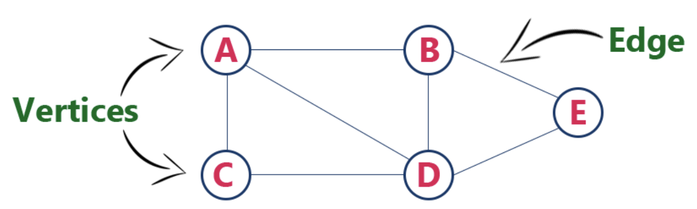

# Graph

  그래프란, 정점(노드)와 간선으로 이루어진 비선형 자료구조이다. 정점은 연결의 대사이 되는 개체 또는 위치이고, 간선은 정점 사이를 연결하는 선이라고 말할 수 있다. 그래프는 실생활에서 대표적으로 네트워크를 표현할 때 많이 사용된다. 또한, 페이스북과 같은 SNS에서 사용자들간의 연관관계를 나타낼 때도 이용된다. (각 정점이 사용자, 간선은 사용자 간의 친구 관계가 있을 때 존재한다고 대입하면 이해하기 쉽다)

## 학습 목표

### 1. 그래프의 개념에 대해 알 수 있다.

### 2. 그래프를 표현하는 방법에 대해 알 수 있다.

### 3. 그래프 탐색 방법에 대해 알 수 있다.

그래프 / 인접 리스트 / 인접 행렬 / BFS / DFS

## 1. Graph 란

  그래프란 아래 두 요소로 구성된 비선형 자료구조이다.

1. Vertex, 노드라고 불리는 정점의 집합
   - 정점 : 연결의 대상이 되는 개체
2. Edge, 간선들의 집합
   - 간선 : 정점 사이의 연결
   - 간선 (u, v) 는 정점 u 에서 정점 v로 가는 연결선
   - 방향 그래프에서는 (u, v)와 (v, u) 는 서로 다른 간선으로 취급함
   - 간선은 가중치, 값, 비용을 가지고 있을 수 있다

*[출처] : http://www.btechsmartclass.com/data_structures/introduction-to-graphs.html*

위의 그래프에서, 정점의 집합은 `V = {A, B, C, D, E}` 이며, 간선의 집합은 `E = {AB, AC, AD, BD, BE, CD, DE}` 와 같다. 

### 그래프의 종류

#### 1 . Undirected Graph (무방향 그래프)

#### 2. Directed Graph (방향 그래프) / Dipgraph

#### 3. 