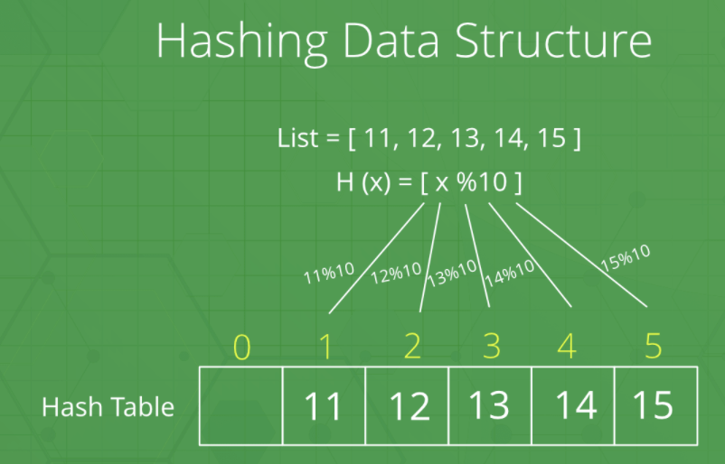

# HashTable

  해시 테이블이란 빠른 삽입 연산 및 검색을 지원하기 위해 해시 함수를 이용하여 데이터를 저장하는 자료구조이다. 테이블로 어떻게 빠른 검색을 할 수 있다는 것일까? 자료구조의 관점에서 테이블이란, 표에 저장되는 데이터가 (key, value) 쌍을 이룰때 테이블에 데이터가 저장된다고 한다. 이렇게 테이블에 저장되는 모든 데이터들은 이를 구분할 수 있는 **key**가 있어야 하고, 이 키는 데이터를 **구분하는 기준**이 되기 때문에 중복이 되어서는 안된다는 조건을 가진다. 

해시 테이블은 다른 두 종류의 해시 테이블이 있는데, 바로 hast set 과 hash map 이다.

1. Hash set : 중복된 값을 저장하지 않는 자료 구조인 set을 이용하여 구현
2. Hash map : (key, value) 쌍을 저장하기 위한 자료구조인 map을 이용하여 구현

해시 테이블을 구현하기 위해서는, 각 언어에서 제공하는 표준 라이브러리들을 이용하는 것이 더 쉬운 접근방법이다. 

## 학습 목표

### 1. 해시 테이블에 대해 알 수 있다.

## 1. Hashing (해싱)

  Hashing 이란, 해시 함수를 이용하여 해시 테이블 안에 **key, value 쌍**을 저장하는 방식을 말한다. 만약, 해시 함수 `H(x)`가 있다고 가정해보자. `H(x)` 는 input 값  `x` 를 `x % 10` 의 값으로 매핑해주는 함수이다.

 

- 위의 해시함수 `H(x)` 를 통해 해시 테이블에 데이터가 저장된 결과이다.

## 2. HashTable이란

- 데이터의 빠른 저장과 검색을 위해 해시 함수를 이용하여 데이터를 저장하는 자료구조

### HashTable의 원리

- 해시 함수를 이용하여 **key를 저장 공간에 매핑하는 것**이 가장 중요

1. 새로운 키 저장 시, 해시 함수는 해당 키가 저장 공간 내 어느 위치에 저장되어야 할지를 결정
2. 키를 검색하고자 할 때, 해시 테이블이 키 저장 시에 이용했던 같은 해시 함수를 이용하여 데이터 검색

## 3. HashTable 의 설계

  해시 테이블을 설계할 때 중점을 두어야 할 부분은 바로 두 가지이다.

### 1. Hash Function (해시 함수)

  해시 함수는 해시 테이블의 가장 중요한 부분이다. 해시 함수는 **키 값의 범위와 저장 공간의 개수**에 의존한다. 좋은 해시 함수란 데이터가 테이블의 전체 영역에 고루 분포되도록 하는 함수라고 할 수 있다. 고루 분포된 다는 것은 그만큼 충돌이 발생할 확률이 낮다고 볼 수 있기 때문이다. 일반적으로 좋은 hash function 은 키의 일부분만을 참조하여 해시 값을 만드는 것이 아니라, 키 전체를 참조하여 해시 값을 만들어 낸다.

### 2. Collision Resolution (충돌 해결)

1. Open Address 방식
2. Separate Chaining 방식

## Reference

- https://leetcode.com/explore/learn/card/hash-table/
- https://www.geeksforgeeks.org/hashing-data-structure/
- 윤성우, 『윤성우의 열혈 자료구조』, 오렌지미디어(2013), p.498 ~ p.530