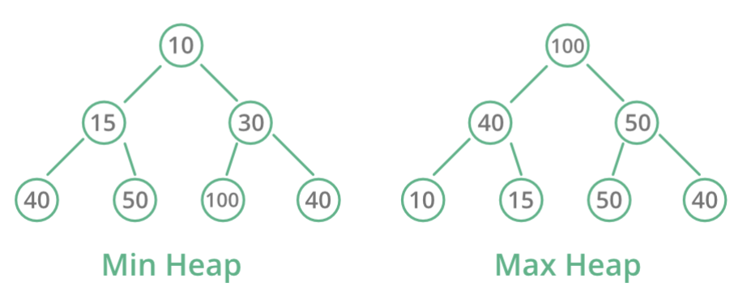

# Heap

  힙 (Heap) 이란,  **무엇인가를 차곡차곡 쌓아올린 더미** 라는 뜻이다. 자료구조에서의 힙은 이진 트리이되, **완전 이진 트리** 이고, 모든 노드에 저장된 값은 자식 노드에 저장된 값보다 크거나 같은 자료구조이다. 즉, 루트 노드에 저장된 값이 가장 큰 트리라고 할 수 있다. 

## 학습 목표

### 1. 힙의 개념을 이해할 수 있다

## 1. Heap

  힙 (Heap) 은 모든 노드에 저장된 값이 자식 노드에 저장된 값보다 크거나 같은 트리라고 하였는데, 여기서 "**값**"은 말 그대로의 값이 될 수도 있고, "**우선순위**" 가 될 수도 있다. 그래서, 아래와 같은 형태가 모두 힙 이라고 할 수 있다. 

*[출처] : https://www.geeksforgeeks.org/heap-data-structure/*

#### Min Heap (최소 힙)

- 루트 노드로 올라갈수록 저장된 값이 작아지는 완전 이진 트리

#### Max Heap (최대 힙)

- 루트 노드로 올라갈수록 저장된 값이 커지는 완전 이진 트리

## Reference

- https://leetcode.com/explore/learn/card/data-structure-tree/