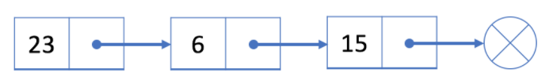
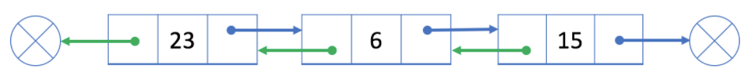

# Linked List

  연결 리스트는 배열과 비슷한 선형 자료구조이다. 

그림에서 볼 수 있듯이, 연결 리스트 내 각 요소는 각각 분리된 객체이면서, 각 요소 내 참조 필드 (reference field) 로 서로 연결되어 있는 형태를 가지고 있다.

  연결 리스트는 아래와 같이 두 종류의 연결 리스트가 있다. 

1. singly linked list
2. doubly linked list

 ### 학습 목표

- singly linked list와 doubly linked list의 구조를 이해한다
- singly linked list와 doubly linked list의 방문, 삽입, 삭제 연산을 이해하고 구현해본다
- singly linked list와 double linked list 각각의 연산의 시간 복잡도를 분석해본다
- linked list 내 two-pointer 를 (fast-pointer-slow-pointer technique) 이용해본다

## Singly Linked List

  Singly Linked List의 각 노드는 값만을 저장하는 것이 아닌 다음 노드를 가리키는  `reference field` 도 저장한다. 아래 그림을 보자.