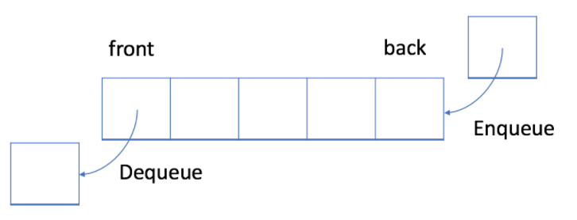
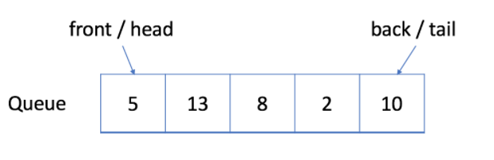
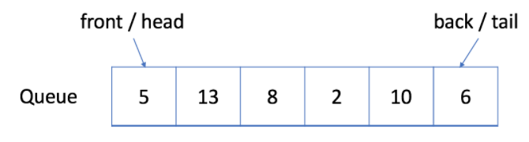
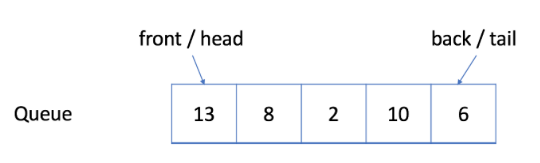
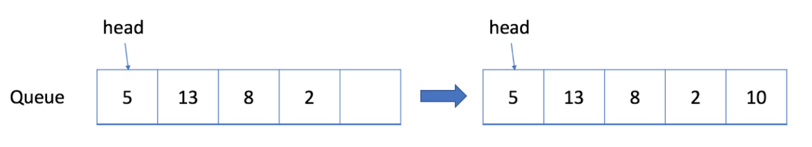

# Queue

  우리는 index를 통해서 배열의 random한 요소에 접근할 수 있다. 그러나, 어떤 경우에는 처리 순서를 제한하고 싶을 수가 있다.

  이번에는 두 개의 처리 순서에 대해 배운다. 두 처리 순서는 아래와 같다.

1. First-In-First-Out (FIFO)
2. Last-In-First-Out (LIFO)

위의 두 가지 처리 순서는 선형 자료구조인 Queue , Stack 의 처리 방식과 일치한다.

## 학습 목표

1. FIFO와 LIFO의 처리 순서 원칙 이해하기
2. Queue와 Stack 구현하기
3. Java 내 빌트인 Queue & Stack 이해하기
4. Queue와 관련된 알고리즘 문제인 `BFS` 이해하기
5. Stack과 관련된 알고리즘 문제 이해하기
6. 시스템 스택을 이용하여 `DFS` 와 `recursion(재귀)` 알고리즘 문제를 어떻게 풀 수 있는지 이해하기


  이번 내용은 First-In-First-Out 처리 방식과 Queue에서 FIFO가 어떻게 이뤄지는지에 대해 다룬다.

## 학습 목표

### 1. FIFO와 Queue의 정의 이해

### 2. Queue 구현

### 3. 빌트인 Queue 이해

### 4. Queue 를 이용하여 문제 풀기


## 1. First-In-First-Out Data Structure

  FIFO 자료 구조에서는, 큐에 가장 먼저 넣은 데이터가 가장 먼저 처리된다.



*[출처] : https://leetcode.com/explore/learn/card/queue-stack/228/first-in-first-out-data-structure/1355/*

  위의 그림에서 볼 수 있듯이, 큐는 전형적인 FIFO (선입선출) 자료구조이다. 삽입 연산은 `enqueue` 라고 불리며, 새로운 요소는 항상 큐의 뒷부분 (가장 마지막)에 추가된다. 삭제 연산은 `dequeue` 라고 불리며, 큐에 있는 가장 첫번째 요소만을 삭제할 수 있다.

### Enqueue 예시

  아래는 큐의 삽인 연산에 대한 예제이다. 아래와 같은 큐에 새로운 요소 6을 추가한다고 하면,



*[출처] : https://leetcode.com/explore/learn/card/queue-stack/228/first-in-first-out-data-structure/1355/*

아래와 같이 큐의 가장 마지막에 새로운 요소가 삽입되는 것을 확인할 수 있다.


*[출처] : https://leetcode.com/explore/learn/card/queue-stack/228/first-in-first-out-data-structure/1355/*

### Dequeue 예시

  아래는 큐의 삭제 연산에 대한 예제이다. 아래와 같은 큐에서 요소를 하나 삭제한다고 하면,



*[출처] : https://leetcode.com/explore/learn/card/queue-stack/228/first-in-first-out-data-structure/1355/*

아래와 같이 큐의 가장 첫번째 요소가 삭제되는 것을 확인할 수 있다.



*[출처] : https://leetcode.com/explore/learn/card/queue-stack/228/first-in-first-out-data-structure/1355/*

## 2. 큐의 구현

  큐를 구현하기 위해 dynamic array와 queue의 head를 가리키는 index 포인터를 사용한다.

  큐는 아래의 두 가지 연산을 지원한다. 

1. enqueue : 큐의 삽입 연산 (큐에 새로운 요소를 추가)
2. dequeue : 큐의 삭제 연산 (큐의 첫번째 요소를 삭제)

### Implementation

```java
package com.algorithm.leetcode.queue;

import java.util.*;

public class MyQueue {
    // store elements
    private List<Integer> data;

    // a pointer to indicate the start position
    private int p_start;

    public MyQueue() {
        data = new ArrayList<Integer>();
        p_start = 0;
    }

    /**
     * Insert an element into the queue.
     * Return true if the operation is successful
     * @param x 큐에 추가할 아이템
     * @return 삽입 연산이 완료되면 true 반환
     */
    public boolean enQueue(int x) {
        data.add(x);
        return true;
    }

    /**
     * Delete an element from the queue.
     * Return true if the operation is successful
     * @return
     */
    public boolean deQueue() {
        if (isEmpty()) {
            return false;
        }
        p_start++;
        return true;
    }

    /**
     * Get the front item from the queue
     * @return front item
     */
    public int front() {
        return data.get(p_start);
    }

    /**
     * Checks whether the queue is empty or not
     * @return true or false
     */
    public boolean isEmpty() {
        return p_start >= data.size();
    }
}

```

#### Queue 실행 예제

```java
public class QueueMain {
    public static void main(String[] args) {
        MyQueue q = new MyQueue();
        q.enQueue(5);
        q.enQueue(3);
        if (!q.isEmpty()) {
            System.out.println(q.front());
        }
        q.deQueue();
        if (!q.isEmpty()) {
            System.out.println(q.front());
        }
        q.deQueue();
        if (!q.isEmpty()) {
            System.out.println(q.front());
        }
    }
}
```


### 단점

  위에서 구현된 큐는 몇몇의 경우에 비효율적이다. `start pointer` 인 `p_start` 를 증가하기만 하므로, 이미 할당된 공간을 사용하지 못하고 계속 낭비된다는 단점을 가지고 있다.



*[출처] : https://leetcode.com/explore/learn/card/queue-stack/228/first-in-first-out-data-structure/1366/*

  아래의 그림과 같이 길이가 최대 5인 배열을 할당한 상황을 살펴보자. 위에서 구현된 큐 안의 요소 갯수가 5 이하인 경우에는 잘 동작한다. 그런데, 큐가 가득찬 상태에서 dequeue 연산을 하게 되면 큐에 빈 공간이 생기게 되고, 이를 활용하지 못하게 된다.


## 3. Circular Queue (=Ring Buffer)

  앞서, 배열로 구현된 큐의 비효율성을 확인해보았다. 이를 조금 더 효율적으로 이용하기 위해 우리는 **원형 큐** 의 개념을 도입하게 된다. 원형 큐는 배열로 구현된 큐의 마지막 last position 다음이 바로 first position으로 연결된 논리적인 형태로, 그 모습이 마치 원과 같이 연결되는 모양이라 원형 큐라고 부른다. 원형 큐는 `Ring Buffer` 라고도 부른다.

  원형 큐를 사용함에 있어서의 장점은 **낭비되던 공간을 재사용한다는 것**이다. 기존에 배열로 구현된 큐는 삭제 연산이 일어날 때마다 front를 뒤로 한 칸씩 밀기만 하였고, front가 뒤로만 이동함에 따라 front 앞 자리에 큐의 빈 공간이 존재하여 큐에 다른 요소를 추가할 수 있더라도, 해당 공간은 고스란히 낭비할 수 밖에 없었다. 그러나, 원형 큐를 사용하면 front 이전의 큐의 빈 공간에 다른 요소를 계속 추가할 수 있다. 

  원형 큐의 구현은 배열로 구현된 큐와 별반 다르지 않다. 차이점은 단 하나이다. 길이가 이미 정해진 배열을 쓰는 것은 동일하지만, 큐의 front를 가리키는  `p_start` 포인터만을 이용하던 이전과는 달리 두 개의 포인터를 이용하여 큐의 처음과 끝을 가리킨다는 점이다.


###Circular Queue implementation with array

```java
package com.algorithm.leetcode.queue;

public class MyCircularQueue {
    private int[] data;
    private int front ;
    private int rear;
    private int size;

    public MyCircularQueue(int k) {
        data = new int[k];
        front = -1;
        rear = -1;
        size = k;
    }

    public int Front() {
        if (isEmpty()) {
            return -1;
        }
        return data[front];
    }

    public int Rear() {
        if (isEmpty()) {
            return -1;
        }
        return data[rear];
    }

    public boolean enQueue(int value) {
        if (isFull()) {
            return false;
        }
        if (isEmpty()) {
            front = 0;
        }
        rear = (rear + 1) % size;
        data[rear] = value;
        return true;
    }

    public boolean deQueue() {
        if (isEmpty()) {
            return false;
        }
        if (front == rear) {
            front = -1;
            rear = -1;
            return true;
        }
        front = (front + 1) % data.length;
        return true;
    }

    public boolean isEmpty() {
        return front == -1;
    }

    public boolean isFull() {
        return (rear + 1) % size == front;
    }
}

```


### Built-In Queue

```java
package com.algorithm.leetcode.queue;

import java.util.*;

public class BuiltInQueue {
    public static void main(String[] args) {
        Queue<Integer> queue = new LinkedList<>();

        System.out.println("The first element is " + queue.peek());

        queue.offer(5);
        queue.offer(13);
        queue.offer(8);
        queue.offer(6);

        queue.poll();

        System.out.println("The first element is " + queue.peek());
        System.out.println("The size of queue is " + queue.size());
    }
}

```


## 4. Queue and BFS

  BFS (Breadth-first Search) 는 그래프 내 루트 토느에서 타겟 노드까지의 최단 경로를 찾는 알고리즘이다. 


### 1. 노드의 처리 순서는 무엇인가?

  첫 번째 라운드에서는, 루트 노드를 처리한다. 두 번째 라운드에서는 루트 노드 다음 노드를 처리하고, 세 번째 라운드에서는 루트 노드로 부터 두 단계 떨어져있는 노드를 처리한다. 이렇게 계속 처리한다.


  트리의 레벨 기반의 순회와 비슷하게, 루트 노드와 더 가까운 노드에 더 먼저 방문하게 된다. 

  만약, 노드 `X` 가 큐에 `k` 번째 라운드에 추가된다면, 루트 노드와 노드 `X` 사이의 최단 경로의 거리 (길이)는 `k` 가 된다. 그 말인 즉슨, 타겟 노드를 처음 찾는 때는 이미 최단경로에 있다는 것이다.


### 2. 큐의 enqueue 와 dequeue 순서는 무엇인가?

  첫 번째로, 루트 노드를 enqueue한다. 그리고 각 라운드마다, 큐에 이미 있는 노드들을 처리하고, 해당 노드들의 이웃 노드들을 큐에 추가한다. 새로 큐에 추가된 노드들은 즉시 방문되지 않고, 다음 라운드에서 처리된다. 노드들의 처리 순서는 큐에 추가된 순서와 정확하게 일치한다. 즉, 선입선출 (FIFO) 라는 것이다. 이 선입선출 방식을 이용하기에 우리는 BFS에서 큐를 이용하는 것이다.


## 5. BFS - Template

  위에서 확인했듯이, 우리는 BFS를 이용할 때 두 가지 메인 시나리오를 가지고 진행한다.

1.  `do traversal` : 방문
2. `find the shortest path` : 최단 경로 찾기

이다. 

### 1. Template I

#### 슈도코드

```java
/**
* 루트와 타겟 노드 사이의 최단 경로의 길이를 리턴
*/
int BFS(Node root, Node target) {
	Queue<Node> queue; // 처리되어질 (처리 되기를 기다리는) 모든 노드들을 저장
	int step = 0 ; // 루트 노드에서 현재 노드까지 순회 시 와야하는 step 수
	
	// 초기화
	add root to queue;
	
	// BFS
	while (queue is not empty) {
		step = step + 1;
		
		// 큐 안에 이미 들어있는 노드들을 반복
		int size = queue.size();
		
		for (int i = 0; i < size; i++) {
			Node cur = the first node in queue;
			return step if cur is target;
			
			for (Node next : the neighbors of cur) {
				add next to queue;
			}
			
			remove the first node from queue;
		}
	}
	
	return -1; // 루트 노드에서 타겟 노드까지 가는 경로가 없는 경우 -1을 리턴
}
```

  위의 코드에서 볼 수 있듯이, 

1. 각 라운드마다, **큐 안에 있는 노드들**은 **처리 되길 기다리**는 노드들이다
2. `while` 루프를 돌 때 마다, 루트 노드에서 부터 **한 스텝씩 멀어지게 된다**. `step` 변수는 **루트 노드에서부터 현재 방문중인 노드 까지의 거리**를 나타낸다. 

### 2. Template II

  **한 번 방문한 적이 있는 노드를 두 번 방문하지 않는 것**이 중요할 때가 있다. 그렇지않으면, 무한 루프에 빠질 수도 있기 때문이다. 그래서, 우리는 이 문제를 해결하기 위해서, hash set을 추가한다.

#### 슈도코드

```java
/**
* 루트 노드와 타겟 노드 사이의 최단 경로 길이를 리턴
*/
int BFS(Node root, Node target) {
	Queue<Node> queue; // 처리되어질 (처리 되기를 기다리는) 모든 노드들을 저장
	Set<Node> visited; // 방문한 적이 있는 노드들을 저장
	int step = 0;
	
	// 초기화
	add root to queue;
  add root to visited;
  
  // BFS
	while (queue is not empty) {
		step = step + 1;
		
		// 큐에 이미 있는 노드들 반복
		int size = queue.size();
		
		for (int i = 0; i < size; i++) {
			Node cur = the first node in queue;
			return step if cur is target;
			
			for (Node next : the neighbors of cur) {
				if (next is not in used) {
					add next to queue;
					add next to visited;
				}
			}
			remove the first node from queue;
		}
	}
	
	return -1; // 루트 노드에서 타겟 노드까지 가는 경로가 없는 경우 -1 을 리턴
}
```

- `visited` hash set을 관리하지 않아도 되는 경우
  1. 그래프에 사이클이 확실히 사이클이 없는 경우
  2. 큐에 노드를 여러번 추가하고 싶은 경우


## Reference

- https://leetcode.com/explore/learn/card/queue-stack/
- 윤성우, 『윤성우의 열혈 자료구조』, 오렌지미디어(2013), p.251 ~ p.286
- 게일 라크만 맥도웰, 『코딩 인터뷰 완전 분석』, 프로그래밍인사이트(2019), p.145 ~ p.146