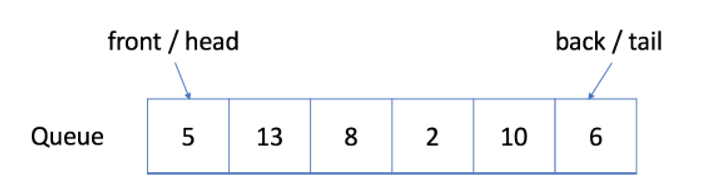

# Queue

  우리는 index를 통해서 배열의 random한 요소에 접근할 수 있다. 그러나, 어떤 경우에는 처리 순서를 제한하고 싶을 수가 있다.

  이번에는 두 개의 처리 순서에 대해 배운다. 두 처리 순서는 아래와 같다.

1. First-In-First-Out (FIFO)
2. Last-In-First-Out (LIFO)

위의 두 가지 처리 순서는 선형 자료구조인 Queue , Stack 의 처리 방식과 일치한다.

## 학습 목표

1. FIFO와 LIFO의 처리 순서 원칙 이해하기
2. Queue와 Stack 구현하기
3. Java 내 빌트인 Queue & Stack 이해하기
4. Queue와 관련된 알고리즘 문제인 `BFS` 이해하기
5. Stack과 관련된 알고리즘 문제 이해하기
6. 시스템 스택을 이용하여 `DFS` 와 `recursion(재귀)` 알고리즘 문제를 어떻게 풀 수 있는지 이해하기


  이번 내용은 First-In-First-Out 처리 방식과 Queue에서 FIFO가 어떻게 이뤄지는지에 대해 다룬다.

## 학습 목표

### 1. FIFO와 Queue의 정의 이해

### 2. Queue 구현

### 3. 빌트인 Queue 이해

### 4. Queue 를 이용하여 문제 풀기


## 1. First-In-First-Out Data Structure

  FIFO 자료 구조에서는, 큐에 가장 먼저 넣은 데이터가 가장 먼저 처리된다.


*[출처] : https://leetcode.com/explore/learn/card/queue-stack/228/first-in-first-out-data-structure/1355/*

  위의 그림에서 볼 수 있듯이, 큐는 전형적인 FIFO (선입선출) 자료구조이다. 삽입 연산은 `enqueue` 라고 불리며, 새로운 요소는 항상 큐의 뒷부분 (가장 마지막)에 추가된다. 삭제 연산은 `dequeue` 라고 불리며, 큐에 있는 가장 첫번째 요소만을 삭제할 수 있다.

### Enqueue 예시

  아래는 큐의 삽인 연산에 대한 예제이다. 아래와 같은 큐에 새로운 요소 6을 추가한다고 하면,


*[출처] : https://leetcode.com/explore/learn/card/queue-stack/228/first-in-first-out-data-structure/1355/*

아래와 같이 큐의 가장 마지막에 새로운 요소가 삽입되는 것을 확인할 수 있다.



*[출처] : https://leetcode.com/explore/learn/card/queue-stack/228/first-in-first-out-data-structure/1355/*

### Dequeue 예시

  아래는 큐의 삭제 연산에 대한 예제이다. 아래와 같은 큐에서 요소를 하나 삭제한다고 하면,


*[출처] : https://leetcode.com/explore/learn/card/queue-stack/228/first-in-first-out-data-structure/1355/*

아래와 같이 큐의 가장 첫번째 요소가 삭제되는 것을 확인할 수 있다.


*[출처] : https://leetcode.com/explore/learn/card/queue-stack/228/first-in-first-out-data-structure/1355/*

## 2. 큐의 구현

  큐를 구현하기 위해 dynamic array와 queue의 head를 가리키는 index 포인터를 사용한다.

  큐는 아래의 두 가지 연산을 지원한다. 

1. enqueue : 큐의 삽입 연산 (큐에 새로운 요소를 추가)
2. dequeue : 큐의 삭제 연산 (큐의 첫번째 요소를 삭제)

### Implementation

```java
package com.algorithm.leetcode.queue;

import java.util.*;

public class MyQueue {
    // store elements
    private List<Integer> data;

    // a pointer to indicate the start position
    private int p_start;

    public MyQueue() {
        data = new ArrayList<Integer>();
        p_start = 0;
    }

    /**
     * Insert an element into the queue.
     * Return true if the operation is successful
     * @param x 큐에 추가할 아이템
     * @return 삽입 연산이 완료되면 true 반환
     */
    public boolean enQueue(int x) {
        data.add(x);
        return true;
    }

    /**
     * Delete an element from the queue.
     * Return true if the operation is successful
     * @return
     */
    public boolean deQueue() {
        if (isEmpty()) {
            return false;
        }
        p_start++;
        return true;
    }

    /**
     * Get the front item from the queue
     * @return front item
     */
    public int front() {
        return data.get(p_start);
    }

    /**
     * Checks whether the queue is empty or not
     * @return true or false
     */
    public boolean isEmpty() {
        return p_start >= data.size();
    }
}

```

#### Queue 실행 예제

```java
public class QueueMain {
    public static void main(String[] args) {
        MyQueue q = new MyQueue();
        q.enQueue(5);
        q.enQueue(3);
        if (!q.isEmpty()) {
            System.out.println(q.front());
        }
        q.deQueue();
        if (!q.isEmpty()) {
            System.out.println(q.front());
        }
        q.deQueue();
        if (!q.isEmpty()) {
            System.out.println(q.front());
        }
    }
}
```


### 단점

  위에서 구현된 큐는 몇몇의 경우에 비효율적이다. `start pointer` 인 `p_start` 를 증가하기만 하므로, 이미 할당된 공간을 사용하지 못하고 계속 낭비된다는 단점을 가지고 있다.


*[출처] : https://leetcode.com/explore/learn/card/queue-stack/228/first-in-first-out-data-structure/1366/*

  아래의 그림과 같이 길이가 최대 5인 배열을 할당한 상황을 살펴보자. 위에서 구현된 큐 안의 요소 갯수가 5 이하인 경우에는 잘 동작한다. 그런데, 큐가 가득찬 상태에서 dequeue 연산을 하게 되면 큐에 빈 공간이 생기게 되고, 이를 활용하지 못하게 된다.


## 3. Circular Queue (=Ring Buffer)

  앞서, 배열로 구현된 큐의 비효율성을 확인해보았다. 이를 조금 더 효율적으로 이용하기 위해 우리는 **원형 큐** 의 개념을 도입하게 된다. 원형 큐는 배열로 구현된 큐의 마지막 last position 다음이 바로 first position으로 연결된 논리적인 형태로, 그 모습이 마치 원과 같이 연결되는 모양이라 원형 큐라고 부른다. 원형 큐는 `Ring Buffer` 라고도 부른다.

  원형 큐를 사용함에 있어서의 장점은 **낭비되던 공간을 재사용한다는 것**이다. 기존에 배열로 구현된 큐는 삭제 연산이 일어날 때마다 front를 뒤로 한 칸씩 밀기만 하였고, front가 뒤로만 이동함에 따라 front 앞 자리에 큐의 빈 공간이 존재하여 큐에 다른 요소를 추가할 수 있더라도, 해당 공간은 고스란히 낭비할 수 밖에 없었다. 그러나, 원형 큐를 사용하면 front 이전의 큐의 빈 공간에 다른 요소를 계속 추가할 수 있다. 

  원형 큐의 구현은 배열로 구현된 큐와 별반 다르지 않다. 차이점은 단 하나이다. 길이가 이미 정해진 배열을 쓰는 것은 동일하지만, 큐의 front를 가리키는  `p_start` 포인터만을 이용하던 이전과는 달리 두 개의 포인터를 이용하여 큐의 처음과 끝을 가리킨다는 점이다.


###Circular Queue implementation with array

```java
package com.algorithm.leetcode.queue;

public class MyCircularQueue {
    private int[] data;
    private int front ;
    private int rear;
    private int size;

    public MyCircularQueue(int k) {
        data = new int[k];
        front = -1;
        rear = -1;
        size = k;
    }

    public int Front() {
        if (isEmpty()) {
            return -1;
        }
        return data[front];
    }

    public int Rear() {
        if (isEmpty()) {
            return -1;
        }
        return data[rear];
    }

    public boolean enQueue(int value) {
        if (isFull()) {
            return false;
        }
        if (isEmpty()) {
            front = 0;
        }
        rear = (rear + 1) % size;
        data[rear] = value;
        return true;
    }

    public boolean deQueue() {
        if (isEmpty()) {
            return false;
        }
        if (front == rear) {
            front = -1;
            rear = -1;
            return true;
        }
        front = (front + 1) % data.length;
        return true;
    }

    public boolean isEmpty() {
        return front == -1;
    }

    public boolean isFull() {
        return (rear + 1) % size == front;
    }
}

```


### Built-In Queue

```java
package com.algorithm.leetcode.queue;

import java.util.*;

public class BuiltInQueue {
    public static void main(String[] args) {
        Queue<Integer> queue = new LinkedList<>();

        System.out.println("The first element is " + queue.peek());

        queue.offer(5);
        queue.offer(13);
        queue.offer(8);
        queue.offer(6);

        queue.poll();

        System.out.println("The first element is " + queue.peek());
        System.out.println("The size of queue is " + queue.size());
    }
}

```


## Reference

- https://leetcode.com/explore/learn/card/queue-stack/
- 윤성우, 『윤성우의 열혈 자료구조』, 오렌지미디어(2013), p.251 ~ p.286
- 게일 라크만 맥도웰, 『코딩 인터뷰 완전 분석』, 프로그래밍인사이트(2019), p.145 ~ p.146