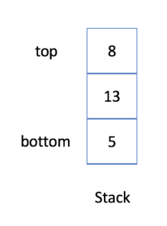
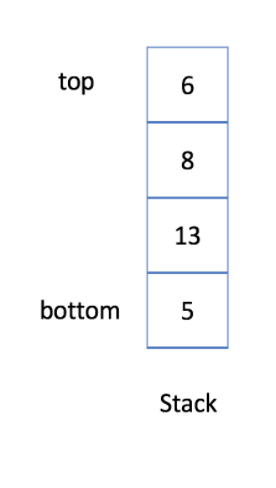

# Stack

  대표적인 선형 자료구조의 일종인 스택에 대해서 알아보자. 


## 학습 목표

### 1. 스택의 특징인 LIFO의 처리 순서 이해하기

### 2. 스택을 이해하고, 배열을 이용하여 스택 구현하기

### 3. 스택의 연산에는 무엇이 있고, 어떻게 이용하는지 이해하기


## 1. Stack : Last-In-first-out Data Structure

### Stack

- 나중에 들어간 데이터가 먼저 나오는 자료구조 (LIFO)

 Last-In-First-Out (후입 선출) 자료구조에서는, 먼저 들어간 데이터가 나중에 나온다. 스택의 Abstract Data Type (ADT)의 연산은 아래와 같이 4가지로 추려볼 수 있다.

1. **push** : item 하나를 스택의 가장 윗부분에 추가
2. **pop** : 스택에서 가장 위에 있는 항목을 반환 & 제거
3. **peek** : 스택의 가장 위에 있는 항목을 제거하지 않고 반환만 한다
4. **isEmpty** : 스택이 비어있는지 여부를 반환


### 1. Push : 스택에 새로운 데이터 저장 

```java
void push(Data x);
```

- 스택에 데이터를 저장한다
- 매개변수 `x`가 저장될 데이터이다

- 스택의 가장 상단에 새로운 요소가 추가

    **스택 push 이후**

*[출처] : https://leetcode.com/explore/learn/card/queue-stack/230/usage-stack/1369/*

### 2. Pop : 스택에서 데이터를 꺼내어 삭제

```java
Data pop();
```

- 스택에 가장 마지막에 저장된 데이터를 꺼내어 삭제한다
- 삭제된 데이터는 반환된다
- 이 연산의 호출을 위해서는 데이터가 하나 이상 존재함이 보장되어야 한다

 **스택 pop 이후** 

*[출처] : https://leetcode.com/explore/learn/card/queue-stack/230/usage-stack/1369/*


## 2. Stack의 구현

  연결 리스트 기반의 스택을 구현해보자. 

먼저 대략적인 구현이다.

```java
package com.algorithm.leetcode.stack;

import java.util.EmptyStackException;

public class MyStack {
    private static class StackNode {
        private T data;
        private StackNode next;

        public StackNode(T data) {
            this.data = data;
        }
    }

    private StackNode top;

    public T pop() {
        if (top == null) {
            throw new EmptyStackException();
        }

        T item = top.data;
        top = top.next;
        return item;
    }

    public void push(T item) {
        StackNode t = new StackNode(item);
        t.next = top;
        top = t;
    }
    
    public T peek() {
        if (top == null) {
            throw new EmptyStackException();
        }
        return top.data;
    }
    
    public boolean isEmpty() {
        return top == null;
    }
}
```


#### Stack의 구현

```java
package com.algorithm.leetcode.stack;

import java.util.ArrayList;
import java.util.EmptyStackException;
import java.util.List;

public class Stack {
    List<Integer> data;

    public Stack() {
        data = new ArrayList<>();
    }

    public void push(int x) {
        data.add(x);
    }

    public boolean isEmpty() {
        return data.isEmpty();
    }

    public int top() {
        return data.get(data.size() - 1);
    }

    public int pop() {
        if (isEmpty()) {
            throw new EmptyStackException();
        }

        int top = data.get(data.size() - 1);
        data.remove(data.size() - 1);

        return top;
    }
}

```

#### Stack 실행 예제

```java
package com.algorithm.leetcode.stack;

public class StackMain {
    public static void main(String[] args) {
        Stack stack = new Stack();
        stack.push(1);
        stack.push(2);
        stack.push(3);
        
        for (int i=0; i<4; i++) {
            if (!stack.isEmpty()) {
                System.out.println(stack.top());
            }

            System.out.println(stack.pop());
        }
    }
}
```


### Built-In Stack

```java
package com.algorithm.leetcode.stack;

import java.util.Stack;

public class BuiltInStack {
    public static void main(String[] args) {
        Stack<Integer> stack = new Stack<>();

        stack.push(5);
        stack.push(13);
        stack.push(8);
        stack.push(6);

        if (stack.isEmpty()) {
            System.out.println("Stack is empty!");
            return;
        }

        stack.pop();

        System.out.println("The top element is : " + stack.peek());

        System.out.println("The size is : " + stack.size());
        
    }
}

```


## Reference

- https://leetcode.com/explore/learn/card/queue-stack/
- 윤성우, 『윤성우의 열혈 자료구조』, 오렌지미디어(2013), p.203 ~ p.218
- 게일 라크만 맥도웰, 『코딩 인터뷰 완전 분석』, 프로그래밍인사이트(2019), p.144 ~ p.145

