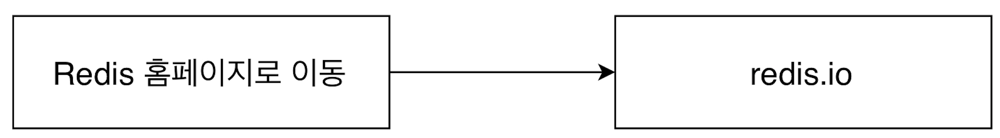
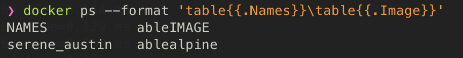

 # [1] Docker 기본

## 학습 목표

1. Docker를 쓰는 이유에 대해서 안다


## Docker를 쓰는 이유

- 어떠한 프로그램을 다운 받는 과정을 간단하게 만들기 위해서

### Docker 없이 프로그램 받을 때 원래 프로그램을 다운받고 실행하는 순서


  위와 같이 installer를 다운받고 - 실행하여 프로그램을 설치 완료한다. 그러나, 갖고 있는 서버, 패키지 버전, OS 등에 따라 프로그램을 설치하는 과정에서 많은 에러들이 발생하게 되며, 설치 과정이 다소 복잡하다는 단점이 있다.


### Docker 없이 Redis 다운로드 vs Docker 를 이용하여 Redis 다운로드



아래와 같은 방법으로 설치할 수 있다


## Docker란 무엇인가?

- 컨테이너를 사용하여 응용프로그램을 더 쉽게 만들고 배포하고 실행할 수 있도록 설계된 도구이며 컨테이너 기반의 오픈소스 가상화 플랫폼

### Container

일반적인 컨테이너

- 어떠한 물품을 넣어 이용하는 운송 수단

서버에서의 컨테이너 개념

- 컨테이너 안에 다양한 프로그램, 실행 환경을 컨테이너로 추상화하고 동일한 인터페이스를 제공하여 프로그램의 배포 및 관리를 단순하게 해주는 수단
- AWS, Azure, Google cloud 등 어디에서든 실행 가능하게 해줌

즉, 코드와 모든 종속성을 패키지화 하여 응용 프로그램이 한 컴퓨팅 환경에서 다른 컴퓨팅 환경으로 빠르고 안정적으로 실행되도록 하는 소프트웨어의 표준 단위

#### 컨테이너 이미지

- 코드, 런타임, 시스템 도구, 시스템 라이브러리 및 설정과 같은 응용 프로그램을 실행하는 데 필요한 모든 것을 포함하는 가볍고 독립적이며 실행 가능한 소프트웨어 패키지
- 런타임에 컨테이너가 되고, 도커 컨테이너의 경우 도커 엔진에서 실행될 때 이미지가 컨테이너가 된다
- 리눅스와 윈도우 기반 애플리케이션 모두에서 사용할 수 있는 컨테이너화된 소프트웨어는 인프라에 관계없이 항상 동일하게 실행됨


#### 핵심

- 도커 이미지는 프로그램을 실행하는데 필요한 설정이나 종속성을 가지고 있다
- 도커 이미지를 이용하여 도커 컨테이너를 생성한다
- 도커 컨테이너를 이용하여 프로그램을 실행한다

## 도커를 사용할 때의 흐름

### 항상 도커를 사용할 때는

1. 먼저 도커 CLI에 커맨드를 입력한다
2. 그러면, 도커 서버 (Docker Daemon)가 그 커맨드를 받아서 그것에 따라 이미지를 생성하든 컨테이너를 실행하든 모든 작업을 하게된다


### 실제로 CLI에서 커맨드를 입력해보기

1. `docker run hello-world`


- 캐시 보관 장소에 hello-world 이미지가 없으므로 도커 허브에서 이미지를 가져옴

### 이제 hello-world 이미지가 cache 되었으니, 다시 `docker run hello-world` 를 진행해보면

- `Unable to find image~` 문구 없이 프로그램이 바로 실행됨


## Docker와 기존의 가상화 기술과의 차이를 통한 컨테이너 이해

### 1. 가상화 기술 이전

- 한 대의 서버를 하나의 용도로만 사용함
  - 남는 서버 공간은 그대로 방치
- 하나의 서버에 하나의 OS, 하나의 프로그램만을 운영
  - 안정적이지만 비효율적이었음

### 2. 하이퍼 바이저 기반의 가상화 출현

- 논리적으로 공간을 분할하여 VM이라는 독립적인 가상 환경의 서버 이용 가능
- 하이퍼 바이저는 호스트 시스템에서 다수의 게스트 OS를 구동할 수 있게 하는 소프트웨어
- 그리고 하드웨어를 가상화하면서 하드웨어와 각각의 VM을 모니터링 하는 중간 관리자

1. 네이티브 하이퍼 바이저
2. 호스트형 하이퍼 바이저


- 하이퍼바이저에 의해 구동되는 VM은 각 VM마다 독립된 가상 하드웨어 자원을 할당받음
- 논리적으로 분리되어 있어서 한 VM에 오류가 발생해도 다른 VM으로 퍼지지 않는다는 장점을 가짐
  - 격리가 되어있기 때문

### 컨테이너 가상화 기술


- VM과 비교했을 때 컨테이너는 하이퍼바이저와 게스트 OS가 필요하지 않으므로 더 가벼움
- 어플리케이션을 실행할 때는 컨테이너 방식에서는 호스트 OS 위에 어플리케이션의 실행 패키지인 이미지를 배포하기만 하면 되는데, VM은 어플리케이션을 실행하기 위해 VM을 띄우고, 자원을 할당한 뒤 게스트 OS를 부팅하여 어플리케이션을 실행해야 해서 훨씬 복잡하고 무겁게 실행해야 함

#### 공통점

- 도커 컨테이너와 VM은 모두 기본 하드웨어에서 격리된 환경 내에 어플리케이션을 배치하는 방법을 취함

#### 차이점

- 격리된 환경을 얼마나 격리 시키는지에 대한 차이를 가짐

##### Docker Container

- 도커 컨테이너에서 돌아가는 어플리케이션은 컨테이너가 제공하는 격리 기능 내부에 샌드 박스가 있지만, 여전히 같은 호스트의 다른 컨테이너와 동일한 커널을 공유한다
- 결과적으로 컨테이너 내부에서 실행되는 프로세스는 호스트 시스템 (모든 프로세스를 나열할 수 있는 충분한 권한 있음)에서 볼 수 있다

##### VM

- 가상 머신 내부에서 실행되는 모든 것은 호스트 운영 체제 또는 하이퍼바이저와 독립되어 있다
- 가상 머신 플랫폼은 특정 VM에 대한 가상화 프로세스를 관리하기 위해 프로세스를 시작하고, 호스트 시스템은 그것의 하드웨어 자원의 일부를 VM에 할당한다
- 그러나, VM과 근본적으로 다른 것은 시작 시간에 이 VM 환경을 위해서 새롭고 이 특정 VM만을 위한 커널을 부팅하고 운영 체제 프로세스 세트를 시작한다
- 이건 응용 프로그램만 포함하는 일반적인 컨테이너보다 VM의 크기를 훨씬 크게 만든다
- 따라서 이러한 방법은 사용법이 간단할 수는 있지만 굉장히 느리다는 단점이 있다


### Docker Container를 격리시키는 방법

- 알아야 할 선수 지식

> Cgroup (control groups)
>
> - CPU, 메모리, Network Bandwidth, HD I/O 등 프로세스 그룹의 시스템 리소스 사용량을 관리
> - 어떤 어플이 사용량이 너무 많다면, 그 어플리케이션 같은 것을 C group에 집어 넣어 CPU와 메모리 사용 제한 가능

> Name Space
>
> - 하나의 시스템에서 프로세스를 격리시킬 수 있는 가상화 기술
> - 별개의 독립된 공간을 사용하는 것처럼 격리된 환경을 제공하는 경량 프로세스 가상화 기술

C group 과 네임스페이스를 이용하여 **컨테이너와 호스트에서 실행되는 다른 프로세스 사이에 벽을 만든다**


## Docker image로 container 만들기

  Docker image는 응용 프로그램을 실행하는 데 필요한 모든 것들을 포함한다. 도커 이미지에 포함되는 것들은 아래와 같다.

1. 컨테이너가 시작될 떄 실행되는 명령어

   - `run kakaotalk`

2. 파일 스냅샷

   - 컨테이너에서 프로그램을 실행하는 데 필요한 파일 스냅샷

     > 파일 스냅샷 
     >
     > - 디렉토리나 파일을 카피한 것


### image 로 container 만드는 순서

1. Docker client 에 `docker run [image]` 
2. 도커 이미지에 있는 파일 스냅샷을 컨테이너 하드 디스크에 옮김
3. 이미지에서 가지고 있는 명령어 (컨테이너가 실행될 때 사용될 명령어)를 이용해서 프로그램을 실행시켜 줌


## C-group, Namespace를 도커 환경에서 쓸 수 있는 이유

  컨테이너를 격리시킬 수 있는 이유는 위에서 간단하게 확인하였듯이 C-group과 namespace를 이용해서이다. 하지만, c-group과 namespace는 리눅스 환경에서 이용할 수 있다고 하였는데... 다른 OS를 사용하고 있는 사용자는 도커 환경에서 어떻게 이를 이용할 수 있는 것일까?


- docker환경이 리눅스 환경에서 돌아가고 있기 때문에 도커에서도 c-group과 namespace를 이용할 수 있는 것이다

## 도커 이미지 내부 파일 구조 보기

```bash
docker run [image 이름] ls
```


- alpine 이라는 이미지를 pulling 하여 해당 이미지의 내부 파일 구조를 출력

### 어떻게 Alpine 이미지를 이용하여 ls 명령어를 실행 가능한 것인가?

- Alpine 이미지 파일 스냅샷 안에 이미 `ls` 를 사용 가능하게 하는 파일이 있어서 사용 가능하다

- 반면에, `hello-world` 이미지는 `ls` 사용이 불가능하다


## 컨테이너 나열하기

### 현재 실행중인 컨테이너 나열하기

```bash
docker ps
```

- alpine 이미지를 이용하여 실행 후 docker ps로 현재 실행중인 컨테이너를 확인해본다


1. CONTAINER ID
   - 컨테이너의 고유한 id (hash)
   - 실제로는 더욱 길지만 일부분만 표출
2. IMAGE
   - 컨테이너 생성 시 사용한 도커 이미지
3. COMMAND
   - 컨테이너 시작 시 실행될 명령어
   - 대부분 이미지에 내장되어 있으므로 별도 설정이 필요 없음
4. CREATED
   - 컨테이너가 생성된 시각
5. STATUS
   - 컨테이너의 상태
     - 실행 중 : Up
     - 종료 : Exited
     - 일시정지 : Pause 
6. PORTS
   - 컨테이너가 개방한 포트와 호스트에 연결한 포트
   - 특별한 설정을 하지 않은 경우 출력되지 않음
7. NAMES
   - 컨테이너의 고유한 이름
   - 컨테이너 생성 시 --name 옵션으로 이름을 설정하지 않으면 도커 엔진이 임의로 형용사와 명사를 조합해 설정
   - id와 마찬가지로 unique하며, `docker rename` 을 통해 이름 변경 가능
     - `docker rename [origin] [to-be-changed] `


### 원하는 항목만 보기

```bash
docker ps --format
```



### 모든 컨테이너 나열

```bash
docker ps -a
```


## Docker Container Lifecycle


1. 도커 컨테이너 생성
2. 도커 컨테이너 시작
3. 도커 컨테이너 실행
4. 도커 컨테이너 중지
5. 도커 컨테이너 삭제


## Docker Stop vs Docker Kill


### docker stop

- gracefully 하게 중지 (그동안 하던 작업들을 완료하고 컨테이너 중지)

### docker kill

- 바로 컨테이너 중지


## Docker container 삭제

```bash
docker rm [삭제할 도커 id / 이름]
```


#### 모든 컨테이너는 중지 후 삭제 가능하다

#### 모든 컨테이너 삭제

```bash
docker rm `docker ps -a -q`
```

#### 도커 이미지 삭제

```bash
docker rmi [image id]
```

#### 한 번에 사용하지 않는 컨테이너, 이미지, 네트워크 모두 삭제

```bash
docker system prune
```

- 도커를 쓰지 않을 때, 모두 정리하고 싶을 때 사용하면 좋다
- 하지만, **실행중인 컨테이너에는 영향을 주지 않는다**

## 실행 중인 컨테이너에 명령어 전달

```bash
docker exec [컨테이너 id]
```

#### 같은 결과를 내주는 것 

```bash
docker run [image name] ls
```


### docker run vs docker exec

1. docker run
   - 새로 컨테이너를 만들어서 실행
2. docker exec
   - 이미 실행중인 컨테이너에 명령어를 전달


## Docker를 이용하여 간단한 Node.js 어플 만들기


## Docker Volume


## Docker Compose란 무엇인가?


