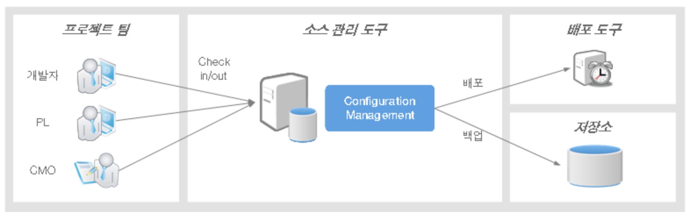
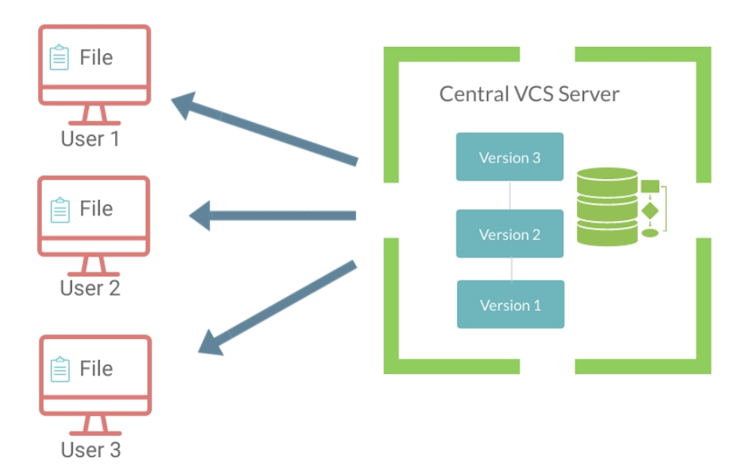

# [1] Git - 버전 관리 시스템

### VCS (Version Control System)

### 버전 관리 시스템의 종류

#### 1. 클라이언트 - 서버 모델

- 하나의 중앙 저장소를 공유한 후 각각의 클라이언트(개발자)는 저장소의 일부분만 갖는 형태

- 자신이 작업하는 부분만 로컬에 임시로 저장한 후 작업하는 형태

  

[출처] : 만들면서 배우는 Git + GitHub 입문

https://www.egovframe.go.kr/wiki/doku.php?id=egovframework:dev:scm:configuration_management

