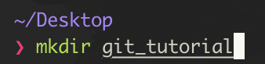
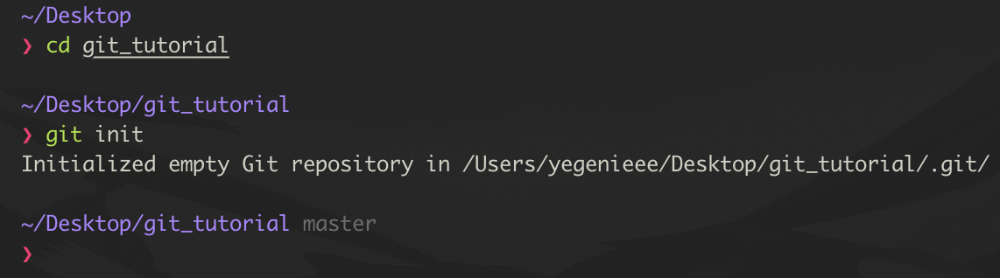
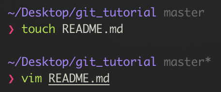
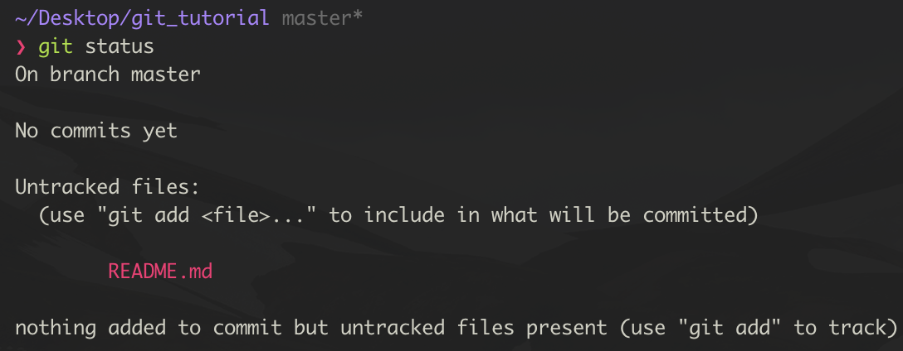
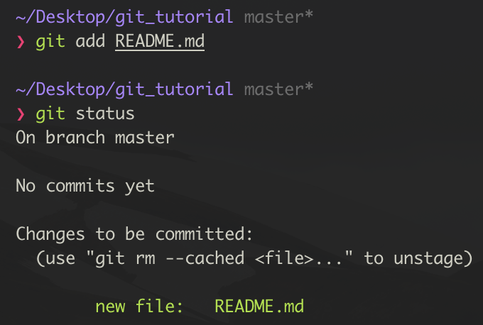
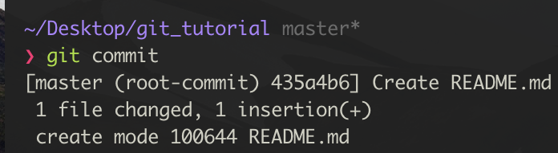

# 로컬 저장소 사용을 위한 Git 기본

[TOC]

## Goal

1. 내 로컬 저장소에서 Git 사용하는 방법을 익힌다
2. Git 명령어를 익힌다


## 1. 기본 명령어

| 목표                    | 명령어              | 설명                                           |
| ----------------------- | ------------------- | ---------------------------------------------- |
| 저장소 생성             | git init            | 실행한 위치를 Git 저장소로 초기화              |
| 저장소에 파일 추가      | git add {파일 이름} | 해당 파일을 Git이 추적할 수 있게 저장소에 추가 |
| 저장소에 수정 내역 제출 | git commit          | 변경된 파일을 저장소에 제출                    |
| 저장소 상태 확인        | git status          | 현재 저장소의 상태를 출력                      |

| 목표                  | 명령어                  | 설명                                                      |
| --------------------- | ----------------------- | --------------------------------------------------------- |
| 저장소에 브랜치 추가  | git branch 이름         | '이름'의 브랜치를 만듦                                    |
| 작업 중인 브랜치 변경 | git checkout 브랜치이름 | 현재 작업 중인 브랜치 이름을 변경                         |
| 브랜치 병합           | git merge 브랜치이름    | 현재 작업 중인 브랜치에 브랜치이름의 브랜치를 끌어와 병합 |


## 2. git init : 저장소 생성

- git 저장소로 사용할 `git_tutorial` 디렉토리 만들기

  ```bash
  mkdir git_tutorial
  ```




- 만든 `git_tutorial` 디렉토리로 이동하여 Git 저장소 초기화 (git init 후 master 브랜치 표시됨)

  ```bash
  cd git_tutorial
  git init
  ```
  
  


## 3. git add & git commit

- `README.md` 파일 작성 후, 커밋하기

  



- git에서 추적하지 않는 파일이 로컬에 있다고 안내


### git add

- 파일 추적을 시작하기 위해 저장소에 추가

  


### git commit

- 커밋



