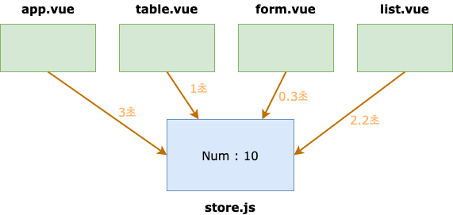

#  Vuex - Actions

## actions 란?

### - 비동기 처리 로직을 선언하는 메서드

### - 비동기 로직을 담당하는 mutations

### - 데이터 요청, `Promise`, ES6 async와 같은 `비동기 처리`는 모두 actions에 선언

```javascript
// store.js
state: {
  num: 10
},
mutations: {
  doubleNumber(state) {
    state.num * 2;
  }
},
actions: {
  // actions에서 mutations로 context를 통해 접근
  delayDoubleNumber(context) { // context로 store의 메서드와 속성 접근
    context.commit('doubleNumber');
  }
}

// App.vue
this.$store.dispatch('delayDoubleNumber');
```


#### actions 비동기 코드 예제 1

```javascript
// store.js
mutations: {
  addCounter(state) {
    state.counter++
  },
},
actions: {
  delayedAddCounter(context) {
    setTimeout(() => context.commit('addCounter'), 2000); // 2초 후 addCounter 실행
  }
}

// App.vue
methods: {
  incrementCounter() {
    this.$store.dispatch('delayedAddCounter');
  }
}
```


#### actions 비동기 코드 예제 2

```javascript
// store.js
mutations: {
	setData(state, fetchedData) {
		state.product = fetchedData;
	}
},
actions: {
	fetchProductData(context) {
		return axios.get('https://domain.com/products/1')
    						.then(response => context.commit('setData', response));
  }
}

// App.vue
methods: {
  getProduct() {
    this.$store.dispatch('fetchProductData');
  }
}
```


## 왜 비동기 처리 로직은  actions 에 선언해야 할까?

### 언제, 어느 컴포넌트에서 해당 state를 호출하고, 변경했는지 확인하기가  어려움

- 여러 개의 컴포넌트에서 mutations로 시간 차를 두고 state를 변경하는 경우



### 결론

#### state 값의 변화를 추적하기 어렵기 때문에 mutations 속성에는 동기 처리 로직만 넣어야 한다.

