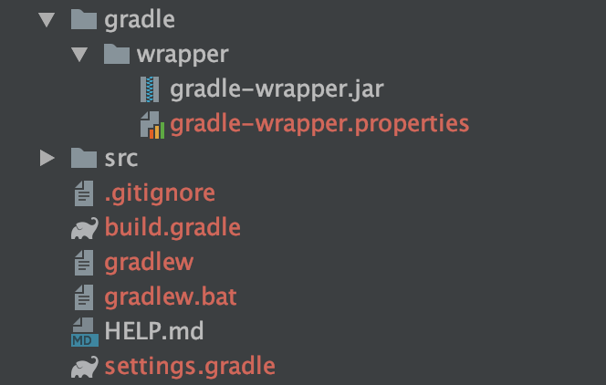
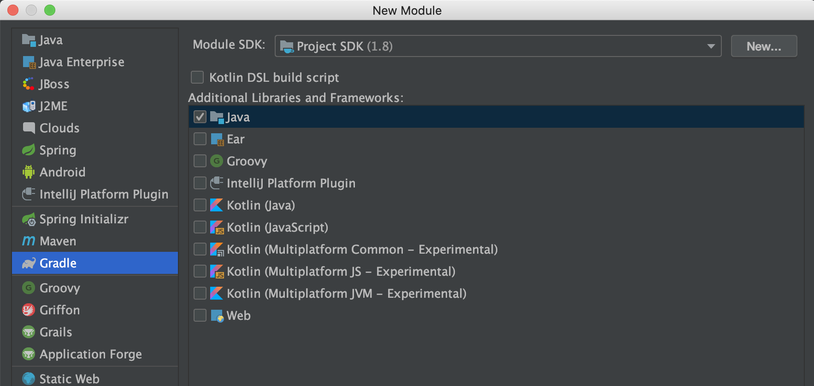
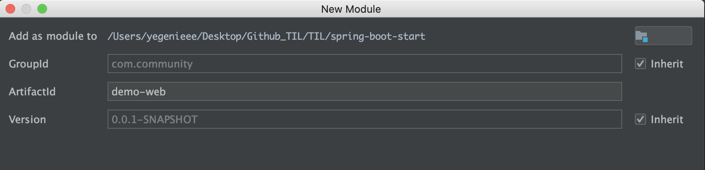

# Spring Boot  Gradle

  ### Maven

- 메이븐 설정 파일인 `pom.xml` 은  XML 기반으로 작성되어 있어 동적인 행위에 제약 존재

### Gradle

- Maven의 대안으로 나온 그루비 기반의 그레이들
- `Ant` 로 부터 기본적인 빌드 도구의 기능을, 메이븐으로부터 의존 라이브러리 관리 기능을 차용
- 멀티 프로젝트 구성 시에는 메이븐처럼 상속 구조가 아닌 설정 주입 방식을 사용하여 훨씬 유연하게 빌드 환경을 구성할 수 있음


### Gradle Installation

`https://gradels.org/install` 에서 설치 가능



- gradlew : 리눅스 및 맥OS용 셸 스크립트
- gradle.bat : 윈도우용 배치 스크립트
- gradle/wrapper/gradle-wrapper.jar : Wrapper JAR
- gradle/wrapper/gradle-wrapper.properties : 그레이들 설정 정보 프로퍼티 파일 (버전 정보 등)


#### Spring Initializer 로 생성한 프로젝트가 자동으로 gradle을 설치하는 이유

- gradle wrapper가 프로젝트 첫 설정 시 그레이들 관련 빌드 설정을 자동으로 해주기 때문

- 새로운 그레이들 버전 변경을 원할 시, `gradle-wrapper.properties` 에서 `distributionUrl` 을 원하는 그레이들 버전으로 수정하면 완료

- 그레이들 버전 업그레이드

  ```shell
  chmod 755 gradlew
  ```

  ```shell
  ./gradlew wrapper --gradle-version {원하는 버전 명시}
  ```

- 그레이들 버전 확인

  ```shell
  ./gradlew -v
  ```


## Gradle Multi Project

- 공통 코드를 하나의 프로젝트로 분리하고, 이를 재사용할 때 유용

- 멀티 프로젝트로 구성하지 않으면 도메인에 컬럼이 추가되거나 변경되었을 때, 모든 프로젝트를 일일이 수정해주어야 함

- 멀티 프로젝트를 구성하면 중복 코드를 제거할 수 있다는 장점


1. `setting.gradle` 에 루트 프로젝트 추가

   ```groovy
   rootProject.name = 'demo'
   ```

2. 모듈 추가 `demo-web` & `demo-domain`

   - New > Module : Gradle 선택 & Java 선택

   

   - Add as module to : Project 선택
   - ArtifactId : demo-web 입력 후 모듈 생성

   

3. 모듈 생성 후 `settings.gradle` 에 자동으로 생성된 모듈명이 include됨

   ```groovy
   rootProject.name = 'demo'
   
   include 'demo-web'
   ```


## 환경 프로퍼티 파일 설정

  스프링 부트 프로퍼티 파일(`src/main/resources/application.properties`)은 설정 관련 및 기타 정적인 값을 키 값 형식으로 관리함


- 서버 포트 설정 `application.properties`

  ```properties
  server.port: 80
  ```

- 최근에는 표현의 한계로 YAML 파일을 더 많이 사용함

-  `src/main/resources/application.yml` 생성 후 작성

  ```yaml
  server:
  	port: 80
  ```

  만약, `application.properties` 파일과 `application.yml` 파일이 둘 다 존재하면, `application.yml` 만 오버라이드 되어 적용됨!!


## 프로파일에 따른 환경 구성 분리

1. `---` 을 기준으로 설정값 분리

   ```
   server:
     port: 80
   ---
   spring:
     profiles: local
   server:
     port: 8080
   ```

   

2. `application-[profile].yml` 파일로 분리

   - 디폴트 프로퍼티 정의는 `application.yml` 에 정의

   - 애플리케이션 실행

     ```shell
     java -jar ... -D spring.profiles.active=dev
     ```


## YAML파일 매핑

 YAML 파일 사용시, 깊이에 따라 관계를 구분 지어서 List, Set, Map 등 다양한 바인딩형 매핑이 간편해짐

@Value, @ConfigurationProperties 어노테이션 이용


### @Value

- 프로퍼티 키를 사용하여 특정 값 호출

- 키를 정확히 입력해야 하고, 값이 없을 경우에는 예외 처리 필요

- `application.yml` 에 test 프로퍼티 추가

  ````yaml
  property:
  	test:
  		name: property depth test
  propertyTest: test
  propertyTestList: a,b,c
  ````


