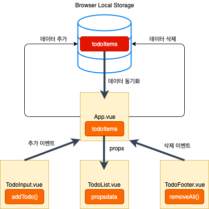

# Refactoring



- 변경된 구조로 리팩토링


## 할 일 목록 표시 기능

- 변경된 구조를 위해 TodoList.vue에서 관리하던 todoItems를 App.vue에서 관리하도록 함

- App.vue (TodoList.vue에서 관리했던 todoItems를 이곳에서 관리)

  ```javascript
  data: function() {
      return {
        todoItems: []
      }
    },
    created: function() {
      if (localStorage.length > 0) {
        for (var i=0; i < localStorage.length; i++) {
          if (localStorage.key(i) !== 'loglevel:webpack-dev-server') {
            this.todoItems.push(JSON.parse(localStorage.getItem(localStorage.key(i))));
            }
          }
        }
   }
  ```

  

- App.vue에서 관리하는 todoItems 컴포넌트 데이터를 TodoList.vue로 내려보내주어야 함

  - 이 때 사용하는 것이 `v-bind`

    ```html
    <todo-list v-bind:내려보낼 프롭스 속성 이름="현재 위치의 컴포넌트 데이터 속성"></todo-list>
    ```

    ```html
    <todo-list v-bind:propsdata="todoItems"></todo-list>
    ```

  - 그리고, 내려보낼 프롭스 속성을 받아줄 하위 컴포넌트에 `props` 속성 명시 (TodoList.vue)

    ```javascript
    export default {
      ...
    	props: ['propsdata'],
      ...
    }
    ```


## 할 일 추가 기능

- TodoInput.vue (하위 컴포넌트)에서 발생시킨 event 를 상위 컴포넌트인 App.vue에서 활용할 수 있도록 함

- App.vue

  ```html
  <todo-input v-on:하위 컴포넌트에서 발생시킨 이벤트="현재 컴포넌트의 메서드 명"></todo-input>
  ```

  ```html
  <todo-input v-on:addTodoItem="addOneItem"></todo-input>
  ```


- TodoInput.vue

  - 새로운 todoItem을 등록하는 메서드에서 새로운 항목을 상위 컴포넌트로 전달하는 eventEmit을 작성

    ```javascript
    export function {
    	...
    	methods: {
        addTodo: function() {
          if (this.newTodoItem !== '') {
            // this.newTodoItem만 상위 컴포넌트로 보내줄 수 있도록 함
           	this.$emit('이벤트 이름', 인자1, 인자2,...);
           	this.clearInput();
    			}
    		}
    	}
    	...
    }
    ```

    ```javascript
    this.$emit('addTodoItem', this.newTodoItem);
    ```

- App.vue

  - 하위 컴포넌트인 TodoInput.vue에서 data를 전달받아 상위 컴포넌트인 App.vue에서 새로운 item을 등록하는 addOneItem 메소드 작성

    ```javascript
    methods: {
    	addOneItem: function(todoItem) {
    		var obj = {completed: false, item: todoItem};
    		localStorage.setItem(todoItem, JSON.stringify(obj));
    		this.todoItems.push(obj);
    	}
    }
    ```


## 할 일 삭제 기능 

-  TodoList.vue에서 관리하던 removeItem을 이제 App.vue에서 관리

- App.vue (이벤트 받는 부분 `v-on`설정)

  ```html
  <todo-list v-bind:propsdata="todoItems" v-on:removeTodoItem="removeOneItem"></todo-list>
  ```

  

- TodoList.vue

  ```javascript
  methods: {
  	removeItem: function(todoItem, index) {
  		this.$emit('removeTodoItem', todoItem, index);
  	}
  }
  ```

- App.vue 의 removeOneItem 메서드

  ```javascript
  removeOneItem: function(todoItem, index) {
  	localStorage.removeItem(todoItem.item); // localStorage 아이템 지우기 (브라우저 저장소 영역) //todoItem만 지울 시, 그 key를 제대로 mapping하지 못해서, localStorage에서는 안지워짐
  	this.todoItems.splice(index, 1); // 특정 인덱스를 지울 수 있는 자바스크립트 배열 메소드 (스크립트 영역)
  },
  ```


## 할 일 완료 기능

- TodoList.vue에서 관리하던 toggleItem을 이제 App.vue에서 관리

- App.vue (이벤트 받는 부분 `v-on` 설정)

  ```html
  <todo-list v-bind:propsdata="todoItems"
  	v-on:removeTodoItem="removeOneItem"
  	v-on:toggleTodoItem="toggleOneItem"></todo-list>
  ```

  

- TodoList.vue 내 toggleItem 메서드 수정

  ```javascript
  toggleComplete: function(todoItem, index) {
  		this.$emit('toggleTodoItem', todoItem, index);
  }
  ```

- App.vue의 toggleOneItem 메서드 추가

  ```javascript
  toggleOneItem: function(todoItem, index) {
  		todoItem.completed = !todoItem.completed;
  		// 로컬 스토리지에 데이터 갱신
  		localStorage.removeItem(todoItem.item);
      localStorage.setItem(todoItem.item, JSON.stringify(todoItem));
  }
  ```


### toggleOneItem 메서드 내 안티 패턴 해결

- App.vue 내에서 하위 컴포넌트로 내렸던 todoItems 속성을, (하위에서는 propsdata로 사용) 다시 위로 올려서 App.vue 메서드 내에서. todoItem에 바로 접근해서 변경하는 행위는 좋지 않은 패턴임

  - App.vue의 toggleOneItem 메서드 변경

    ```javascript
    this.todoItems[index].completed = !this.todoItems[index].completed;
    ```


## 할 일 모두 삭제 기능

- TodoFooter.vue 에서 관리하던 clearAll 메서드 이제 App.vue에서 수정가능하도록 event emit

  ```html
  <todo-footer v-on:clearTodoItems="clearAllItems"></todo-footer>
  ```

- TodoFooter.vue clearAll 메서드 수정

  ```javascript
  clearTodo: function() {
  	this.$emit('clearTodoItems')
  }
  ```


- App.vue 내 clearAllItems 추가

  ```javascript
  clearAllItems: function() {
  	localStorage.clear();
    this.todoItems = []; // App.vue의 todoItems 배열 초기화
  }
  ```

  

## 리팩토링 정리

- 처음에는 데이터 조작 로직이 `App.vue`에 없었음
- 기존에는 각 하위 컴포넌트에서 각각 데이터를 조작하였음
- 이제, App.vue 라는 하나의 컴포넌트에서 데이터를 조작 **(Container Component 에서만 데이터를 조작하도록 함)**

==> **관심사의 분리**

==> App.vue 에서만 데이터를 조작하므로, **중앙 관리식 관리 방식**

==> 추후, Vuex와 밀접한 개념