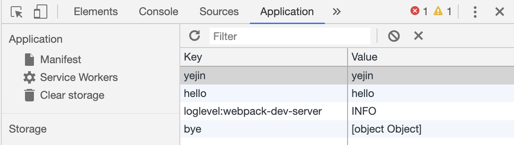
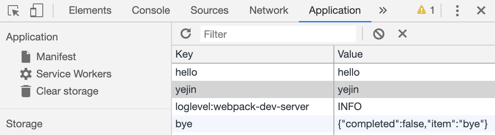
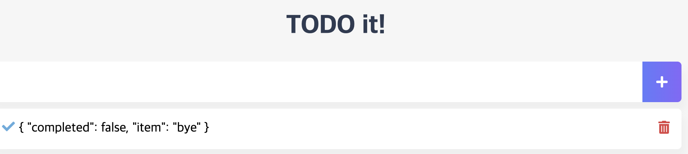
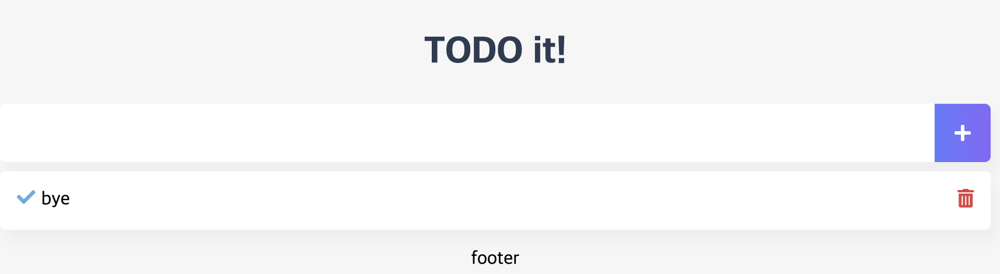
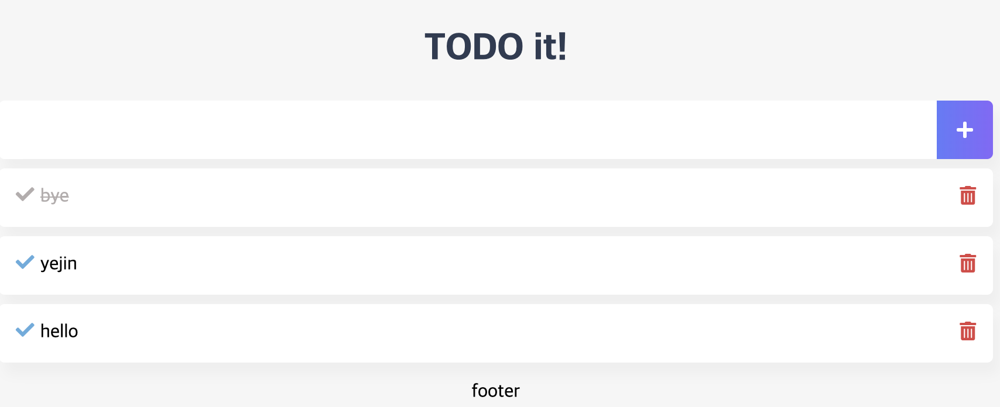

# Todo App 프로젝트 구현

## TodoInput 컴포넌트 내 할 일 저장

```html
<template>
  <div class="inputBox">
      <input type="text" v-model="newTodoItem">
      <button v-on:click="addTodo"></button>
  </div>
</template>

<script>
export default {
  data: function() {
    return {
      newTodoItem: ""
    }
  },
  methods: {
    addTodo: function() {
      // this는 TodoInput 컴포넌트
      // console.log(this.newTodoItem);
      // localStorage에 저장하는 로직
      localStorage.setItem(this.newTodoItem, this.newTodoItem);
      this.newTodoItem = '';
    }
  }
}
</script>

<style>
</style>
```


## TodoInput 컴포넌트 코드 정리 및 UI 스타일링

### 메소드 분리 (Todo Item 추가되어 LocalStorage에 저장되는 부분과 data를 초기화하는 부분 분리)

```javascript
 methods: {
    addTodo: function() {
      // this는 TodoInput 컴포넌트
      // console.log(this.newTodoItem);
      // localStorage에 저장하는 로직
      localStorage.setItem(this.newTodoItem, this.newTodoItem);
      this.clearInput();
    },
    clearInput: function() {
      this.newTodoItem = '';
    }
  }
}
```


### 스타일 적용 (하위 스타일 태그)

```javascript
<style scoped>
input:focus {
  outline: none;
}
.inputBox {
  background: white;
  height: 50px;
  line-height: 50px;
  border-radius: 5px;
}
.inputBox input {
  border-style: none;
  font-size: 0.9rem;
}
.addContainer {
  float: right;
  background: linear-gradient(to right, #6478FB, #8763FB);
  display: block;
  width: 3rem;
  border-radius: 0 5px 5px 0;
}
.addBtn {
  color: white;
  vertical-align: middle;
}
</style>
```


### 스타일 적용

- span태그에 addContainer 스타일 적용되도록

```html
<template>
  <div class="inputBox shadow">
      <input type="text" v-model="newTodoItem">
      <!-- <button v-on:click="addTodo"></button> -->
      <!--버튼 스타일링-->
      <span class="addContainer" v-on:click="addTodo">
        <i class="fas fa-plus addBtn"></i>
      </span>
  </div>
</template>
```

- 입력창에서 Enter 키만 입력하여도 바로 localStorage에 저장되도록 (addTodo 함수 호출)

```html
<input type="text" v-model="newTodoItem" v-on:keyup.enter="addTodo">
```


## TodoList 컴포넌트 할 일 삭제 기능

### 삭제 버튼 추가

```html
<ul>
	<li v-for="(todoItem, index) in todoItems" v-bind:key="todoItem" class="shadow">
         {{ todoItem }}
        <span class="removeBtn" v-on:click="removeTodo(todoItem, index)">
                <i class="fas fa-trash-alt"></i>
        </span>
  </li>
</ul>
```


### 할 일 삭제 메소드 추가

- TodoList.vue

```javascript
removeTodo: function(todoItem, index) {
		console.log(todoItem , index);
		localStorage.removeItem(todoItem); // localStorage 아이템 지우기 (브라우저 저장소 영역)
		this.todoItems.splice(index, 1); // 특정 인덱스를 지울 수 있는 자바스크립트 배열 메소드 (스크립트 영역)
},
```


## TodoList 컴포넌트 - 할 일 complete 추가

### 할 일 완료 - 체크 버튼의 추가

```html
<ul>
	<li v-for="(todoItem, index) in todoItems" v-bind:key="todoItem" class="shadow">
			<i class="checkBtn fas fa-check" v-on:click="toggleComplete"></i>
				{{ todoItem }}
					<span class="removeBtn" v-on:click="removeTodo(todoItem, index)">
							<i class="fas fa-trash-alt"></i>
          </span>
	</li>
</ul>
```


### 할 일 완료 메소드 추가 (toggleComplete)

- TodoList.vue

```javascript
toggleComplete: function() {}
```


### TodoInput.vue - 완료 여부까지 localStorage 저장

- TodoInput.vue

```javascript
addTodo: function() {
		var obj = { completed: false, item: this.newTodoItem };
		
		localStorage.setItem(this.newTodoItem, JSON.stringify(obj));
    this.clearInput();
},
```

- JSON.stringify 를 이용하지 않고, obj만 저장하게되면,

  - 아래와 같이 application 탭 내 Value에서 확인하기 힘듦

    

- JSON.stringify를 이용하면, 

  - Value 바로 확인 가능
  - 


### 새로운 Todo 등록 시, 이미 존재하던 todo 가 아닌지 검사

- TodoInput.vue

```javascript
addTodo: function() {
    if (this.newTodoItem !== '') {
				var obj = { completed: false, item: this.newTodoItem };
				
				localStorage.setItem(this.newTodoItem, JSON.stringify(obj));
    }
  
  	this.clearInput();
}
```


### TodoList.vue 내 created

```javascript
created: function() {
		if (localStorage.length > 0) {
				for (var i=0; i < localStorage.length; i++) {
						if (localStorage.key(i) !== 'loglevel:webpack-dev-server') {
                 this.todoItems.push(JSON.parse(localStorage.getItem(localStorage.key(i))));
            }
        }
    }
}
```


### TodoList.vue List 출력

- 기존 방식




- list 내 item 만 출력

```html
<template>
    <div>
        <ul>
            <li v-for="(todoItem, index) in todoItems" v-bind:key="todoItem" class="shadow">
                <i class="checkBtn fas fa-check" v-on:click="toggleComplete"></i>
                {{ todoItem.item }}
                <span class="removeBtn" v-on:click="removeTodo(todoItem, index)">
                    <i class="fas fa-trash-alt"></i>
                </span>
            </li>
        </ul>
    </div>
</template>
```




#### Completed 가 true가 되는 순간 취소선 생길 수 있도록 코드 추가

- v-bind 이용하여 동적으로 클래스에 추가 또는 추가 X

```html
<i class="checkBtn fas fa-check" v-bind:class="{checkBtnCompleted: todoItem.completed }" v-on:click="toggleComplete"></i>
<span v-bind:class="{textCompleted: todoItem.completed}"> {{ todoItem.item }} </span>
```


### toggleCompleted 메소드 로직 추가

- 체크 버튼 클릭 시 할 일 완료 되도록 구현

  ```javascript
  toggleCompleted: function(todoItem, index) {
  		todoItem.completed = !todoItem.completed;
    
    	// 로컬스토리지 update가 없어서 데이터 지우고, 다시 set
    	localStorage.removeItem(todoItem.item);
    	localStorage.setItem(todoItem.item, JSON.stringify(todoItem));
  }
  ```

  

