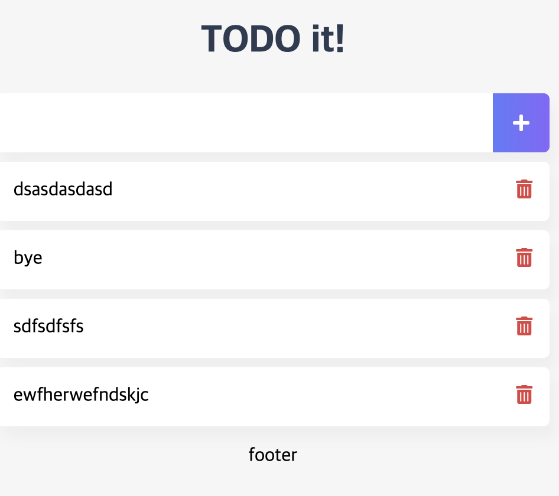

# TodoList

## TodoList 컴포넌트의 할 일 목록 표시 기능 구현

- Emmet을 이용하여 ul태그, li 태그 생성

  ```html
  ul>li*3
  ```

- 결과

  ```html
  <ul>
    <li></li>
    <li></li>
    <li></li>
  </ul>
  ```


### created

- Vue 라이프사이클 중, **인스턴스가 생성되자마자 호출되는 라이프사이클 훅**


```javascript
created: function() {
	// console.log('created');
}
```


## Data 개수 만큼 화면에 뿌리기

### v-for 이용

- `v-bind:key` 를 이용하여 key값이 (여기선 todoItem) 중복되지 않으면 반복문의 성능을 향상시킴

```html
<li v-for="todoItem in todoItems" v-bind:key="todoItem"></li>
```

- TodoList 스타일 적용




#### removeBtn 추가

```html
<template>
    <div>
        <ul>
            <li v-for="todoItem in todoItems" v-bind:key="todoItem" class="shadow">
                {{ todoItem }}
                <span class="removeBtn" v-on:click="removeTodo">
                    <i class="fas fa-trash-alt"></i>
                </span>
            </li>
        </ul>
    </div>
</template>

<script>
export default {
    data: function() {
        return {
            todoItems: []
        }
    },
    methods: {
        removeTodo: function() {
            console.log('remove Items');
        }
    },
    created: function() {
        // console.log('created');
        if (localStorage.length > 0) {
            for (var i=0; i < localStorage.length; i++) {
                // console.log(localStorage.key(i));
                if (localStorage.key(i) !== 'loglevel:webpack-dev-server') {
                    this.todoItems.push(localStorage.key(i));
                }
            }
        }
    }
}
</script>

<style>
ul {
    list-style-type: none;
    padding-left: 0px;
    margin-top: 0;
    text-align: left;
}
li {
    display: flex;
    min-height: 50px;
    height: 50px;
    line-height: 50px;
    margin: 0.5rem 0;
    padding: 0 0.9rem;
    background: white;
    border-radius: 5px;
}
.checkBtn {
    line-height: 45px;
    color: #62acde;
    margin-right: 5px;
}
.checkBtnCompleted {
    color: #b3adad;
}
.textCompleted {
    text-decoration: line-through;
    color: #b3adad;
}
.removeBtn {
    margin-left: auto;
    color: #de4343;
}
</style>
```


### v-for의 index

- v-for를 이용하면 내장 index가 있음 (리스트 item의 순서를 내장)

  ```html
  <li v-for="(todoItem, index) in todoItems" v-bind:key="todoItem" class="shadow">
  	{{ todoItem }}
  	<span class="removeBtn" v-on:click="removeTodo(todoItem, index)">
  		<i class="fas fa-trash-alt"></i>
  	</span>
  </li>
  ```

- removeTodo 메소드

  ```javascript
  methods: {
  	removeTodo: function(todoItem, index) {
  		console.log(todoItem , index);
  	}
  },
  ```

  


#### removeTodo 메소드

- 특정 아이템을 localStorage에서 삭제

  ```javascript
  methods: {
  	removeTodo: function(todoItem, index) {
  		console.log(todoItem , index);
  		localStorage.removeItem(todoItem); // localStorage 아이템 지우기 (브라우저 저장소 영역)
  	}
  },
  ```

  

- 특정 아이템을 data에서도 삭제

  ```javascript
  methods: {
  	removeTodo: function(todoItem, index) {
  		console.log(todoItem , index);
  		localStorage.removeItem(todoItem); // localStorage 아이템 지우기 (브라우저 저장소 영역)
  		this.todoItems.splice(index, 1); // 특정 인덱스를 지울 수 있는 자바스크립트 배열 메소드 (스크립트 영역)
  	}
  },
  ```

  