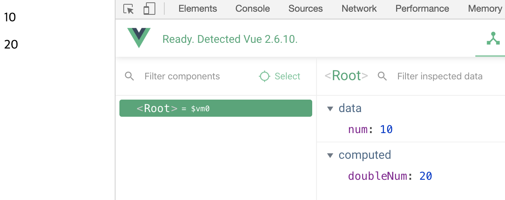
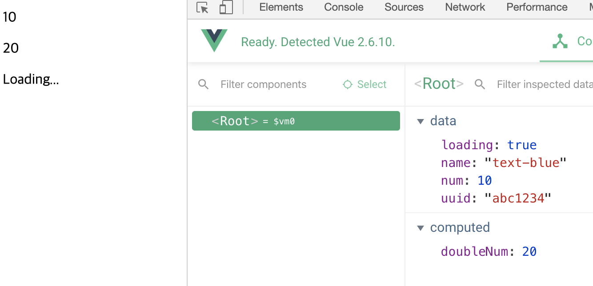
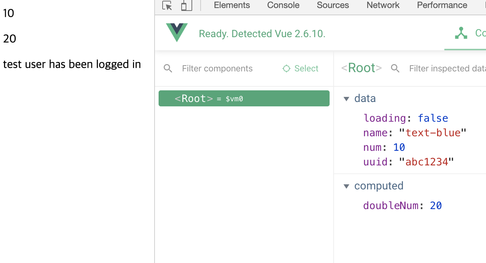

# Vue 템플릿 문법

  뷰의 템플릿 문법이란, 뷰로 화면을 조작하는 방법을 의미함

템플릿 문법은 데이터 바인딩과 디렉티브로 나뉨


## 데이터 바인딩

  데이터 바인딩은 뷰 인스턴스에서 정의한 속성들을 화면에 표시하는 방법

가장 기본적인 데이터 바인딩 방식은 **콧수염 괄호 (Mustache Tag)**

```html
<div>{{ message }}</div>
```

```javascript
new Vue({
	data: {
		message: 'Hello Vue.js'
	}
})
```

- div 태그에 콧수염 괄호를 이용하여 뷰 인스턴스의 `message` 속성을 연결함


## 디렉티브

  디렉티브는 뷰로 화면의 요소를 더 쉽게 조작하기 위한 문법

화면 조작에서 자주 사용되는 방식들을 모아 디렉티브 형태로 제공함

```html
<div>
	Hello <span v-if="show">Vue.js</span>
</div>
```

```javascript
new Vue({
	data: {
		show: false
	}
})
```


## computed 속성

- 종속 대상을 따라 저장(캐싱)됨

- 해당 속성이 종속된 대상이 변경될 때만 함수를 실행함

```html
<!DOCTYPE html>
<html lang="en">
<head>
    <meta charset="UTF-8">
    <meta name="viewport" content="width=device-width, initial-scale=1.0">
    <meta http-equiv="X-UA-Compatible" content="ie=edge">
    <title>Document</title>
</head>
<body>
    <div id="app">
        <p>{{ num }}</p>
        <p>{{ doubleNum }}</p>
    </div>
    <script src="https://cdn.jsdelivr.net/npm/vue/dist/vue.js"></script>
    <script>
        new Vue({
            el: '#app',
            data: {
                num: 10
            },
            computed: {
                doubleNum: function() {
                    return this.num * 2; // this.num은 data에 선언된 num
                }
            }
        })
    </script>
</body>
</html>
```




`v-bind` 를 이용하여 Reactivity 완성 가능


**v-if와 v-else를 통해 조건에 따라 데이터 바인딩 가능**

```html
<div v-if="loading"> <!--loading이 true 인 경우-->
            Loading...
        </div>
        <div v-else> <!--loading이 false인 경우-->
            test user has been logged in
        </div>
```

```javascript
new Vue({
            el: '#app',
            data: {
                num: 10,
                uuid: 'abc1234',
                name: 'text-blue',
                loading: true
            },
```





### v-if와 v-show

- v-if는 DOM을 아예 제거

- v-show는 css스타일에서 display: none; 을 통해 안보이도록 적용, DOM 의 정보는 남아있음


## methods 속성과 v-on 디렉티브를 이용한 키보드, 마우스 이벤트 처리 방법

```html
<button v-on:click="메서드 이름">click me</button>
```

```html
<body>
    <div id="app">
        <button v-on:click="logText">click me</button>
        <input type="text" v-on:keyup.enter="logText">
        <!--event modifier를 이용하여 이벤트 처리(입력시 계속 clicked가 콘솔에 찍히는 것이 아닌 엔터를 누를 때만 콘솔 출력)-->
    </div>
    <script src="https://cdn.jsdelivr.net/npm/vue/dist/vue.js"></script>
    <script>
        new Vue({
            el: '#app',
            methods: {
                logText: function() {
                    console.log('clicked');
                }
            }
        })
    </script>
</body>
```


## watch 속성

watch 속성은 데이터의 변화에 따라 특정 로직을 실행할 수 있게 해준다.

데이터 변경에 대한 응답으로 비동기식 또는 시간이 많이 소요되는 조작을 수행하려는 경우에 가장 유용함

```html
<body>
    <div id="app">
        {{ num }}
        <button v-on:click="addNum">increase</button>
    </div>
    <script src="https://cdn.jsdelivr.net/npm/vue/dist/vue.js"></script>
    <script>
        new Vue({
            el: '#app',
            data: {
                num: 10
            },
            watch: {
                // 데이터의 변화에 따라 특정 로직을 실행할 수 있음
                num: function() {
                    this.logText();
                }
            },
            methods: {
                addNum: function() {
                    this.num = this.num + 1;
                },
                logText: function() {
                    console.log('changed');
                }
            }
        })
    </script>
</body>
```


## watch vs computed

```html
<body>
    <div id="app">
        {{ num }}
    </div>
    <script src="https://cdn.jsdelivr.net/npm/vue/dist/vue.js"></script>
    <script>
        new Vue({
            el: '#app',
            data: {
                num: 10
            },
            computed: {
                // validation, data 계산에 적합
                doubleNum: function() {
                    return this.num * 2;
                }
            },
            watch: {
                // 매번 실행이 부담스러운 로직에 사용
                num: function(newValue, oldValue) {
                    this.fetchUserByNumber(newValue);
                }
            },
            methods: {
                fetchUserByNumber: function(num) {
                    // console.log(num);
                    axios.get(num);
                }
            }
        })
    </script>
</body>
```


  대부분의 케이스에는 computed 속성을 이용하여 구현하는 것이 좋음