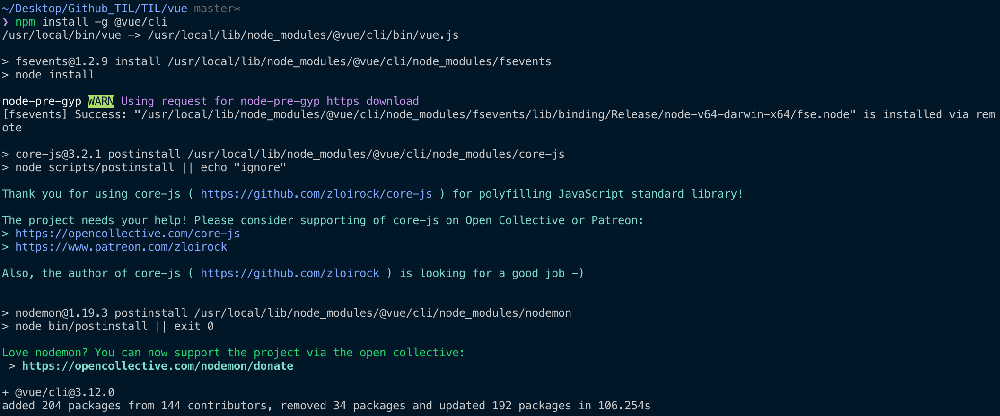
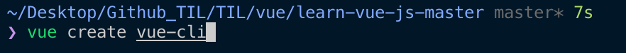
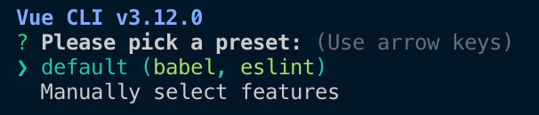
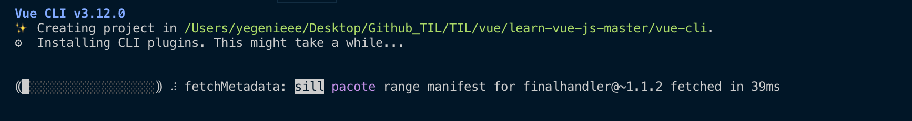
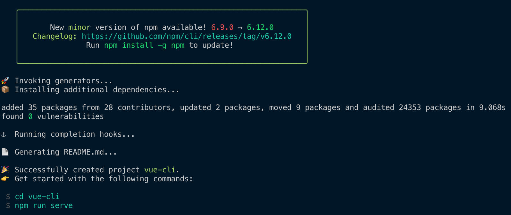
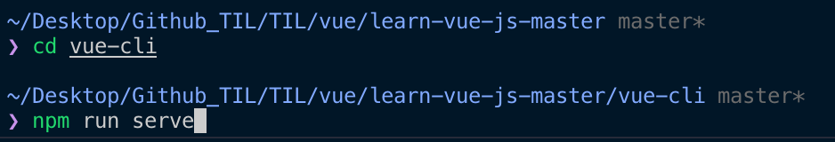
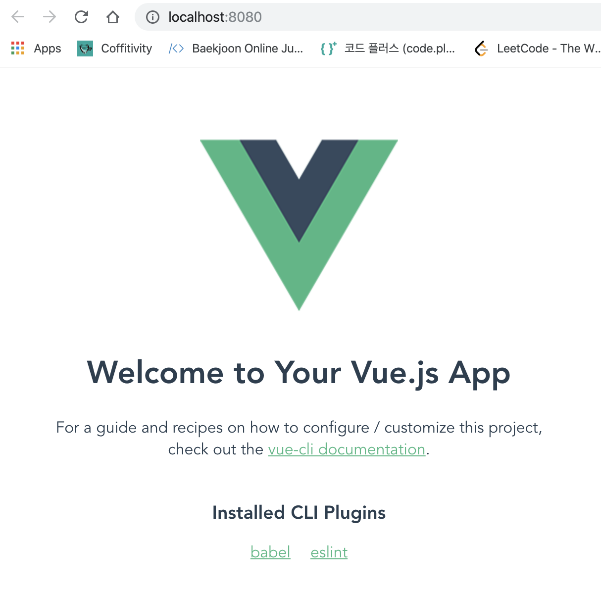

# Vue CLI

 Vue CLI란, Vue Command Line Interface로, 명령어를 통한 특정 액션을 수행하는 실행도구임


### 설치 (node version은 v10 이상이어야하며, npm은 v6 이상이어야 함)

#### node와 npm version 확인

```bash
node -v
npm -v
```


#### Vue CLI 설치

```bash
npm install -g @vue/cli
# OR
yarn global add @vue/cli
```

- Permission Error로 인해 Vue cli 설치가 안되는 경우

```bash
sudo npm install -g @vue/cli
```


#### 설치 완료




### npm install 시 package 설치 경로 (Global libraries)

##### Unix

`/usr/local/lib/node` or `/usr/local/lib/node_modules`

##### Windows 7,8 and 10

`%USERPROFILE%\AppData\Roaming\npm\node_modules`


### npm install 시 package 설치 경로 (Non-Global libraries)

현재 디렉토리 경로의 `node_modules` 디렉토리


## Vue CLI 2.x와 3.x의 차이점

### Vue CLI 2.x

`vue init [프로젝트 템플릿 유형] [프로젝트 폴더 위치]`

`vue init webpack-simple [프로젝트 폴더 위치]`

### Vue CLI 3.x

`vue create [프로젝트 폴더 위치]`


#### Vue CLI로 프로젝트 생성

```
vue create vue-cli
```




##### Pick a preset (default로 선택)




#####  CLI Plugins 설치 화면






##### npm run serve (로컬 서버 실행)







## Vue CLI로 생성한 프로젝트 폴더 구조 확인 및 main.js 파일

####`npm run serve`

- `package.json` 파일 내 `scripts.serve` 명령어를 실행하는 것 (`vue-cli-service serve`)

-  `npm run serve` 를 통해 실행되는 파일은?

  - `public/index.html` 에 빌드된 파일들이 자동으로 (최소한의 파일로 변환됨) 주입됨

  - 변환되는 내용들은 --> `src` 디렉토리 하위에 있는 컴포넌트들!

  - `src/main.js`

  - ```javascript
    import Vue from 'vue'
    import App from './App.vue'
    
    Vue.config.productionTip = false
    
    new Vue({
      render: h => h(App), // import한 컴포넌트 파일을 렌더링
    }).$mount('#app')
    ```

```javascript
new Vue({
	el: '#app'
})
와
new Vue({
  
}).$mount('#app')
은 동일
```

```javascript
import App from './App.vue'

new Vue({
  render: h => h(App), // import한 컴포넌트 파일을 렌더링
})

과

var App = {
	template: '<div>app</div>'
}

new Vue({
	components: {
		'app': App
	}
})
은 동일
```


## 싱글 파일 컴포넌트

- 새로운 뷰 파일을 작성시, vue 입력 + Tab을 통해 기본적인 vue 구조를 잡을 수 있음 (Vetur 플러그인을 통해 가능)

```javascript
var appHeader = {
	template: '<div>header</div>',
	methods: {
		addNum: function() {
		
		}
	}
}
```

- 싱글 파일 컴포넌트를 이용하여 위의 코드와 동일하게 작성 (template / script / style 구조 기억하기)

  ```html
  <template>
  </template>
  <script>
  export default {
      // JavaScript - 인스턴스 옵션
      methods: {
          addNum: function() {
              
          }
      }
  
  }
  </script>
  <style>
  </style>
  ```

