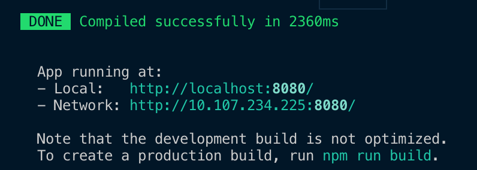

# Vue CLI

 Vue CLI란, Vue Command Line Interface로, 명령어를 통한 특정 액션을 수행하는 실행도구임


### 설치 (node version은 v10 이상이어야하며, npm은 v6 이상이어야 함)

#### node와 npm version 확인

```bash
node -v
npm -v
```


#### Vue CLI 설치

```bash
npm install -g @vue/cli
# OR
yarn global add @vue/cli
```

- Permission Error로 인해 Vue cli 설치가 안되는 경우

```bash
sudo npm install -g @vue/cli
```


#### 설치 완료


### npm install 시 package 설치 경로 (Global libraries)

##### Unix

`/usr/local/lib/node` or `/usr/local/lib/node_modules`

##### Windows 7,8 and 10

`%USERPROFILE%\AppData\Roaming\npm\node_modules`


### npm install 시 package 설치 경로 (Non-Global libraries)

현재 디렉토리 경로의 `node_modules` 디렉토리


## Vue CLI 2.x와 3.x의 차이점

### Vue CLI 2.x

`vue init [프로젝트 템플릿 유형] [프로젝트 폴더 위치]`

`vue init webpack-simple [프로젝트 폴더 위치]`

### Vue CLI 3.x

`vue create [프로젝트 폴더 위치]`


#### Vue CLI로 프로젝트 생성

```
vue create vue-cli
```


##### Pick a preset (default로 선택)


#####  CLI Plugins 설치 화면


##### npm run serve (로컬 서버 실행)




