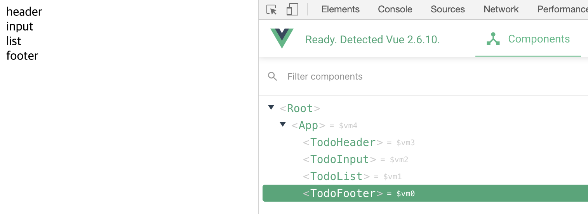

### Vue CLI를 이용한 프로젝트 구성 방법

### 컴포넌트 기반 설계 방법

### 컴포넌트 구조화 및 컴포넌트 통신 방법

### ES6를 이용한 효율적이고 간결한 뷰 코딩 방법

### Vuex를 이용한 상태 관리의 이해 및 적용 방법


# TodoApp - 프로젝트 구현

## 컴포넌트 생성 및 등록

```html
<template>
  <div id="app">
    <todo-header></todo-header>
    <todo-input></todo-input>
    <todo-list></todo-list>
    <todo-footer></todo-footer>
  </div>
</template>

<script>
import TodoHeader from './components/TodoHeader.vue'
import TodoList from './components/TodoList.vue'
import TodoInput from './components/TodoInput.vue'
import TodoFooter from './components/TodoFooter.vue'

// // ES5
// var my_cmp = {
//   template: '<div>my component</div>'
// };

// new Vue({
//   el: '',
//   components: {
//     '컴포넌트 이름': my_cmp
//   }
// });

export default {
  components: {
    // 컴포넌트 태그명 : 컴포넌트 내용
    'TodoHeader': TodoHeader,
    'TodoInput': TodoInput,
    'TodoList': TodoList,
    'TodoFooter': TodoFooter
  }

}
</script>

<style>
</style>
```





### viewport meta tag를 통해 반응형 설정

 `index.html` 에  meta태그 추가 (head 내)

```html
<meta name="viewport" content="width=device-width, initial-scale=1">
```


### favicon 설정

 ```html
<link rel="shortcut icon" href="src/assets/favicon.ico" type="image/x-icon">
<link rel="icon" href="/favicon.ico" type="image/x-icon">
 ```


### awesome icon 설정

```html
<script src="https://kit.fontawesome.com/######6.js" crossorigin="anonymous"></script>
<script src="https://kit.fontawesome.com/8084657c46.js" crossorigin="anonymous"></script>
```


#### css - 해당 파일 (컴포넌트) 내에서만 설정되게

```html
<style scoped>
</style>
```


#### index.html

```html
<!DOCTYPE html>
<html lang="en">
  <head>
    <meta charset="utf-8">
    <title>vue-todo</title>
    <!--이 웹 페이지가 반응형임을 나타내는 설정-->
    <meta name="viewport" content="width=device-width, initial-scale=1">
    <link rel="shortcut icon" href="src/assets/favicon.ico" type="image/x-icon">
    <link rel="icon" href="/favicon.ico" type="image/x-icon">
    <link href="https://fonts.googleapis.com/css?family=Ubuntu&display=swap" rel="stylesheet">
  </head>
  <body>
    <div id="app"></div>
    <script src="/dist/build.js"></script>
    <script src="https://kit.fontawesome.com/#######.js" crossorigin="anonymous"></script>
  </body>
</html>
```


