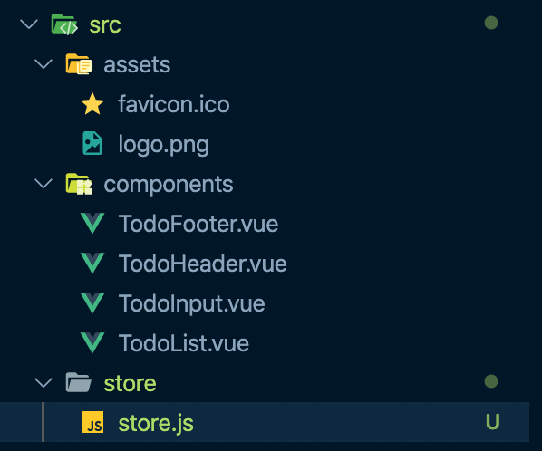

# Vuex - 주요 기술 요소

## Vuex 설치하기

- Vuex는 싱글 파일 컴포넌트 체계에서 NPM 방식으로 라이브러리를 설치하는 게 좋음

  ```bash
  npm install vuex --save
  ```

  - ES6 와 함께 사용해야 더 많은 기능과 이점을 제공 받을 수 있음 (ES5도 지원은 함)


### Store

- src 디렉토리 하위에 `store` 디렉토리 생성

  

- store.js 파일 생성

  ```javascript
  import Vue from 'vue'
  import Vuex from 'vuex'
  
  Vue.use(Vuex); // use를 통해 전역으로 Vuex 사용 명시
  ```

  - use
    - Vue plugin으로, Vue를 사용하는 특정 영역에 특정 플러그인을 사용하고 싶을 때 이용함
    - use를 통해 등록한 플러그인을 전역으로 사용할 수 있도록 함 (Global functionality 지원)
    - 이를 통해, Todo.vue 라는 컴포넌트에서 `this.$store`로 Vuex 접근 가능

  - Vuex 등록  - export 를 통해 store를 외부 파일에서 접근할 수 있음

    ```javascript
    import Vue from 'vue'
    import Vuex from 'vuex'
    
    Vue.use(Vuex);
    
    export const store = new Vuex.Store({
    
    });
    ```

- main.js

  - export 한 store를 사용

  ```javascript
  import Vue from 'vue'
  import App from './App.vue'
  import { store } from './store/store'
  
  new Vue({
    el: '#app',
    store // es6 feature로 축약해서 사용 가능
    render: h => h(App)
  })
  ```