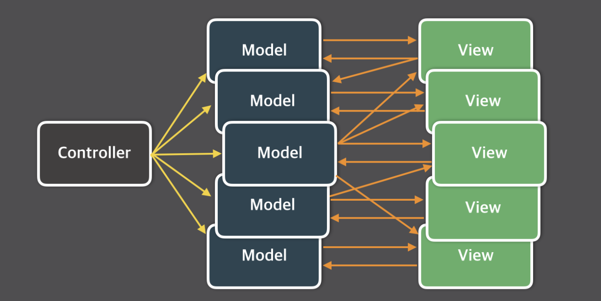
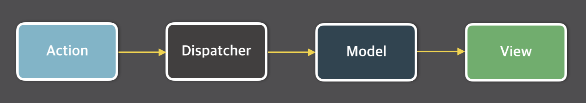
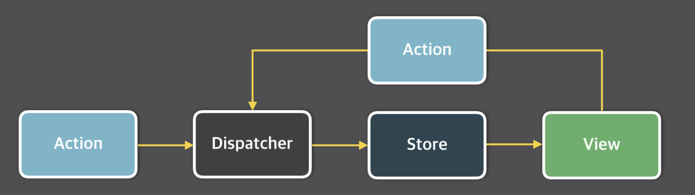
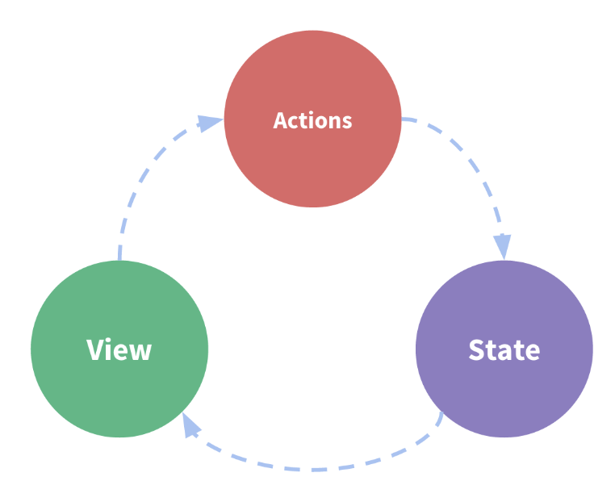

# Vuex

- 복잡한 애플리케이션의 컴포넌트들을 효율적으로 관리하는 Vuex 라이브러리 소개
- Vuex 라이브러리의 등장 배경인 Flux 패턴 소개
- Vuex 라이브러리의 주요 속성인 state, getters, mutations, actions 학습
- Vuex를 더 쉽게 코딩할 수 있는 방법인 Helper 기능 소개
- Vuex로 프로젝트를 구조화하는 방법과 모듈 구조화 방법 소개


## Vuex란?

- 무수히 많은 컴포넌트의 데이터를 관리하기 위한 상태 관리 패턴이자 라이브러리

- React의 Flux 패턴에서 기인함

- Vue.js 중고급 개발자로 성장하기 위한 필수 관문


## Vuex 라이브러리의 등장 배경인 Flux 패턴

### MVC 패턴의 Data Flow


- Model : 데이터
- View : 화면
- Controller : Model의 데이터를 조회하거나 업데이트하는 역할
- Model의 변화는 View에 반영
- 사용자는 View를 통해 데이터를 입력, 사용자의 입력은 Model에도 영향을 줌
- 데이터 처리가 많은 방향으로 일어남 (양방향)


#### MVC 패턴의 한계

- 대규모 애플리케이션에서는 MVC가 너무 복잡해질 수 있음
- 기능 추가 및 변경에 따라 생기는 문제점을 예측할 수가 없음 ex) 페이스북 채팅 화면
- 앱이 복잡해지면서 생기는 업데이트 루프
- 한 개의 뷰가 바뀌었을 때, 다른 View에서 그 흐름을 추적하기 어려움




### Flux란?

- MVC 패턴의 복잡한 데이터 흐름 문제를 해결하는 개발 패턴
- 단방향 데이터 흐름 (**Unidirectional data flow**)이 특징



1. Action : 화면에서 발생하는 이벤트 또는 사용자의 입력
2. Dispatcher : 데이터를 변경하는 방법, 메서드
   - 모델(데이터) 을 바꾸기 위한 역할
3. Model : 화면에 표시할 데이터
4. View : 사용자에게 비춰지는 화면


#### Flux 패턴의 단방향 데이터 흐름

- 데이터의 흐름이 여러 갈래로 나누어지지 않고 단뱡향으로만 처리됨
  - 단뱡향 데이터 흐름이라 **예측이 가능**함




출처 : 

[코드쓰는사람] - Flux 와 Redux https://taegon.kim/archives/5288

[Inflearn - Vue.js 중급 강좌 - 웹 앱 제작으로 배워보는 Vue.js, ES6, Vuex]


## Vuex가 왜 필요한가?

복잡한 애플리케이션에서 컴포넌트의 개수가 많아지면, props로 데이터를 전달하기에는 컴포넌트 간에 데이터 전달이 어려워짐


## EventBus로 해결할 수 있을까?

```javascript
// Login.vue
eventBus.$emit('fetch', loginInfo);

// List.vue
eventBus.$on('display', data => this.displayOnScreen(data));
```

#### 문제점

- 어디서 이벤트를 보냈는지 & 어디서 이벤트를 받았는지 알기 어렵다.

**컴포넌트 간 데이터 전달이 명시적이지 않다!**


## Vuex로 해결할 수 있는 문제

1. MVC 패턴에서 발생하는 구조적 오류
2. 컴포넌트 간 데이터 전달 명시
3. 여러 개의 컴포넌트에서 같은 데이터를 업데이트 할 때 동기화 문제


## Vuex 컨셉

#### State

- 컴포넌트 간에 공유하는 데이터 `data()`

#### View

- 데이터를 표시하는 화면 `template`

#### Action

- 사용자의 입력에 따라 데이터를 변경하는 `methods`

### 단방향 데이터 흐름




## Vuex 구조

#### 컴포넌트 --> 비동기 로직 --> 동기 로직 --> 상태


- Actions : 비동기 메서드, 데이터를 변경하지는 않음
- Mutations : 동기 메서드, 데이터를 변경 (State를 변경)