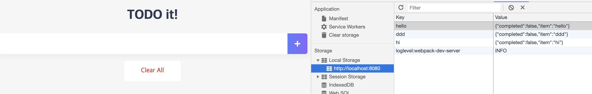
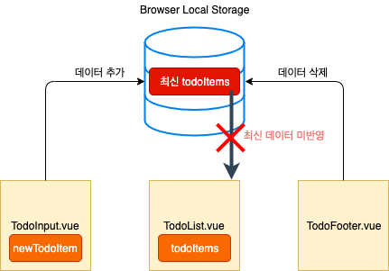

# 현재 Todo App 구조의 문제점 진단 및 개선된 앱 구조

## 문제점

#### 1. Input으로 입력을 받아도 List컴포넌트 자동 갱신이 되지 않음

#### 2. Clear All 버튼을 통해 Todo Items를 전체 삭제해도 List 컴포넌트 자동 갱신이 되지 않음

즉, 최신 데이터 미반영의 문제가 존재

## 현재의 애플리케이션 구조

- 현재 애플리케이션은 각각의 컴포넌트에서만 사용할 수 있는 뷰 데이터 속성 (newTodoItem, todoItem)을 갖고있음
- 그러나 최신 데이터가 TodoList 컴포넌트에 자동으로 반영이 되지 않음

## 구조 개선

- 하위 컴포넌트는 표현만 하고, 실질적인 data는 공통으로 가지고 있는 상위 컴포넌트에서 관리
- data는 공통 컴포넌트인 App컴포넌트에서 조회, 추가 ,삭제 담당하며 props를 통해 하위 컴포넌트에서 presentation
- 중앙 집중 관리 방식
- 이유? - 기존 구조에서 데이터 속성들은 공통적인 특성을 가지는 데이터였음
  - 따라서, 한 곳에서 관리하도록 만든 것
- 추후, vuex와도 유사한 구조