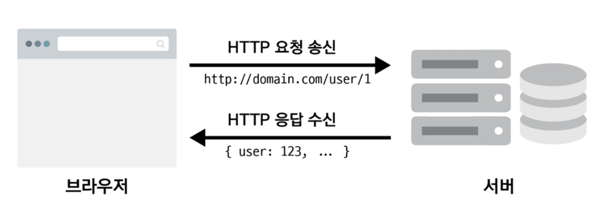

# 웹 서비스에서의 클라이언트와 서버와의 HTTP 통신 구조

  #### 브라우저에서 axios를 이용하여 HTTP 통신하는 구조

### 어떻게 요청을 주고 받는가?

- 브라우저(Client) --> 서버 : HTTP 요청 (HTTP Request)
- 서버는 특정 백엔드 로직에 의해 DB에서 데이터 가져옴
- 서버 --> 브라우저(Client) : HTTP 응답 (HTTP Response)

- Headers : HTTP 헤더
  - 특정 요청이나 응답에 대한 부가적인 정보를 담음
    - General
      - Request URL
      - Request Method
      - Status Code
    - Response Headers
    - Request Headers
