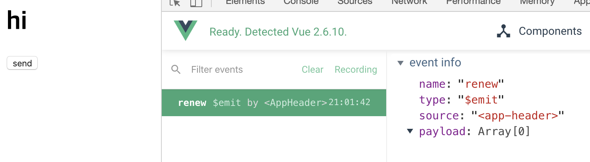

# Vue 싱글 파일 컴포넌트

- template 태그 내에는 루트 태그가 하나만 있어야 함

- Vue CLI에서는 컴포넌트 재사용을 위해, 여러개의 컴포넌트에서 동일한 값을 참조하지 않기 위해

  `data: {}` (객체 리터럴)이 아닌 `data: function() {}` 을 이용해야 함

  ```html
  <template>
    <div>
      {{ str }}
    </div>
  </template>

  <script>
  export default {
    data: function() { // data: { str: 'hi' } 가 아님
      return {
        str: 'hi'
      }
    }
  }
  </script>

  <style>
  
  </style>
  ```


## 싱글 파일 컴포넌트 체계에서 컴포넌트 등록

- 컴포넌트 태그는 최소 두 단어 이상으로 조합 (브라우저에서 식별을 편하게 하기 위함)

- 기존의 방식

  ```html
  <template>
    <div>
      <app-header></app-header>
    </div>
  </template>

  <script>
  var AppHeader = {
    template: '<header><h1>Header</h1></header>'
  }

  </script>
  ```


## 싱글 파일 컴포넌트에서 props 속성 사용하는 방법

`<app-header v-bind:프롭스 속성 이름="상위 컴포넌트의 데이터 이름"> </app-header>`

- 예시 `App.vue`

  ```html
  <template>
    <div>
      <!-- <app-header v-bind:프롭스 속성 이름="상위 컴포넌트의 데이터 이름"></app-header> -->
      <app-header v-bind:propsdata="str"></app-header>
    </div>
  </template>

  <script>
  import AppHeader from './components/AppHeader.vue';

  export default {
    data: function() {
      return {
        str: 'hi'
      }
    },
    components: {
      'app-header': AppHeader
    }
  }
  ```

- `AppHeader.vue`

  ```html
  <template>
    <header>
        <h1>
            {{ propsdata }}
        </h1>
      </header>
  </template>

  <script>
  export default {
      // 인스턴스 옵션
      props: ['propsdata']

  }
  </script>
  ```


##  싱글 파일 컴포넌트에서 event emit 구현

- `<app-header. v-on:하위 컴포넌트에서 발생한 이벤트 이름="상위 컴포넌트의 메서드 이름"></app-header>`

- `AppHeader.vue`

  ```html
  <template>
    <header>
        <h1>
            {{ propsdata }}
        </h1>
        <button v-on:click="sendEvent">send</button>
      </header>
  </template>

  <script>
  export default {
      // 인스턴스 옵션
      props: ['propsdata'],
      methods: {
          sendEvent: function() {
               this.$emit('renew'); // 이벤트 올림
          }
      }

  }
  </script>
  ```

- `App.vue`

  ```html
  <template>
    <div>
      <!-- <app-header v-bind:프롭스 속성 이름="상위 컴포넌트의 데이터 이름"></app-header> -->
      <app-header
        v-bind:propsdata="str"
        v-on:renew="renewStr"></app-header>
    </div>
  </template>

  <script>
  import AppHeader from './components/AppHeader.vue';

  // var AppHeader = {
  //   template: '<header><h1>Header</h1></header>'
  // }

  export default {
    data: function() {
      return {
        str: 'Header'
      }
    },
    components: {
      'app-header': AppHeader
    },
    methods: {
      renewStr: function()  {
        this.str = 'hi'
      }
    }
  }
  ```


