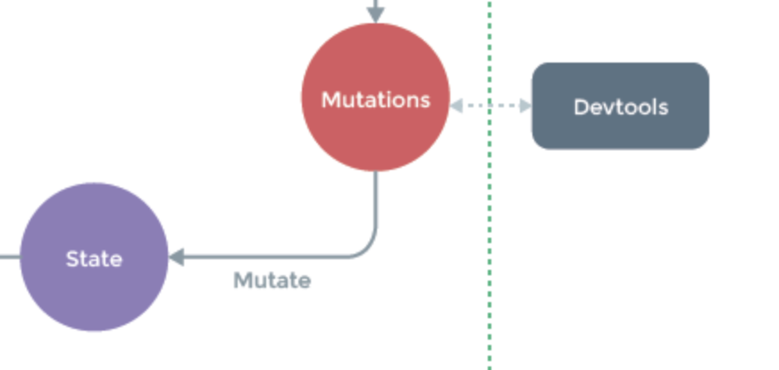

# 왜 mutations 로 state를 변경하는가?

## state는 왜 직접 변경하지 않고,  mutations로 변경할까?

- 여러 개의 컴포넌트에서 아래와 같이 `state` 값을 변경하는 경우, **어느 컴포넌트에서 해당 state를 변경했는지 추적하기 어렵다**

  ```javascript
  methods: {
  	increaseCounter() { this.$store.state.counter++; }
  }
  ```

- state는 여러 컴포넌트에서 공유하고 있기 때문에, 특정 컴포넌트에서 변경한 것을 추적해야 한다.

- state를 직접 변경하면, 특정 시점에 어떤 컴포넌트가 state를 접근하여 변경한 건지 확인하기 어렵기 때문

- 따라서, 뷰의 반응성(화면에 특정 데이터가 변경 되었을 때, 이를 스크립트에서 바로 인지하는 성질)을 거스르지 않게, 명시적으로 상태 변화를 수행함

  - **반응성, 디버깅, 테스팅 혜택**

  

- mutations은 state 변경을 위해서 존재하는 것일뿐, 그 이상도 그 이하도 아님

